# Git

> E:\Git

## Git概念

概念：一个免费开源，分布式的代码版本控制系统，帮助开发团队维护代码

作用：记录代码内容，切换代码版本，多人开发时高效合并代码内容

## VS Code中使用

VS Code 找到 GIT 终端

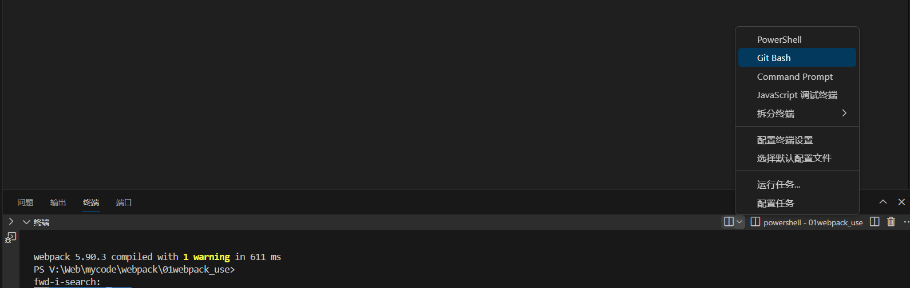

查看邮箱和名字 ```git config --list```

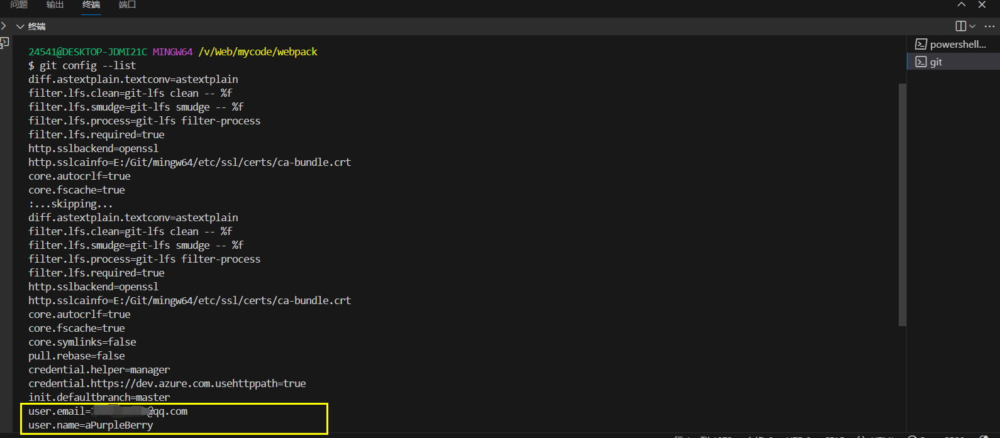

## 仓库（repository）

Git 仓库（repository）：记录文件状态内容的地方，存储着修改的历史记录

也就是说，git仓库就是一个 .git 的隐藏文件夹，这里会记录所在项目的 你提交过的 所有文件的 状态的历史记录。


**创建仓库**

1. 把本地文件夹转换成 Git 仓库：命令 git init
2. 从其他服务器上克隆 Git 仓库


### 示例 

- 创建一个空白的 Git 仓库

<font color="red">（要看好当前路径）</font>

.git是隐藏的文件夹。在git_study下 创建了一个空白的 Git 仓库

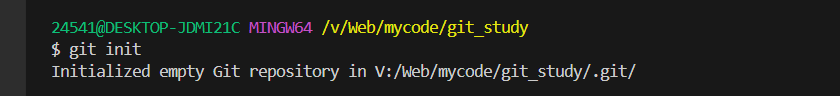

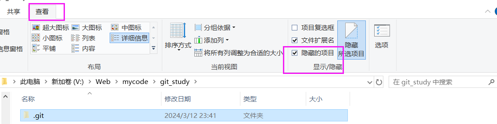

## Git 使用时的三个区域

Git 使用时：

工作区：实际开发时操作的文件夹

暂存区：保存之前的准备区域（暂存改动过的文件）

版本库：提交并保存暂存区中的内容，产生一个版本快照

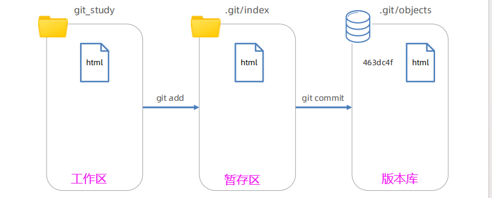


### 示例

```git ls-files ```查看当前目录下有哪些文件

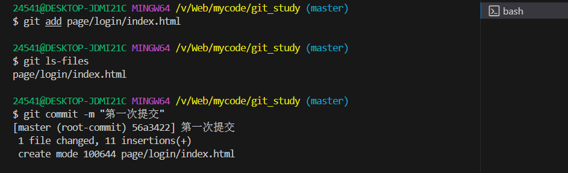

## Git 文件状态

<font color="red">**Git 文件 2 种状态：**</font>

<font color="red">✓ 未跟踪：新文件，从未被 Git 管理过</font>

<font color="red">✓ 已跟踪：Git 已经知道和管理的文件</font>

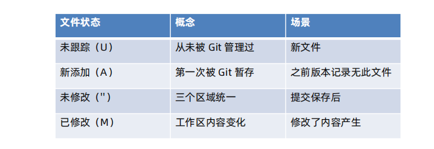

文件A 从未跟踪 到 新添加状态：git add（此时还没有被记录，如果删除是找不回来的）

【此时文件A从工作区被放进暂存区】

-> git commit 产生一次版本记录 变成未修改状态。

【此时文件A从暂存区被放进版本库】

->如果之后修改了文件A，那么就会变成已修改状态。

修改之后，通过git add从工作区被放进暂存区，通过git commit 从暂存区被放进版本库


- **git status -s**

```git status -s```查看文件状态

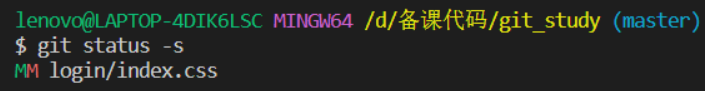

第一列是暂存区状态

第二列是工作区状态 


### 示例

① 添加了一个新文件之后 ，它的状态是 U未跟踪

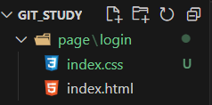

② git add . 放进暂存区让git管理该文件

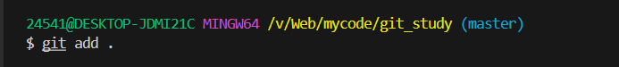

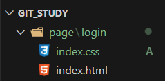

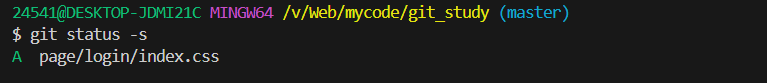

③ 在暂存区发生改动

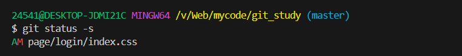

 再次 git add . 

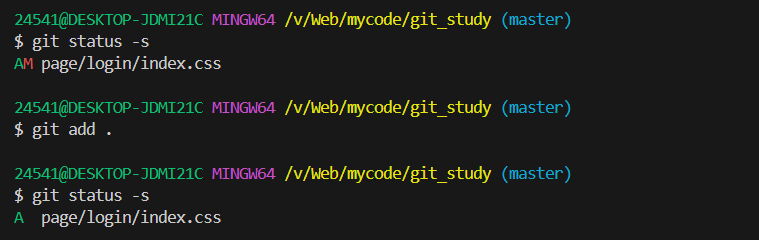

<font color="blue">这里不是 MM 而是 AM ，因为A表示新添加，新是对于版本库来说的，没有提交到版本库中的文件都是新文件。</font>

③ 把文件提交到版本库中 git commits

此时通过 git status -s 发现当前没有变化的文件了（也可以看出这个命令是检测变化的文件）

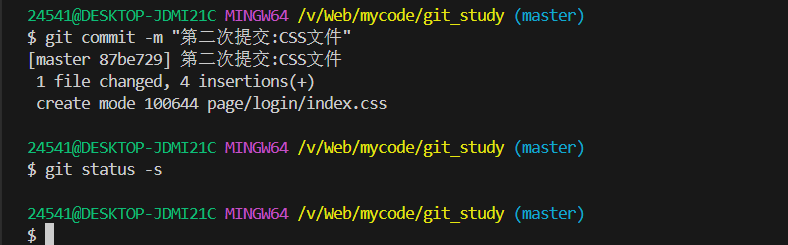

④ 再次修改

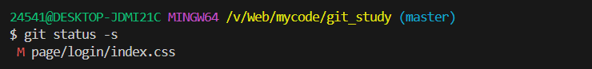


## Git 暂存区

暂存区：暂时存储，可以临时恢复代码内容，与版本库解耦


- 暂存区 -> 覆盖 -> 工作区（回退），命令：**git restore 目标文件**（注意：完全确认 工作区中新修改的代码不想要了，就把暂存区的代码覆盖工作区）

  注意这里还没有 git add .

- 从暂存区移除文件，命令：**git rm --cached** 目标文件

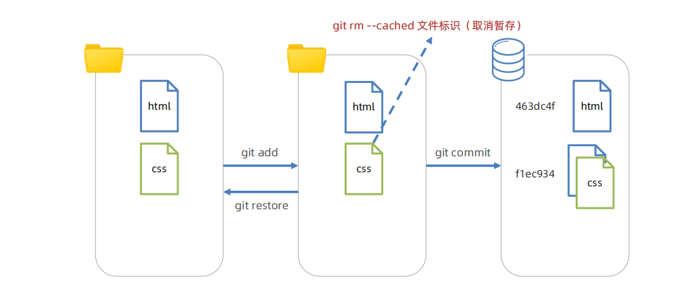

### 示例

git ls-files 是查看**暂存区**文件

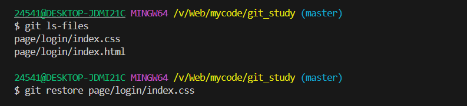

移除之后只剩下一个了

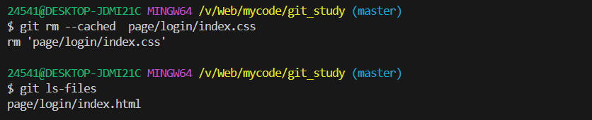

此时 index.css变成 未跟踪U状态

 

## Git 回退版本

概念：把版本库某个版本对应的内容快照，恢复到工作区/暂存区

查看提交历史：```git log --oneline```  

```git reflog --oneline``` 查看完整日志

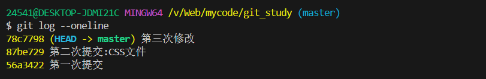


- **回退命令：**

<font color="red">git reset --soft 版本号（其他文件未跟踪）</font>

<font color="red">git reset --hard 版本号（常用）</font>

<font color="red">git reset --mixed 版本号 （与 git reset 等价）</font>

注意1：只有记录在版本库的提交记录才能恢复

注意2：回退后，继续修改->暂存->提交操作即可（产生新的提交记录过程）

 

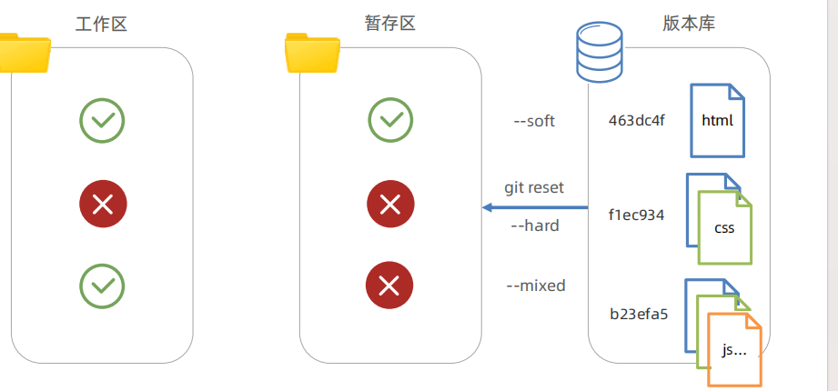

√ 是保留的意思，指的是，从版本库恢复之后，工作区和暂存区原本的内容不会被覆盖

× 是覆盖的意思


- 示例

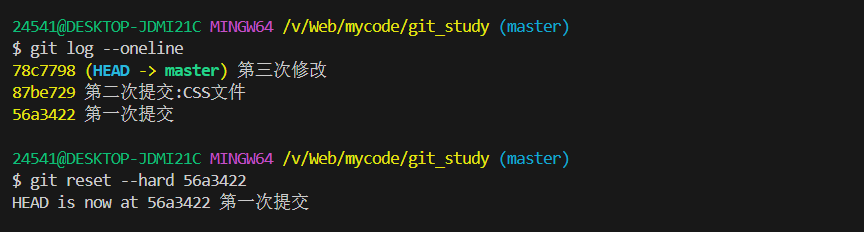

## 删除文件

步骤：

1. 手动删除工作区文件
2. 暂存变更 git add/手动删除git rm --cached暂存区文件造成变更 
3. 提交保存 git commit

总结：

工作区只要改变，都可以暂存提交产生新记录

## 忽略文件

概念：.gitignore 文件可以让 git 彻底忽略跟踪指定文件

目的：让 git 仓库更小更快，避免重复无意义的文件管理

例如：

1. 系统或软件自动生成的文件
2. 编译产生的结果文件
3. 运行时生成的日志文件，缓存文件，临时文件等
4. 涉密文件，密码，秘钥等文件


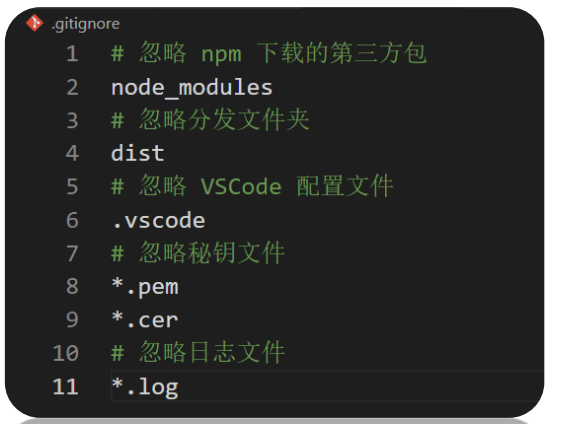

### 示例

1. 项目根目录新建 .gitignore 文件
2. 填入相应配置来忽略指定文件

注意：如果文件已经被暂存区跟踪过，可以从暂存区移除即可

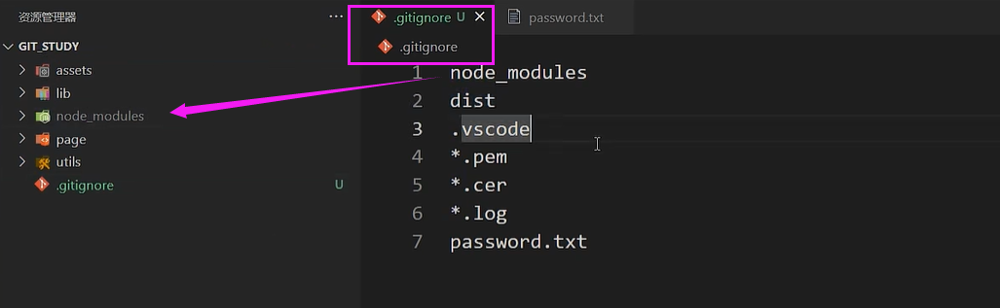

## 分支

### 分支的使用

概念：本质上是指向提交节点的可变指针，默认名字是 master

注意：HEAD 指针影响工作区/暂存区的代码状态

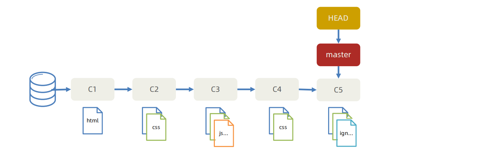


使用 场景：开发新需求 / 修复 Bug，保证主线代码随时可用，多人协同开发提高效率

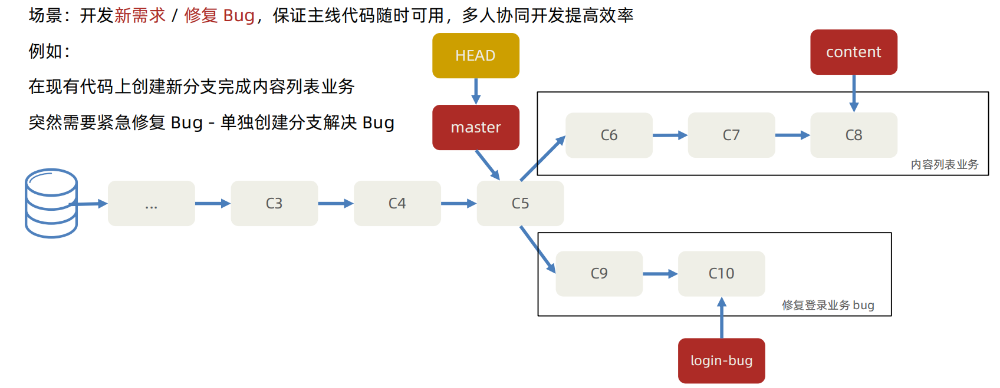

- 示例步骤：

1. 创建分支命令：git branch 分支名

2. 切换分支命令：git checkout 分支名

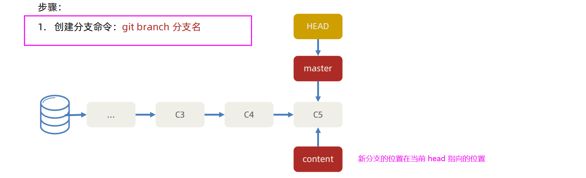

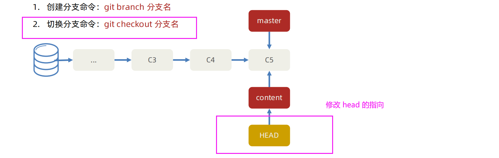

HEAD 会影响 工作区和暂存区的代码

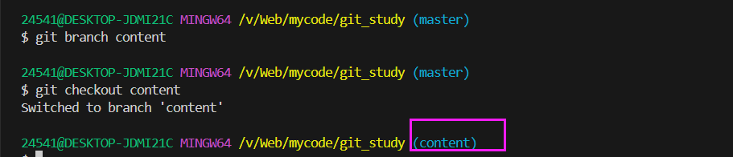

```git branch```查看当前仓库中有哪些分支的名字：

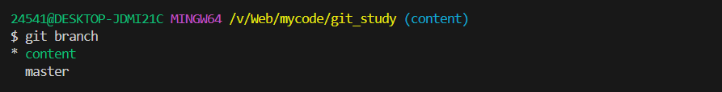

### 分支的合并与删除

- **合并：**

步骤：

1. 切回到要合入的分支上：git checkout master
2. 合并其他分支过来：git merge login-bug（其他分支）
3. 删除合并后的分支指针：git branch -d login-bug（其他分支）

- **合并提交：**

合并提交：发生于原分支产生了新的提交记录后，再合并回去时发生，自动使用多个快照记录合并后产生一次新的提交

步骤：

1. 切回到要合入的分支上：git checkout master
2. 合并其他分支过来：git merge content
3. 删除合并后的分支：git branch -d content

<font color="red">注意：提交记录的顺序按照产生的先后顺序排列，而非合并的先后顺序</font>

### 分支的合并冲突

需求1：基于 master 新建 publish 分支，完成发布文章业务，然后修改内容页面的 html 文件的 title 标签，并提交一次

需求2：切换到 master，也在修改内容页面的 html 文件的 title 标签，并提交一次

**冲突：把 publish 分支合并到 master 回来，产生合并冲突**

<font color="red">**概念：不同分支中，对同一个文件的同一部分修改，Git 无法干净的合并，产生合并冲突**</font>

解决：

1. 打开 VSCode 找到冲突文件并手动解决
2. 解决后需要提交一次记录

避免：（多交流）

1. 按页面划分不同分支开发
2. 公共代码在统一文件夹维护
3. Node等软件版本统一，npm 包统一下载

## Git常用命令

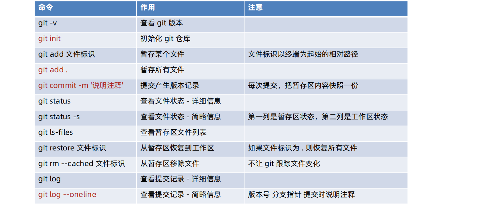

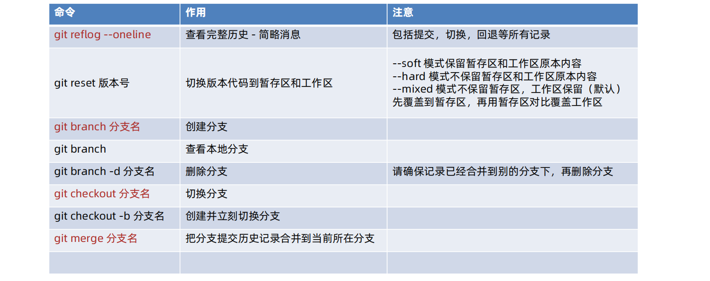

## Git远程仓库 (HTTP)

概念：托管在因特网或其他网络中的你的项目的版本库

作用：保存版本库的历史记录，多人协作

创建：公司自己服务器 / 第三方托管平台（Gitee，GitLab，GitHub...）

### 步骤

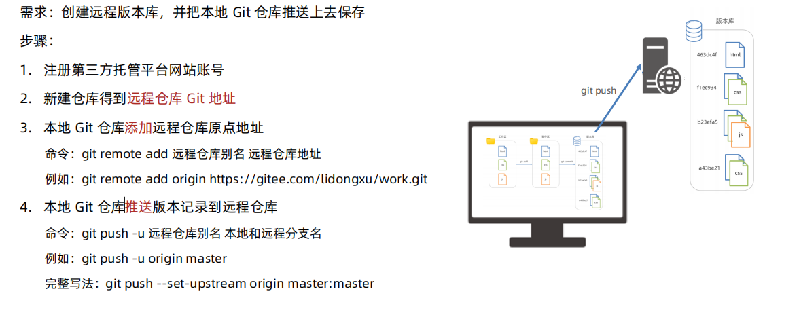

https://gitee.com/apurpleberry/webpack_practice_code.git

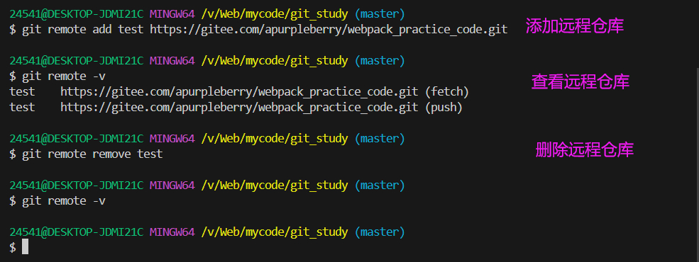

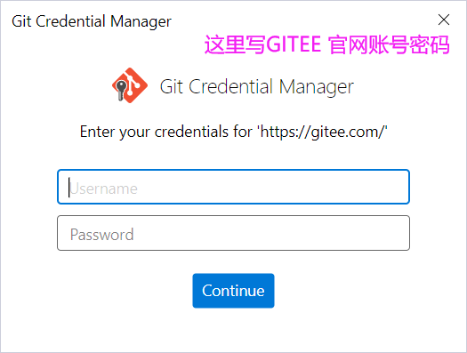

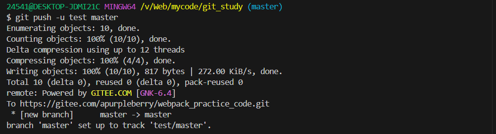

### 远程仓库 克隆

克隆：拷贝一个 Git 仓库到本地，进行使用

<font color="red">**命令：git clone** 远程仓库地址，</font>例如：git clone https://gitee.com/lidongxu/work.git

效果：在运行命令所在文件夹，生成 **work 项目（对应远程仓库地址中的work）**文件夹（包含版本库，并映射到暂存区和工作区）


注意1：Git 本地仓库已经建立好和远程仓库的链接（以后push的时候不需要添加远程仓库了）

注意2：仓库公开随意克隆，但是推送需要身为仓库团队成员

### 远程 多人协同开发

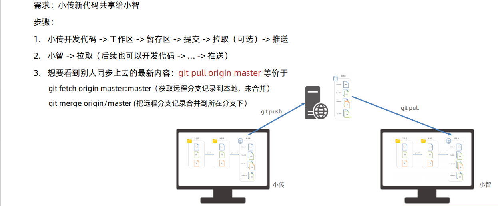

### 远程仓库常用命令

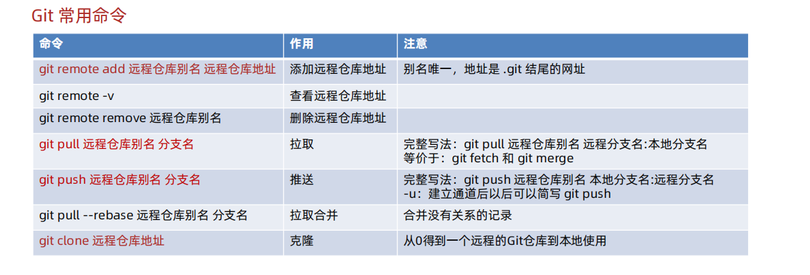

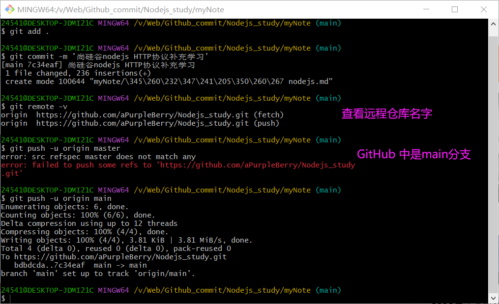