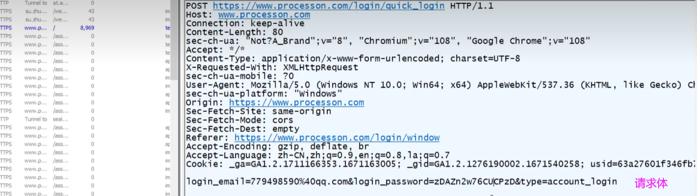
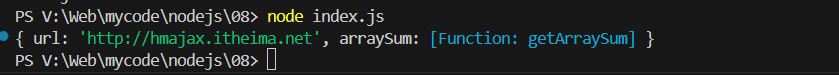

# Node.js

> 教学视频 BV1MN411y7pw , P83-97的笔记 

## 一、定义

Node.js是一个跨平台JavaScript运行环境，使开发者可以搭建服务器端的JavaScript应用程序。


作用：使用 Node.js 编写服务器端程序

✓ 编写数据接口，提供网页资源浏览功能等等

✓ 前端工程化：为后续学习 Vue 和 React 等框架做铺垫

### 1.前端工程化

前端工程化：开发项目直到上线，过程中集成的所有工具和技术

Node.js 是前端工程化的基础（因为 Node.js 可以主动读取前端代码内容）


### 2.Node.js 为何能执行 JS？

首先：浏览器能执行 JS 代码，依靠的是内核中的 V8 引擎（C++ 程序）

其次：Node.js 是基于 Chrome V8 引擎进行封装（运行环境）

区别：都支持 ECMAScript 标准语法，Node.js 有独立的 API

**注意：Node.js 环境没有 DOM 和 BOM 等**


### 3.安装nodejs、删除之前的nodejs

> 因为之前有安装过一次nodejs，但是忘记放在哪里了，
>
> a *later* *version* *of* *node.js* is already installed.

https://www.cnblogs.com/fighxp/p/7410235.html

https://blog.51cto.com/teayear/9559527

>  备注一下，我这次装在了D:\nodejs


### 4.使用 Node.js

需求：新建 JS 文件，并编写代码后，在 node 环境下执行

命令：在 VSCode 集成终端中，输入``` node xxx.js```，回车即可执行


```
总结：
1. Node.js 是什么？
➢ 基于 Chrome 的 V8 引擎封装，独立执行 JavaScript 代码的环境

2. Node.js 与浏览器环境的 JS 最大区别？
➢ Node.js 环境中没有 BOM 和 DOM

3. Node.js 有什么用？
➢ 编写后端程序：提供数据和网页资源等
➢ 前端工程化：集成各种开发中使用的工具和技术

4. Node.js 如何执行代码？
➢ 在 VSCode 终端中输入：node xxx.js 回车即可执行（注意路径）
```

## 二、fs模块 \- 读写文件

模块：类似插件，封装了方法/属性

fs 模块：封装了与**本机文件系统**进行交互的，方法/属性

语法：

1. 加载 fs 模块对象
2. 写入文件内容
3. 读取文件内容


```javascript
 const f = require('fs')
 // 写
 f.writeFile('./02test.txt','hello,node.js',err => {
  if (err) {
    console.log(err);
  } else {
    console.log('写入成功');
  }
 })

// 读
f.readFile('./02test.txt',(err, data) => {
  if(err) console.log(err);
  else {
    console.log(data); // 68 65 6c 6c 6f 2c 6e 6f 64 65 2e 6a 73>
    // data是文件内容的 Buffer数据流 （是字符串在 计算机中保存的二进制数据 转换成的十六进制数据）
    console.log(data.toString()); // hello,node.js
  } 
})
```

## 三、path 模块

问题：Node.js 代码中，相对路径是根据<font color="red">终端所在路径来</font>查找的，可能无法找到你想要的文件。

**建议：在 Node.js 代码中，使用绝对路径**

**补充知识点：**<font color="red">__dirname</font> 内置变量（获取当前模块目录的绝对路径）

- **例子：**

✓ windows： D:\备课代码\3-B站课程\03_Node.js与Webpack\03-code\03 

✓ mac： /Users/xxx/Desktop/备课代码/3-B站课程/03_Node.js与Webpack/03-code/03

mac 和 windows 的区别在于 分隔符 一个是\ 一个是/

注意：path.join() 会使用特定于平台的分隔符，作为定界符，将所有给定的路径片段连接在一起。

```javascript
path.join('03', 'dist/js', 'index.js')
// windows: '03\dist\js\index.js'
// mac:      '03/dist/js/index.js'
```

**语法**


<font color="red">path用于解决，代码中的相对路径和调试终端的所在文件夹 不同的问题。</font>

<font color="red">调用path.join()配合__dirname组成的目标文件的绝对路径。</font>

- **案例：**


修改后：

```javascript
const path = require('path')
console.log(__dirname);

const f = require('fs')
f.writeFile(path.join(__dirname,'./03test.txt'),'444444',err => {
 if (err) {
   console.log(err);
 } else {
   console.log('写入成功');
 }
})
```

## 案例 - 压缩前端html

需求：把 回车符（\r）和换行符（\n）去掉后，写入到新 html 文件中

步骤：

1. 读取源 html 文件内容
2. 正则替换字符串
3. 写入到新的 html 文件中

> V:\Web\mycode\nodejs\04 compress_html\public\index.html

```javascript
/**
 * 目标1：压缩 html 代码
 * 需求：把回车符 \r，换行符 \n 去掉，写入到新 html 文件中
 *  1.1 读取源 html 文件内容
 *  1.2 正则替换字符串
 *  1.3 写入到新的 html 文件中
 */
// 1.1 读取源 html 文件内容
const fs = require('fs')
const path = require('path')
fs.readFile(path.join(__dirname, 'public/index.html'), (err, data) => {
  if (err) console.log(err)
  else {
    const htmlStr = data.toString()
    // 1.2 正则替换字符串
    const resultStr = htmlStr.replace(/[\r\n]/g, '')
    console.log(resultStr)
    // 1.3 写入到新的 html 文件中
    fs.writeFile(path.join(__dirname, 'dist/index.html'), resultStr, err => {
      if (err) console.log(err)
      else console.log('写入成功')
    })
  }
})
```

## 四、HTTP相关

### URL中的端口号

URL：统一资源定位符，简称网址，用于访问服务器里的资源

端口号：标记服务器里不同功能的服务程序

端口号范围：0-65535 之间的任意整数


注意：http 协议，默认访问 80 端口。所以可以省略。

### 常见的服务程序

服务器中常见的服务程序-**Web 服务程序**：用于提供网上信息浏览功能

注意：0-1023 和一些特定端口号被占用，我们自己编写服务程序请避开使用

```
1. 端口号的作用？
➢ 标记区分服务器里不同的服务程序
2. 什么是 Web 服务程序？
➢ 提供网上信息浏览的程序代码
```

### http 模块-创建 Web 服务

使用nodejs提供的http模块，创建 Web 服务

需求：创建 Web 服务并响应内容给浏览器

步骤：

1. 加载 **http** 模块，创建 Web 服务对象

2. 监听 **request** 请求事件，设置响应头和响应体

   server.on('request', (req, res) =>{ // 略})

   - req,request 意为请求. 是对请求报文的封装对象, 通过 request 对象可以获得请求报文的数据
   - res,response 意为响应. 是对响应报文的封装对象, 通过 response 对象可以设置响应报文

3. 配置端口号并启动 Web 服务（一个web服务程序对应一个端口号）

4. 浏览器请求 http://localhost:3000 测试

（localhost：固定代表本机的域名）

```javascript
// 1. 加载 http 模块，创建 Web 服务对象
const h = require('http')
const server = h.createServer()

// 2. 监听 request 请求事件，设置响应头和响应体
server.on('request', (req, res) => {
  // 设置响应头: 内容类型 普通文本以及中文编码格式
  res.setHeader('Content-Type', 'text/plain; charset=utf-8')
  // 设置响应体内容，结束本次请求与响应
  res.end('欢迎使用node.js和http模块创建的web服务')
})

// 3. 配置端口号并启动 Web 服务（一个web服务程序对应一个端口号）
server.listen(3000, () => {
  console.log('web服务启动成功');
})

// 4. 浏览器请求 http://localhost:3000 测试
```

在浏览器网址栏输入 http://localhost:3000后：


#### 案例：浏览时钟

需求：基于 Web 服务，开发提供网页资源的功能


```javascript
const fs = require('fs')
const path = require('path')

// 基于http模块
const http = require('http');
// 创建服务器
const server = http.createServer()


// 服务器监听有没有请求
// req,request 意为请求. 是对请求报文的封装对象, 通过 request 对象可以获得请求报文的数据
// res,response 意为响应. 是对响应报文的封装对象, 通过 response 对象可以设置响应报文
server.on('request', (req, res) => {
  if(req.url === '/index.html') {
    // 返回该网址
    fs.readFile(path.join(__dirname, 'dist/index.html'), (err,data) =>{
      if(err) console.log(err);
      else {
        res.setHeader('Content-Type', 'text/html; charset=utf-8')
        res.end(data.toString())
      }
    })
  } else {
    res.setHeader('Content-Type', 'text/html;charset=utf-8')
    res.end('not found')
  }
})

// 配置端口号并启动 Web 服务
server.listen(8080, () => {
  console.log('web 服务器启动');
})
```


## 尚硅谷-HTTP 协议（未完）

对浏览器和服务器之间的通信进行约束


### fiddler软件

下载fiddler查看报文


### 案例：输入网址敲下回车之后 的请求报文、响应报文

在网页栏输入 www.baidu.com 敲下回车之后，我们的浏览器发送的东西：


百度服务器给我们浏览器返回的结果：


#### 请求报文

- **请求报文的组成**

​	① 请求行：报文的第一行内容

​	② 请求头

​	③ 空行

​	④ 请求体

<font color="red">**① 请求行**</font>


**【请求方法】**（get获取数据、post新增数据、put更新数据、delete等）

**【请求 URL】**  Uniform Resource Locator（统一资源定位器）：用于定位服务器中的资源


协议名 + 主机名（域名www.baidu.com 或者 IP地址10.20.30）用于定位网络上的计算机

+端口号（有些情况省略）+路径（定位服务器中的某一个资源）+ 查询字符串（向服务器传递额外的参数）

**【HTTP版本号】**


<font color="red">**② 请求头**</font>


**作用1：记录浏览器相关的信息**：比如 user-agent记录了浏览器的平台、版本号； accept记录浏览器能处理的数据类型；accept-encoding 当前浏览器支持的压缩方式；

**作用2：记录浏览器的交互行为：** connection: keep-alive 保持链接通道，提高效率；

> 具体信息可以去MDN网站查看详细的

<font color="red">**③ 空行**</font>

<font color="red">**④ 请求体**</font>

请求体的内容格式是非常灵活的，可以设置任意内容



#### 响应报文


- **相应报文的组成**

​	① 响应行：报文的第一行内容

​	② 响应头

​	③ 空行

​	④ 响应体 

​		响应体内容的类型是非常灵活的，常见的类型有 HTML、CSS、JS、图片、JSON

<font color="red">**① 响应行**</font>


**【响应状态码】**：标识相应的结果状态


HTTP协议对状态码进行了分类：


**【响应状态描述】**


<font color="red">**② 响应头**</font>


server：BWS/1.1记录了服务器所属的技术；content-type 记录了与响应body相关的一些内容，声明响应体的内容的格式与字符集。content-length记录了响应体内容的长度，单位是字节。

<font color="red">**③ 空行**</font>

<font color="red">**④ 响应体 **</font>

响应体内容的类型是非常灵活的，常见的类型有 HTML、CSS、JS、图片、JSON 


## 五、模块化

**在Node.js 中，每个文件都被视为一个单独的模块。**

**概念：项目是由很多个模块文件组成的。**一个文件就是一个模块。 

好处：提高代码复用性，按需加载，独立作用域

<font color="red">使用：需要**标准语法**  **导出和导入**进行使用</font>。标准语法有 CommonJS 、ECMAScript

### 1.CommonJS 模块标准

CommonJS 模块是为Nodejs打包 JavaScript 代码的原始方式。Node.js 还支持浏览器和其他JavaScript运行使用的ECMAScript模块标准

**使用：**

​	<font color="red">1、导出：module.exports = {}</font>

<font color="red">	2、导入：require('模块名或路径')</font>

**模块名或路径：**

​	✓ 内置模块：直接写名字（例如：fs，path，http）

​	✓ 自定义模块：写模块文件路径（例如：./utils.js）

- **示例** 

需求：定义 utils.js 模块，封装基地址和求数组总和的函数


> V:\Web\mycode\nodejs\07 modularity_CommonJS\index.js


utils.js:

```javascript
const baseURL = 'http://hmajax.itheima.net'
const getArraySum = arr => arr.reduce((sum, item) => sum += item, 0)

// const getArraySum2 =  function (arr) {
//   return arr.reduce((sum,item) => sum + item ,0)
// }

// 导出
module.exports = {
  url: baseURL,
  arraySum: getArraySum
}
```

index.js:

```javascript
const obj = require('./utils.js')
console.log(obj.url);
console.log(obj.arraySum([1,2,4]));
```


```
总结：
1. Node.js 中什么是模块化？
➢ 每个文件都是独立的模块
2. 模块之间如何联系呢？
➢ 使用特定语法，导出和导入使用
3. CommonJS 标准规定如何导出和导入模块呢？
➢ 导出：module.exports = {}
➢ 导入：require('模块名或路径')
4. 模块名/路径如何选择？
➢ 内置模块，直接写名字。例如：fs，path，http等
➢ 自定义模块，写模块文件路径。例如：./utils.js
```

### 2.ECMAScript 模块标准 

#### 2.1 默认导出和导入

**默认标准使用：**

​	<font color="red">1、导出：export default {}</font>

​	<font color="red">2、导入：import 变量名 from '模块名或路径'</font>

注意：Node.js 默认支持 CommonJS 标准语法。如需使用 ECMAScript 标准语法，在运行模块所在文件夹新建 package.json 文件，并设置 { "type" : "module" }

- **示例**


> V:\Web\mycode\nodejs\08 modularity_ECMAScript_default export\index.js
>
> index.js是运行模块，要在index.js所在的文件夹中 创建一个 package.json


utils.js

```javascript
const baseURL = 'http://hmajax.itheima.net'
const getArraySum = arr => arr.reduce((sum, item) => sum += item, 0)


// 导出
export default {
  url: baseURL,
  arraySum: getArraySum
}
```

index.js

```javascript
import obj from './utils'
console.log(obj);
```

package.json

```json
{
  "type" : "module"
}
```



```
总结
1. ECMAScript 标准规定如何默认导出和导入模块呢？
➢ 导出：export default {}
➢ 导入：import 变量名 from '模块名或路径'
2. 如何让 Node.js 切换模块标准为 ECMAScript？
➢ 运行模块所在文件夹，新建 package.json 并设置
➢ { "type" : "module" }
```

#### 2.2 命名导出和导入

命名标准使用：

​	<font color="red">1、导出：export 修饰定义语句</font>

​	<font color="red">2、导入：import { **同名**变量 } from '模块名或路径‘</font>

**如何选择是默认导入导出还是命名导入导出？**

​	按需加载，使用命名导出和导入

​	全部加载，使用默认导出和导入

​        二者可以同时用


- 示例

utils.js

```javascript
// 导出
export const baseURL = 'http://hmajax.itheima.net'
export const getArraySum = arr => arr.reduce((sum, item) => sum += item, 0)
```

index.js

```javascript
// 默认导入导出
import {baseURL, getArraySum} from './utils.js'
console.log(baseURL);
console.log(getArraySum([1,2,5]));
```

package.json

```json
{ "type" : "module" }
```


**本节总结**

```
1. Node.js 支持哪 2 种模块化标准？
➢ CommonJS 标准语法（默认）
➢ ECMAScript 标准语法
2. ECMAScript 标准，命名导出和导入的语法？
➢ 导出：export 修饰定义的语句
➢ 导入：import { 同名变量 } from '模块名或路径‘
3. ECMAScript 标准，默认导出和导入的语法？
➢ 导出：export default {}
➢ 导入：import 变量名 from '模块名或路径'
```

## 六、包

### 1.包

包：将**模块，代码，其他资料**聚合成一个文件夹


**包分类：**

✓ 项目包：主要用于编写项目和业务逻辑

✓ 软件包：封装工具和方法进行使用


要求：根目录中，必须有 package.json 文件（记录包的清单信息）

- 示例：package.json


<font color="red">注意：导入软件包时，默认引入该包中的 index.js 模块文件 。如果没有找到，就引入package.json文件中 main 属性指定的模块文件。</font>

- **案例**

需求：封装数组求和函数的模块，判断用户名和密码长度函数的模块，形成成一个软件包

> V:\Web\mycode\nodejs\10 package\server.js


**总结**

```
1. 什么是包？
➢ 将模块，代码，其他资料聚合成的文件夹
2. 包分为哪 2 类呢？
➢ 项目包：编写项目代码的文件夹
➢ 软件包：封装工具和方法供开发者使用
3. package.json 文件的作用？
➢ 记录软件包的名字，作者，入口文件等信息
4. 导入一个包文件夹的时候，导入的是哪个文件？
➢ 默认 index.js 文件，package.json文件中 main 属性指定的文件

文件 —— 模块
文件夹 —— 包
```

### 2.npm

#### npm - 软件包管理器

npm是Node.js标准的软件包管理器。

它起初是作为下载和管理Node.js包依赖的方式（下载和管理Node.js中需要的软件包），但其现在也已成为前端JavaScript中使用的工具。


**使用：**

1. 初始化清单文件 ：npm init -y（得到 package.json 文件，用于记录当前项目下载过哪些软件包，有则略过此命令）
2. 下载软件包 ：npm i 软件包名称

3. 使用软件包


- **示例：**需求：使用 dayjs 软件包，来格式化日期时间

① 创建一个项目文件夹 

② 初始化清单文件 ：npm init -y ，得到 package.json 文件，用于记录当前项目下载过哪些软件包 

③ npm i dayjs 命令， 从npm资源库中下载该软件包到当前项目文件夹中的node_modules文件夹中。(1) 同时npm会记录dayjs包的名字、版本号 到 package.json 文件中（具体是dependencies选项里）(2)还会生成一个package-lock.json文件，主要作用是固化下载的软件包对应的版本号。（固化原因：开发项目的过程中如果修改这个软件包，使用过的方法会有问题，为了保证当前项目可以正常运行）

④自己的项目文件中导入dayjs包 并引用方法

流程图：


- 案例

> V:\Web\mycode\nodejs\11 npm_use\server.js


**总结**

```
1. npm 软件包管理器作用？
➢ 下载软件包以及管理版本
2. 初始化项目清单文件 package.json 命令？
➢ npm init -y
3. 下载软件包的命令？
➢ npm i 软件包名字
4. 下载的包会存放在哪里？
➢ 当前项目下的 node_modules 中，并记录在 package.json 中
```

#### npm - 安装所有依赖

从网上找到的代码 少了 node_modules文件夹


项目中不包含 node_modules，不能正常运行。因为缺少依赖的本地软件包。

为什么别人不把node_modules传递给我们呢？因为，自己用 npm 下载依赖比磁盘传递拷贝要快得多。


<font color="red">解决：项目终端输入命令：**【npm i】**  （注意下载路径要对）</font>

下载 package.json 中记录的所有软件包

> BV1MN411y7 , P95

```
总结
1. 当项目中只有 package.json 没有 node_modules 怎么办？
➢ 当前项目下，执行 npm i 安装所有依赖软件包
2. 为什么 node_modules 不进行传递？
➢ 因为用 npm 下载比磁盘传递要快
```

#### npm - 全局软件包 nodemon

> BV1MN411y7pw， P96

软件包区别：

➢ 本地软件包：<font color="red">当前项目</font>内使用，封装<font color="red">属性和方法</font>，存在于 node_modules 

➢ 全局软件包：<font color="red">本机</font>所有项目使用，封装<font color="red">命令和工具</font>，存在于系统设置的位置


nodemon 作用：替代 node 命令，检测我们编写的代码是否发生更改，然后自动重启程序


使用nodemon：

1. 安装：npm i nodemon -g（-g 代表安装到全局环境中，因此下载的时候终端路径是什么都可以）
2. 运行：nodemon 待执行的目标 js 文件

```
总结
1. 本地软件包和全局软件包区别？
➢ 本地软件包，作用在当前项目，封装属性和方法
➢ 全局软件包，本机所有项目使用，封装命令和工具
2. nodemon 作用？
➢ 替代 node 命令，检测代码更改，自动重启程序
3. nodemon 怎么用？
➢ 先确保安装 npm i nodemon -g
➢ 使用 nodemon 执行目标 js 文件
```

## 七、Node.js总结

### 1.Node.js 模块化：

概念：每个**文件**当做一个模块，独立作用域，按需加载

使用：采用特定的标准语法导出和导入进行使用


CommonJS 标准：一般应用在 Node.js 项目环境中

ECMAScript 标准：一般应用在前端工程化项目中

### 2.Node.js 包

Node.js 包：

- 概念：把模块文件，代码文件，其他资料聚合成一个**文件夹**

- 包的分类

​	项目包：编写项目需求和业务逻辑的文件夹

​	软件包：封装工具和方法进行使用的文件夹（一般使用 npm 管理）

​         软件包分类：

​	 ✓ 本地软件包：作用在当前项目，一般封装的属性/方法，供项目调用编写业务需求

​         ✓ 全局软件包：作用在所有项目，一般封装的命令/工具，支撑项目运行


### 3.常用命令

