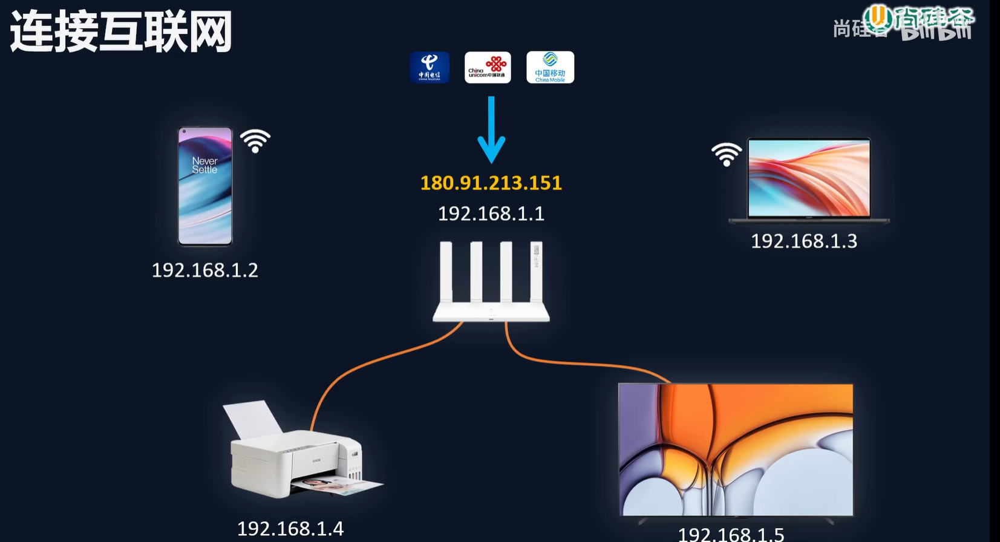

# Node.js-HTTP 模块

## 一、HTTP 协议

HTTP 协议 对浏览器和服务器之间的通信进行约束


### 1.1 fiddler软件

下载fiddler查看报文


### 1.2 案例：输入网址敲下回车之后 的请求报文、响应报文

在网页栏输入 www.baidu.com 敲下回车之后，我们的浏览器发送的东西：


百度服务器给我们浏览器返回的结果：


#### 请求报文

- **请求报文的组成**

​	① 请求行：报文的第一行内容

​	② 请求头

​	③ 空行

​	④ 请求体

<font color="red">**① 请求行**</font>


**【请求方法】**（get获取数据、post新增数据、put更新数据、delete等）

**【请求 URL】**  Uniform Resource Locator（统一资源定位器）：用于定位服务器中的资源


协议名 + 主机名（域名www.baidu.com 或者 IP地址10.20.30）用于定位网络上的计算机

+端口号（有些情况省略）+路径（定位服务器中的某一个资源）+ 查询字符串（向服务器传递额外的参数）

**【HTTP版本号】**


<font color="red">**② 请求头**</font>


**作用1：记录浏览器相关的信息**：比如 user-agent记录了浏览器的平台、版本号； accept记录浏览器能处理的数据类型；accept-encoding 当前浏览器支持的压缩方式；

**作用2：记录浏览器的交互行为：** connection: keep-alive 保持链接通道，提高效率；

> 具体信息可以去MDN网站查看详细的

<font color="red">**③ 空行**</font>

<font color="red">**④ 请求体**</font>

请求体的内容格式是非常灵活的，可以设置任意内容


#### 响应报文


- **相应报文的组成**

​	① 响应行：报文的第一行内容

​	② 响应头

​	③ 空行

​	④ 响应体 

​		响应体内容的类型是非常灵活的，常见的类型有 HTML、CSS、JS、图片、JSON

<font color="red">**① 响应行**</font>


**【响应状态码】**：标识相应的结果状态


HTTP协议对状态码进行了分类：


**【响应状态描述】**


<font color="red">**② 响应头**</font>


server：BWS/1.1记录了服务器所属的技术；content-type 记录了与响应body相关的一些内容，声明响应体的内容的格式与字符集。content-length记录了响应体内容的长度，单位是字节。

<font color="red">**③ 空行**</font>

<font color="red">**④ 响应体 **</font>

响应体内容的类型是非常灵活的，常见的类型有 HTML、CSS、JS、图片、JSON 

## 二、网络

### 2.1 IP

#### IP 概念

IP：IP也称为『IP地址』，本身是一个数字标识。例如192.168.1.3


本质是一个32BIT的二进制数字，因为不利于人的使用，所以进行拆分


作用：IP用来标识网络中的设备，实现设备间通信。

每一个接入到互联网的设备（电脑、手机、手表、摄像头等），只要接入到互联网，就会有一个IP地址。有了IP地址之后，设备之间才可以进行通信。

#### IP分类


上文说到，IP本质是一个32BIT的二进制数字。但是32BIT的数字，表达的数目不够用。


<font color="red">**解决方法有  ① 共享IP、② 家庭共享**</font>

- 以家庭设备为例：

  家里的设备通过网线 或者 无线WIFI 连接到路由器上。路由器会给每一个设备分配一个IP地址，路由器本身也有IP地址。形成了一个网络，叫【局域网】。而路由器分配的地址叫做【局域网IP】或者【私网IP】。在这个局域网里面我们的设备是可以通信的，但此时如果想跟这个局域网外的设备通信，是不行的。

  要想达到和局域网外的设备通信，必须要接入到互联网。需要到通信公司（移动、电信、联通）办理业务，办理完业务后，会有师傅上门，从外面拉一根线，给路由器再接一根线。接完这个线之后路由器就有另外一个IP，这个IP叫做【广域网IP】或者【公网IP】。我们所说的共享IP，指的是公网IP。有了这个IP之后就可以和远方的小伙伴一起玩游戏。

  局域网IP是可以被复用的。这样一来大大减少了IP的占用。实现了IP的复用。而每一个家庭再通过一个公网IP  ，就可以实现家庭与家庭（公司）之间的通讯。




<font color="red">**本地回环IP地址**</font>

127.0.0.1 永远指向当前的本机。

127.0.0.1 ~ 127.255.255.254 区间的地址都是本地回环IP地址。


### 2.2 端口

举例：这里是一个集市。有很多摊位，被标了号码。


可以把这个集市看作一个计算机。把摊位当作计算机中运行的程序。摊位的编号就是端口。


**端口概念：应用程序的数字标识**

- 一台现代计算机有65536个端口(0 ~ 65535)

- 一个应用程序可以使用一个或多个端口

端口作用：实现不同主机应用程序之间的通信

## 三、HTTP模块

### 3.1 创建Http服务端

>  使用 Node.js 创建Http服务

以往我们充当的是浏览器的身份，利用axios对服务器发送请求，并处理返回的数据。

我们现在开始充当的身份是服务器：处理浏览器发送的请求，并返回相应的结果。


Node.js中有一个 **http模块**，其名字刚好和 HTTP 协议一样。

#### 操作步骤

```javascript
//1. 导入 http 模块
const http = require('http');

//2. 创建服务对象 create 创建 server 服务
// request 意为请求. 是对请求报文的封装对象, 通过 request 对象可以获得请求报文的数据
// response 意为响应. 是对响应报文的封装对象, 通过 response 对象可以设置响应报文
const server = http.createServer((request, response) => {
  response.end('Hello HTTP server');
    // 设置响应体 并结束这个响应
});

//3. 监听端口, 启动服务
server.listen(9000, () => {
  console.log('服务已经启动, 端口 9000 监听中...');
});
```

const http = require('http'); 中 http是一个对象，createServer是对象中的一个方法，返回结果是一个对象，createServer接收一个函数作为实参，函数里有两个形参。

**http.createServer：**

- request 意为请求. 是对**请求报文的封装对象**, 通过 request 对象可以获得请求报文的数据（浏览器向服务器的请求报文）

- response 意为响应. 是对**响应报文的封装对象**, 通过 response 对象可以设置响应报文（服务器，也就是我们，返回给浏览器的响应报文）
- 这个回调函数的执行时间，是当我们（服务器）接收到浏览器的HTTP请求，就会执行。

**server.listen：**

第一个参数是端口号

第二个参数是回调函数，执行时间：当这个服务启动成功之后才会执行
