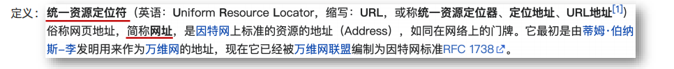

2.27

# AJAX 1 入门

## 01 AJAX 概念和 axios 使用

```
总结：
1. AJAX 有什么用？
➢ 浏览器和服务器之间通信，动态数据交互
2. AJAX 如何学：
➢ 先掌握 axios 使用
➢ 再了解 XMLHttpRequest 原理
3. 这一节 axios 体验步骤？
➢ 引入 axios 库
➢ 使用 axios 语法
```

Ajax即**A**synchronous **J**avascript **A**nd **X**ML（异步JavaScript和XML）

简单来说，就是使用 XMLHttpRequest 对象与服务器通信。

AJAX 是浏览器与服务器进行数据通信的技术。


**怎么用 AJAX ？**

1. 先使用 axios [æk‘sioʊs] 库，与服务器进行数据通信

- 基于 XMLHttpRequest 封装、代码简单、月下载量在 14 亿次

- Vue、React 项目中都会用到 axios 

2. 再学习 XMLHttpRequest 对象的使用，了解 AJAX 底层原理

### axios 使用


### 案例

需求：请求目标资源地址，拿到省份列表数据，显示到页面

目标资源地址：http://hmajax.itheima.net/api/province

```html
<body>
  <p class="my-p"></p>
</body>
<!-- 1 引入axios库 -->
<script src="https://cdn.jsdelivr.net/npm/axios/dist/axios.min.js"></script>
<script>
  // 2 使用axios函数
  axios({
    url: 'http://hmajax.itheima.net/api/province'
  }).then(result => {
    // 回调函数
    console.log(result.data.list);
    console.log(result.data.list.join('<br>'));

    document.querySelector('.my-p').innerHTML = result.data.list.join('<br>')
  })
</script>
```


## 02 认识 URL

```
总结
1. URL 是什么：
➢ 统一资源定位符，网址，用于访问服务器上资源
2. 请解释这个 URL，每个部分作用？
➢ http://hmajax.itheima.net/api/news
➢ 协议://域名/资源路径
```




例如：

• https://www.baidu.com/index.html  网页资源

• https://www.itheima.com/images/logo.png  图片资源

• http://hmajax.itheima.net/api/province 数据资源


**概念：URL 就是统一资源定位符，简称网址，用于访问网络上的资源**

### URL组成


**① 协议**

http 协议：超文本传输协议，规定浏览器和服务器之间传输数据的格式


**② 域名**

域名：标记服务器在互联网中方位


**③ 资源路径**

资源路径：标记资源在服务器下的具体位置

## 03 URL 查询参数

```
1. URL 查询参数有什么作用？
➢ 浏览器提供给服务器额外信息，获取对应的数据
2. axios 要如何携带查询参数？
➢ 使用 params 选项，携带参数名和值
```


定义：浏览器提供给服务器的额外信息，让服务器返回浏览器想要的数据


### axios－查询参数

这是 axios 库的语法

**语法：使用 axios 提供的 params 选项**

<font color="red">请注意params  左边的参数名是 后端定义的。参数名 和 值的引用名字相同的时候可以只写一个。  比如params {pname（这里是后端定义的名字）: pname（这里是前端我们定义的变量名字）}，此时可以简化成 params { pname }</font>

注意：axios 在运行时把参数名和值，会拼接到 url?参数名=值

城市列表：http://hmajax.itheima.net/api/city?pname=河北省


```html
<script src="https://cdn.jsdelivr.net/npm/axios/dist/axios.min.js"></script>
<script>
  axios({
    url: 'http://hmajax.itheima.net/api/city',
    params: {
      pname: '河北省'
    }
  }).then(result => {
    console.log(result);
  })
</script>
```

### 案例 ：地区查询

**需求：**根据输入的省份名字和城市名字，查询地区并渲染列表 

**分析：**

首先：确定 URL 网址和参数说明

• 查询某个省内某个城市的所有地区: http://hmajax.itheima.net/api/area

• 参数名：

​	pname：省份名字或直辖市名字，比如北京、福建省、辽宁省...

​	cname：城市名字，比如北京市、厦门市、大连市...

完整：http://hmajax.itheima.net/api/area?pname=北京&cname=北京市

<font color="red">这里北京没有引号，？ & 也不可以漏掉</font>


## 04 常用请求方法和数据提交

```
1. 请求方法表明对服务器资源的操作，最为常用的2个是？
➢ POST 提交数据，GET 查询数据
2. axios 的核心配置？
➢ url：请求 URL 网址
➢ method：请求方法，GET 可以省略（不区分大小写）
➢ params：查询参数
➢ data：提交数据
```


场景：当数据需要在服务器上保存（比如我们的账号信息 手机和网页上同步）

<font color="red">**POST数据提交，带着自己的data**</font>

<font color="red">**GET获取数据，params中的变量存储数据**</font>

### axios 请求配置

url：请求的 URL 网址

method：请求的方法，GET 可以省略（不区分大小写）

data：提交数据


**数据提交－注册账号**

**需求：**通过 axios 提交用户名和密码，完成注册功能

注册用户 URL 地址：http://hmajax.itheima.net/api/register

请求方法：POST

参数名：

username 用户名（中英文和数字组成，最少 8 位）

password 密码（最少 6 位）


<font color="red">如果有报错信息，那么点开axios的报错信息之后，找到response的data查看信息</font>

```html
  <button class="btn">注册用户</button>
  <script src="https://cdn.jsdelivr.net/npm/axios/dist/axios.min.js"></script>
  <script>
    /*
      注册用户: http://hmajax.itheima.net/api/register
      请求方法: POST
      参数名:
        username: 用户名 (中英文和数字组成, 最少8位)
        password: 密码 (最少6位)

      目标: 点击按钮, 通过axios提交用户和密码, 完成注册
    */
    document.querySelector('.btn').addEventListener('click',()=>{
      axios({
        url: 'http://hmajax.itheima.net/api/register',
        method: 'post', //指定请求的方法
        data: {
          username: 'haokuna',
          password: '234511'
        }
      }).then(result => {
        console.log(result);
      })
    })
  </script>
```

### axios 错误处理

场景：再次注册相同的账号，会遇到报错信息

处理：用更直观的方式，给普通用户展示错误信息

<font color="red">如果有报错信息，那么点开axios的报错信息之后，找到response的data查看信息</font>


## 05 HTTP协议-报文

浏览器是怎么把内容发送给服务器的呢？

### ① 请求报文

```
总结
1. 浏览器发送给服务器的内容叫做请求报文
2. 请求报文的组成：
3. 通过 Chrome 的网络面板查看请求报文
```

HTTP 协议：规定了浏览器发送及服务器返回内容的**格式**

<font color="red">**请求报文**</font>：浏览器按照 HTTP 协议要求的格式，发送给服务器的内容

服务器会使用相应的格式解析请求报文，就知道浏览器想要干什么


1. 请求行：请求方法，URL，协议（遵守什么协议）
2. 请求头：以键值对的格式携带的附加信息，比如：Content-Type
3. 空行：分隔请求头，空行之后的是发送给服务器的资源
4. 请求体：发送的资源


Content-Type规定这次请求时携带的内容类型

axios会把代码中的data对象转化为JSON字符串，携带到请求报文中。

**在浏览器怎么查看请求报文**


#### 作用：错误排查

需求：通过请求报文排查错误原因，并修复

> V:\Web\mycode\AJAX\1-6请求报文_辅助调试.html

案例：输入正确的用户名和密码无法登录

用户名：itheima007

密码：7654321


**思路：**

① 确认了一下输入了正确的用户名和密码确实无法登录 ② 用户名和密码是在后端判断正确的。那么用户名和密码真的携带到了请求报文中吗？我们要在请求报文中验证一下 ③ 在报文中发现密码错误

### ② 响应报文

HTTP 协议：规定了浏览器发送及服务器返回内容的格式

响应报文：服务器按照 HTTP 协议要求的格式，返回给浏览器的内容

1. 响应行（状态行）：协议、**HTTP 响应状态码**、状态信息

2. 响应头：以键值对的格式携带的附加信息，比如：Content-Type

   Content-Type规定服务器返回的内容类型，如下图是 JSON

3. 空行：分隔响应头，空行之后的是服务器返回的资源

4. 响应体：返回的资源


404：网址写错了，服务器找不到这个资源。


```
总结
1. 响应报文的组成：
响应行（状态行）：协议、HTTP 响应状态码、状态信息
响应头：以键值对的格式携带的附加信息，比如 Content-Type
空行：分隔响应头，空行之后的是返回给浏览器的资源
响应体：返回的资源
2. HTTP 响应状态码用来表明请求是否成功完成
```

## 06 接口文档

接口文档：描述接口的文章 （后端工程师）

接口：使用 AJAX 和服务器通讯时，使用的 <font color="red">**URL，请求方法，以及参数**</font>

更多的接口文档案例：传送门 https://apifox.com/apidoc/shared-1b0dd84f-faa8-435d-b355-5a8a329e34a8


<font color="red">知识点补充：axios在看到 data后面是对象的时候，就会把它转换成 JSON字符串</font>


- json 表示字符串

- body参数就是 请求体

```
总结：
接口文档：由后端提供的描述接口相关信息的文章
前端工程师根据这个文档找到想使用的功能接口，根据URL网址、请求方法、要携带的参数和相应的位置，来与服务器进行数据的交互。
```

## 07 案例 - 用户登录

> V:\Web\mycode\AJAX\1-8案例_登录.html
>
> V:\Web\mycode\AJAX\1-9案例_登录_提示信息.html

用户登录：

1. 点击登录时，判断用户名和密码长度<font color="red">（在接口文档中后端规定密码长度</font>
2. 提交数据和服务器通信
3. 提示信息


接口文档如下：


小技巧：右键复制属性路径


```javascript
    document.querySelector('.btn-login').addEventListener('click', 
    ()=> {
      const username = document.querySelector('.username').value
      const password = document.querySelector('.password').value

      //用户名和密码长度判断:
      if(username.length < 8) {
        console.log('用户名必须大于等于8位');
        return
      }

      if(password.length < 6) {
        console.log('密码必须大于等于6位');
        return
      }

      // 提交数据和服务器通信
      axios({
        url: 'http://hmajax.itheima.net/api/login',
        method: 'post',
        data: {
          // 这里为什么用data不用params
          // POST数据提交，带着自己的data
          // GET获取数据，params中的变量存储数据
          username,
          password
          // itheima007, 7654321
        }
      }).then(result => {
        console.log(result.data.message);
      }).catch(error => {
        console.log(error.response.data.message);
      })
    })
```


## 08 form-serialize 插件

作用：快速收集表单元素的值

**语法：**

```javascript
form = document.querySelector('form')
const res = serialize(form, {hash:true, empty: true})
```

**参数：**

- hash 设置获取的数据结构

  true：JS 对象（推荐），false：查询字符串

- empty设置是否获取空值

  true：获取空值（推荐，保证数据结构和标签结构一致），false：不获取空值

**使用步骤：**① 引入 form-serialize 插件 ② 获取form ，并保证所有表单元素都有name属性，且与接口文档一致 ③ 对象解构（在属性和变量名同名的时候可以简写  -pink js P159）


表单元素必须设置name属性（强烈介意和和接口文档一致），值会作为对象的属性名


```html
<body>
  <form action="javascript:;" class="example-form">
    <input type="text" name="username">
    <br>
    <input type="text" name="password">
    <br>
    <input type="button" class="btn" value="提交">
  </form>
  <!-- 
    目标：在点击提交时，使用form-serialize插件，快速收集表单元素值
    1. 把插件引入到自己网页中
  -->
  <script src="./lib/form-serialize.js"></script>
  <script>
    document.querySelector('.btn').addEventListener('click',
    ()=> {
      // 参数一 获取哪个表单
      // 参数二 配置对象
      const form = document.querySelector('.example-form')

      const res = serialize(form, {hash:true, empty: true})
      console.log(res);
    })
  </script>
</body>
```


- 案例

> V:\Web\mycode\AJAX\1-11案例_登录_插件使用.html
