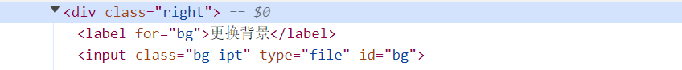

# AJAX 2 综合案例

## 传送门

传送门 https://apifox.com/apidoc/shared-1b0dd84f-faa8-435d-b355-5a8a329e34a8

## 01 图书管理


### Bootstrap 弹框

**功能：**不离开当前页面，显示单独内容，供用户操作

1. 通过属性控制，弹框显示或隐藏  => 使用场景：单纯显示/隐藏
2. 通过 JS 控制，弹框显示或隐藏     => 额外逻辑代码

**步骤：**

1. 引入 bootstrap.css 和 bootstrap.js
2. 准备弹框标签，确认结构
3. 通过自定义属性，控制弹框的显示和隐藏


**Bootstrap引入有两种方法**，① 是本地方式引入Bootstrap（在官网下载之后 在HTML文件中引入）

② 通过[CDN](https://so.csdn.net/so/search?q=CDN&spm=1001.2101.3001.7020)引用Bootstrap。

黑马程序员这个视频是使用 jsdelivr  这个CDN进行引入。JSDelivr是一款开源的免费公共CDN。它是目前第二受欢迎的公共CDN。2020年10月14日，JSDelivr成为Bootstrap的官方CDN。

> https://getbootstrap.com/ 


### 图书管理-渲染列表

> V:\Web\mycode\AJAX\2-2案例_图书管理\index.html

自己的图书数据：给自己起个外号，并告诉服务器（每个人的图书数据都不一样），默认会有三本书，基于这三本书做数据的增删改查


### 图书管理-添加图书

点击添加按钮=>弹框=>添加/取消=>渲染页面

### 图书管理-删除图书

绑定点击事件（获取图书ID）=>调用删除接口=>刷新-图书列表

### 图书管理 - 编辑图书

编辑图书-弹框（显示&隐藏）=>表单（数据回显）=>保存修改&刷新列表

要从服务器中获取，不能直接从表单里拿

## 02 图片上传

1、获取图片文件对象

2、使用 FormData 携带图片文件

```
const fd = new FormData()
fd.append(参数名，值)
这里的参数名与接口文档中定义的 img 保持一致
参数名字一定要写单引号
  fd.append('avatar', e.target.files[0])
  fd.append('creator', creator)
```


3、提交表单数据到服务器，使用图片 url 网址

> **V:\Web\mycode\AJAX\2-3图片上传\index.html**

```html
<body>
  <!-- 文件选择元素 -->
  <input type="file" class="upload">
  

  <script src="https://cdn.jsdelivr.net/npm/axios/dist/axios.min.js"></script>
  <script>
    /**
     * 目标：图片上传，显示到网页上
     *  1. 获取图片文件
     *  2. 使用 FormData 携带图片文件
     *  3. 提交到服务器，获取图片url网址使用
    */
    
    // 文件选择元素=>change改变事件
    document.querySelector('.upload').addEventListener('change',
    e => {
      // 获取图片文件
      console.log(e.target);
      console.log(e.target.files);
      console.log(e.target.files[0]);
      // 使用 FormData 携带图片文件
      const fd = new FormData()
      fd.append('img', e.target.files[0])
      axios({
        url: 'http://hmajax.itheima.net/api/uploadimg',
        method: 'POST',
        data: fd
      }).then(result => {
        console.log(result);
        const imgURL = result.data.data.url
        document.querySelector('.myImg').src = imgURL
      })
    })
  </script>
</body>

```

## 03 更换图片

表单关联，label和input的值关联，这样点击label 就能触发表单



## 04 个人信息设置

步骤：

1. 信息渲染
2. 头像修改
3. 信息修改 提交表单
4. 结果提示

怎么分析步骤？网址一打开，首先肯定要渲染页面，然后再分析修改功能

### 信息渲染

自己的用户信息：给自己起个外号，并告诉服务器，获取对应的用户信息

获取数据=>渲染信息

### 头像修改

获取到用户选择的头像文件=>提交到服务器=>返回服务器上 图片的URL网址=> 渲染

#### 补充知识点：label扩大表单的范围

label扩大表单的范围，用label中for属性的值，关联了input表单里面 ID的值，所以点在label上就等于点在了文件选择表单上


### 信息修改

收集表单信息 => 提交到服务器保存

一次性收集表单所有值：name，一个表单内