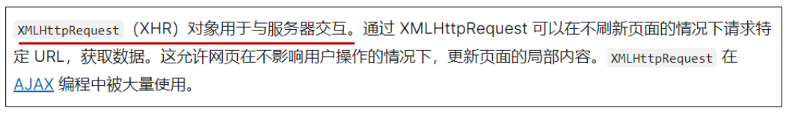
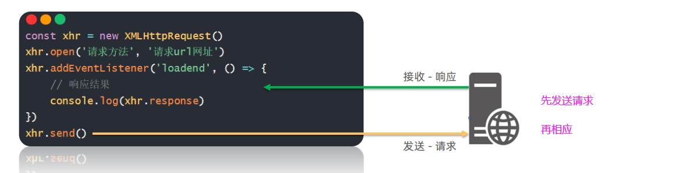
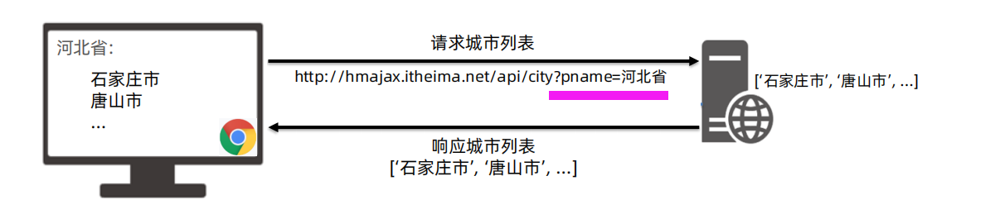
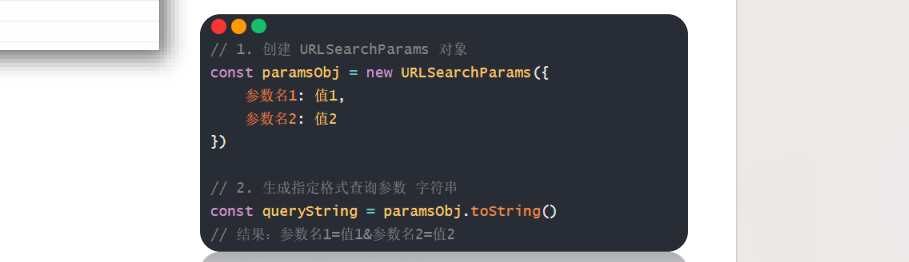
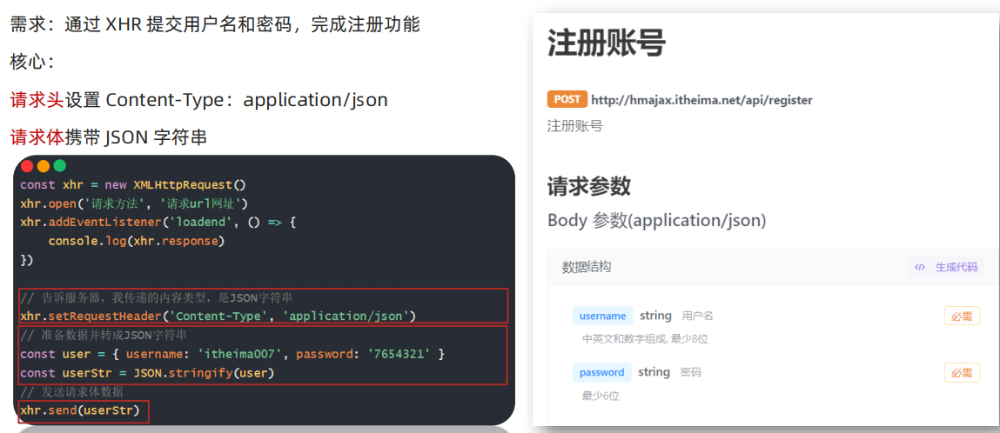
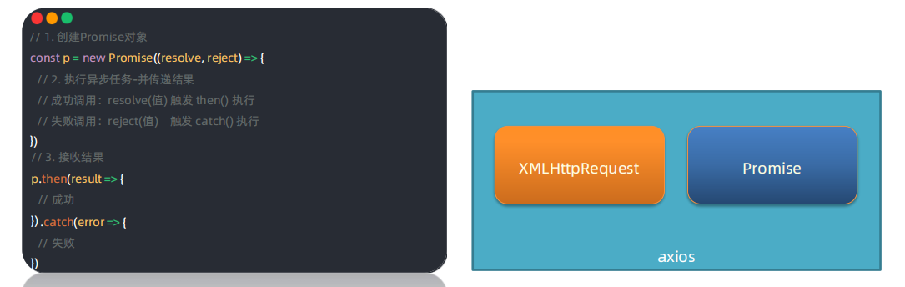
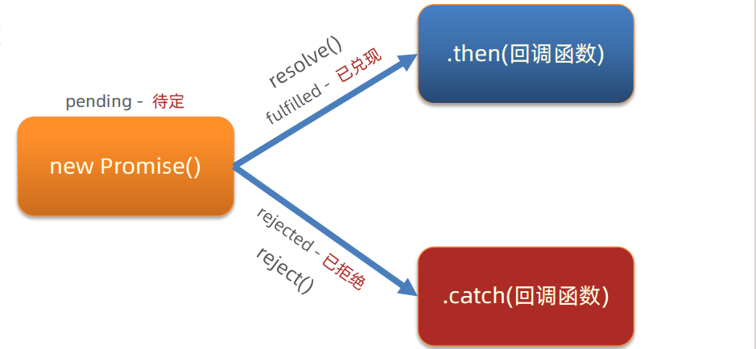
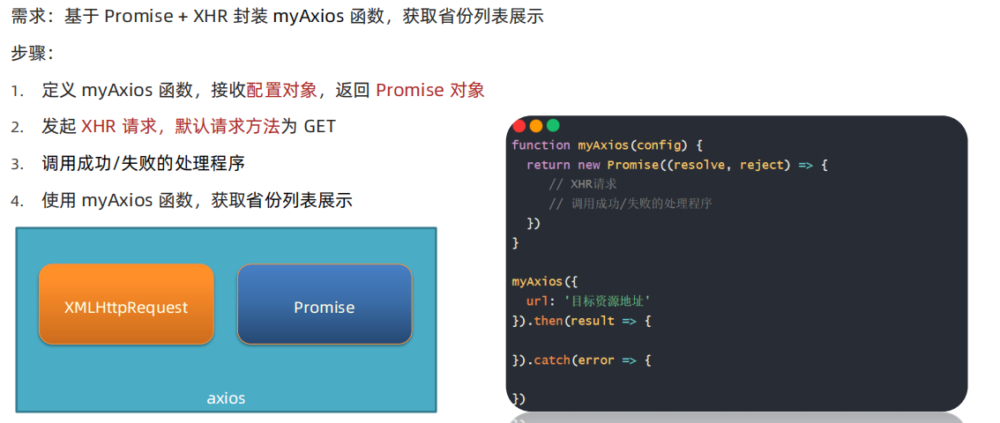
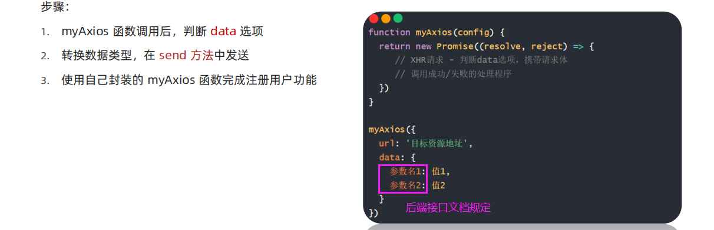

# AJAX 3 原理

## 01 XMLHttpRequest

### ① XHR 定义



### ② XHR & axios 关系

axios 内部采用 XMLHttpRequest 与服务器交互


学习XHR的好处：掌握使用 XHR 与服务器进行数据交互，了解 axios 内部原理

### ③ 使用 XHR

步骤：

1. 创建 XMLHttpRequest 对象
2. 配置请求方法和请求 url 地址
3. 监听 loadend 事件，接收响应结果
4. 发起请求



**举例：**

<font color="red">在axios中，会自动把提交/返回的 JSON 字符串转变为数组，但是原生的 XMLHttpRequest  不会。</font>

```javascript
  // 1. 创建 XMLHttpRequest 对象
  const xhr = new XMLHttpRequest()

  // 2. 配置请求方法和请求 url 地址
  xhr.open('GET','http://hmajax.itheima.net/api/province')

  // 3. 监听 loadend 事件，接收响应结果
  // loadend ：请求和相应都完成了，就会触发这个回调函数
  xhr.addEventListener('loadend', () => {
    console.log(xhr.response);
    const data = JSON.parse(xhr.response)
    console.log(data);
  })

  // 4. 发起请求
  xhr.send()
```


```
1. AJAX 原理是什么？
➢ XMLHttpRequest 对象
2. 为什么学习 XHR？
➢ 有更多与服务器数据通信方式
➢ 了解 axios 内部原理
3. XHR 使用步骤？
➢ 创建 XHR 对象
➢ 调用 open 方法，设置 url 和请求方法
➢ 监听 loadend 事件，接收结果
➢ 调用 send 方法，发起请求
```


### ④ XHR查询参数

定义：浏览器提供给服务器的额外信息，让服务器返回浏览器想要的数据

语法：```http://xxxx.com/xxx/xxx?参数名1=值1&参数名2=值2```



<font color="red">区别axios，axios中有一个params的参数，会自动把里面的参数 拼接到url中，但是XHR中没有，我们可以利用 URLSearchParams</font>

**举例：**

```javascript
  const xhr = new XMLHttpRequest()
  xhr.open('GET','http://hmajax.itheima.net/api/city?pname=辽宁省')
  xhr.addEventListener('loadend', () => {
    console.log(xhr.response);
    const text = document.querySelector('.text')
    text.innerHTML = JSON.parse(xhr.response).list.join('<br>')
  })
  xhr.send()
```

### 案例：地区查询（URLSearchParams）

需求：输入省份和城市名字，查询地区列表

请求地址：```http://hmajax.itheima.net/api/area?参数名1=值1&参数名2=值2```

- 注意上面的参数名 是后端规定的 


在表单中输入省份、城市的名字，获取对象。我们要传递两个参数到服务器，传递多个参数的语法如上。不过这里是需要在表单中获取。可以自己定义一个对象，然后转换成```参数名1=值1&参数名2=值2```这样的格式，不过可以借助插件。



案例：

>V:\Web\04 AJAX\Day03_AJAX原理\03-code\03.案例_地区查询\index.html

```javascript
  /**
   * 目标: 根据省份和城市名字, 查询对应的地区列表
  */
  // 1. 查询按钮-点击事件
  document.querySelector('.sel-btn').addEventListener('click', () => {
    // 2. 收集省份和城市名字
    const pname = document.querySelector('.province').value
    const cname = document.querySelector('.city').value

    // 3. 组织查询参数字符串
    const qObj = {
      pname,
      cname
    }
    // 查询参数对象 -> 查询参数字符串
    const paramsObj = new URLSearchParams(qObj)
    const queryString = paramsObj.toString()
    console.log(queryString)

    // 4. 使用XHR对象，查询地区列表
    const xhr = new XMLHttpRequest()
    xhr.open('GET', `http://hmajax.itheima.net/api/area?${queryString}`)
    xhr.addEventListener('loadend', () => {
      console.log(xhr.response)
      const data = JSON.parse(xhr.response)
      console.log(data)
      const htmlStr = data.list.map(areaName => {
        return `<li class="list-group-item">${areaName}</li>`
      }).join('')
      console.log(htmlStr)
      document.querySelector('.list-group').innerHTML = htmlStr
    })
    xhr.send()
  })
```

### ⑤ XHR数据提交 POST

以注册账号为例。

需求：通过 XHR 提交用户名和密码，完成注册功能

**核心：**

**请求头**设置 Content-Type：application/json

请求体携带 JSON 字符串

注意：请求体Body参数对应axios中的data属性



**案例：**

```html
<body>
  <button class="reg-btn">注册</button>
</body>
<script>
  /**
   * 目标：使用XHR进行数据提交-完成注册功能
   */

  // 点击注册按钮之后触发注册时间
  document.querySelector('.reg-btn').addEventListener('click',
  () => {
    // 假数据
    const newObj = {
      username: '11111111',
      password: '11111111'
    }
    
    // 1. 创建 XMLHttpRequest 对象
    const xhr = new XMLHttpRequest()
    // 2. 配置请求方法和请求 url 地址
    xhr.open('POST', 'http://hmajax.itheima.net/api/register')
    // 3. 监听 loadend 事件，接收响应结果
    // loadend ：请求和相应都完成了，就会触发这个回调函数
    xhr.addEventListener('loadend', () => {
      console.log(xhr.response);
    })
    // 设置请求头 
    xhr.setRequestHeader('Content-Type','application/json')
    const usrStr = JSON.stringify(newObj)
    // 4. 发起请求
    xhr.send(usrStr)
  })
</script>
```


## 02 Promise

### Promise 使用

**Promise对象用于表示一个异步操作的最终完成(或失败）及其结果值。**

学过的异步代码： setTimeout、 setInterval、AJAX

**使用Promise管理异步任务**

好处：

1. 逻辑更清晰
2. 了解 axios 函数内部运作机制
3. 能解决回调函数地狱问题

**语法：**



<font color="red">注意 : catch中打印error，不能用 console.log(error) ，而是要用 console.dir(error)</font>

**案例：**

```javascript
  // 目标：使用Promise管理异步任务

  // 1 创建Promis对象
  const p = new Promise((resolve,reject) => {
    // 2 执行异步代码
    setTimeout(()=> {
      // resolve('模拟AJAX请求-成功结果')
      reject(new Error('模拟AJAX请求-失败结果'))
    }, 2000)
  })

  // 3 获取结果
  p.then(result => {
    console.log(result);
  }).catch(error => {
    console.log(error);
  })
```


```
1. 什么是 Promise？
➢ 表示（管理）一个异步操作最终状态和结果值的对象
2. 为什么学习 Promise？
➢ 成功和失败状态，可以关联对应处理程序
➢ 了解 axios 内部原理(知道了axios的then和catch是怎么来的了)
3. Promise 使用步骤？
```

### Promise - 三种状态

作用：了解Promise对象如何关联地处理函数，以及代码执行顺序

概念：一个Promise对象，必然处于以下几种状态之一

✓ 待定（pending） ：初始状态，既没有被兑现，也没有被拒绝

✓ 已兑现（fulfilled） ：意味着，操作成功完成

✓ 已拒绝（rejected） ：意味着，操作失败

注意：Promise对象一旦被<font color="red">兑现/拒绝</font>就是<font color="red">已敲定</font>了，状态无法再被改变



```javascript
  // 创建Promis对象 pending 待定状态
  const p = new Promise((resolve,reject) => {
    // Promis对象 创建时，这里的代码都会执行了
    setTimeout(()=> {
      // resolve() => 'fullfilled状态-已兑现' => then()
      // resolve('模拟AJAX请求-成功结果')
      // reject() => 'rejected状态-已拒绝' => catch()
      reject(new Error('模拟AJAX请求-失败结果'))
    }, 2000)
  })

  console.log(p); // pending 待定状态

  // 3 获取结果
  p.then(result => {
    console.log(result);
  }).catch(error => {
    console.log(error);
  })
```


```
总结：
1. Promise 对象有哪 3 种状态？
➢ 待定 pending
➢ 已兑现 fulfilled
➢ 已拒绝 rejected
2. Promise 状态有什么用？
➢ 状态改变后，调用关联的处理函数
```

### 案例：使用Promise + XHR 获取省份列表

需求：使用 Promise 管理 XHR 获取省份列表，并展示到页面上

步骤：

1. 创建 Promise 对象
2. 执行 XHR 异步代码，获取省份列表
3. 关联成功或失败函数，做后续处理

```html
<body>
  <p class="my-p"></p>
</body>

<script>
  const p = new Promise((resolve,reject) => {
    const xhr = new XMLHttpRequest()
    xhr.open('GET','http://hmajax.itheima.net/api/province11')
    xhr.addEventListener('loadend', () => {
      console.log(xhr);
      // console.log(xhr.response);

      // 怎么把 XHR 和 Promise 联系起来
      // 利用响应状态码
      if(xhr.status >= 200 && xhr.status < 300) {
        resolve(xhr.response)
      } else {
        reject(new Error(xhr.response))
      }
    })
    xhr.send()
  })

  p.then(result => {
    console.log(result);
    const myP = document.querySelector('.my-p')
    myP.innerHTML = JSON.parse(result).list.join('<br>')
  }).catch(error => {
    console.dir(error)
    const myP = document.querySelector('.my-p')
    myP.innerHTML = error.message
  })
</script>
```


## 03 封装简易版 axios

需求：基于 Promise + XHR 封装 myAxios 函数，获取省份列表展示

步骤：

1. 定义 myAxios 函数，接收**配置对象**，返回 **Promise 对象**

   <font color="red">为什么要有配置**对象**：调用axios的时候，传进了url、params、data配置对象。为什么要返回Promise对象，因为我们在使用axios后，还可以使用 then catch。</font>

2. 发起 XHR 请求，默认请求方法为 GET

3. 调用成功/失败的处理程序

4. 使用 myAxios 函数，获取省份列表展示



```html
<body>
  <p class="myp"></p>
</body>
<script>
  // 需求：基于 Promise + XHR 封装 myAxios 函数，获取省份列表展示
  function myAxios(config) { // config是一个对象！
     return new Promise((resolve, reject) => {
      // 发起XHR请求 默认请求方法为GET
      const xhr = new XMLHttpRequest()
      xhr.open(config.method || 'GET', config.url)
      xhr.addEventListener('loadend', ()=>{
        if(xhr.status >= 200 && xhr.status < 300) {
          // 这里要模仿axios，axios是自动转换JSON字符的
          resolve(JSON.parse(xhr.response))
        } else {
          reject(new Error(xhr.response))
        }
      })
      xhr.send()
     })
  }

  myAxios({
    url: 'http://hmajax.itheima.net/api/province'
  }).then(result => {
    console.log(result);
    const myp = document.querySelector('.myp')
    myp.innerHTML = result.list.join('<br>')
  }).catch(error => {
    console.log(error);
    const myp = document.querySelector('.myp')
    myp.innerHTML = error.message
  })
</script>
```


### 完善1 myAxios-支持传递查询参数

需求：修改 myAxios 函数支持传递**查询参数**，获取"辽宁省"，"大连市"对应地区列表展示

步骤：

1. myAxios 函数调用后，判断 params 选项
2. 基于 URLSearchParams 转换查询参数字符串
3. 使用自己封装的 myAxios 函数展示地区列表

```javascript
  // 需求：修改 myAxios 函数支持传递查询参数，获取"辽宁省"，"大连市"对应地区列表展示
  function myAxios(config) { 
     return new Promise((resolve, reject) => {
      const xhr = new XMLHttpRequest()
      // 1 判断有params选项，携带查询参数
      if(config.params) {
        // 2 使用 URLSearchParams 转换，并携带url上
        const paramsObj = new URLSearchParams(config.params)
        const queryString = paramsObj.toString()
        // 把查询参数字符串，拼接在url ? 后面
        config.url += `?${queryString}`
      }
      xhr.open(config.method || 'GET', config.url)
      xhr.addEventListener('loadend', ()=>{
        if(xhr.status >= 200 && xhr.status < 300) {
          resolve(JSON.parse(xhr.response))
        } else {
          reject(new Error(xhr.response))
        }
      })
      xhr.send()
     })
  }
```

### 完善2 myAxios-支持传递请求体数据

需求：修改 myAxios 函数支持传递请求体数据，完成注册用户功能

步骤：

1. myAxios 函数调用后，判断 data 选项
2. 转换数据类型，在 send 方法中发送
3. 使用自己封装的 myAxios 函数完成注册用户功能




```javascript

  function myAxios(config) { 
     return new Promise((resolve, reject) => {
      const xhr = new XMLHttpRequest()
      if(config.params) {
        const paramsObj = new URLSearchParams(config.params)
        const queryString = paramsObj.toString()
        config.url += `?${queryString}`
      }
      xhr.open(config.method || 'GET', config.url)
      xhr.addEventListener('loadend', ()=>{
        if(xhr.status >= 200 && xhr.status < 300) {
          resolve(JSON.parse(xhr.response))
        } else {
          reject(new Error(xhr.response))
        }
      })
      // 1 判断有data选项，携带请求体
      if(config.data) {
        // 接口文档规定接受的字符是JSON
        const jsonStr = JSON.stringify(config.data)
        // 请求头
        xhr.setRequestHeader('Content-Type','application/json')
        xhr.send(jsonStr)
      } else {
        xhr.send()
      }
     })
  }
```


## 04 案例 - 天气预报

BV1MN411y7——P43

V:\Web\mycode\AJAX\3-9案例_天气预报\index.html