# AJAX 04 进阶

## 01 同步代码和异步代码

- **同步代码**

我们应该注意的是，实际上浏览器是按照我们书写代码的顺序一行一行地执行程序的。浏览器会等待代码的解析和工作，在上一行完成后才会执行下一行。这样做是很有必要的，因为每一行新的代码都是建立在前面代码的基础之上的。
这也使得它成为—个同步程序。

- **异步代码**

异步编程技术使你的程序可以在执行一个可能长期运行的任务的同时继续对其他事件做出反应而不必等待任务完成。与此同时，你的程序也将在任务完成后显示结果。


同步代码：逐行执行，需<font color="red">原地等待结果</font>后，才继续向下执行

异步代码：调用后<font color="red">耗时</font>，不阻塞代码继续执行（不必原地等待），在将来完成后触发一个<font color="red">回调函数</font>


**例子：打印数字的顺序是？**

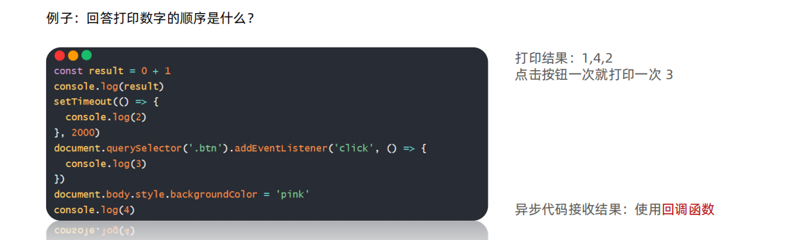

```	
总结：
1. 什么是同步代码？
➢ 逐行执行，原地等待结果后，才继续向下执行
2. 什么是异步代码？
➢ 调用后耗时，不阻塞代码执行，将来完成后触发回调函数
3. JS 中有哪些异步代码？
➢ setTimeout / setInterval
➢ 事件
➢ AJAX
4. 异步代码如何接收结果？
➢ 依靠回调函数来接收
```

## 02 回调函数地狱和 Promise 链式调用

### (1) 回调函数地狱

概念：在回调函数中嵌套回调函数，一直嵌套下去就形成了回调函数地狱

缺点：可读性差，异常无法捕获，耦合性严重，牵一发动全身

**举例：**

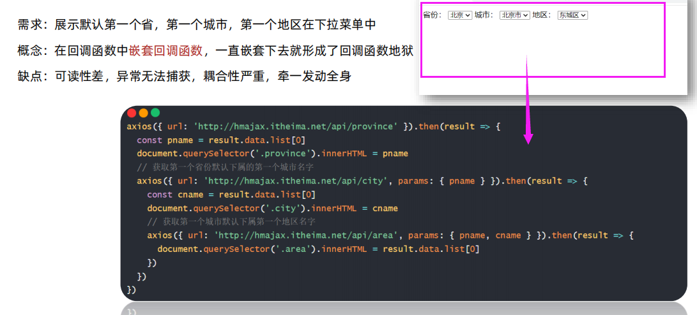

```javascript
/**
   * 目标：演示回调函数地狱
   * 需求：获取默认第一个省，第一个市，第一个地区并展示在下拉菜单中
   * 概念：在回调函数中嵌套回调函数，一直嵌套下去就形成了回调函数地狱
   * 缺点：可读性差，异常无法获取，耦合性严重，牵一发动全身
  */
  // 1. 获取默认第一个省份的名字
  axios({url: 'http://hmajax.itheima.net/api/province'}).then(result => {
    console.log(result);
    const pname = result.data.list[0]
    document.querySelector('.province').innerHTML = pname

    // 2. 获取默认第一个城市的名字
    axios({url:'http://hmajax.itheima.net/api/city', params:{pname}}).then(result =>{
      console.log(result);
      const cname = result.data.list[0]
      document.querySelector('.city').innerHTML = cname

      // 3. 获取默认第一个地区的名字
      axios({url: 'http://hmajax.itheima.net/api/area111', params:{pname,cname}}).then(result => {
        console.log(result);
        const areaName = result.data.list[0]
        document.querySelector('.area').innerHTML = areaName
      })
    })
  }).catch(error => {
    // 我们让 最【内】部“获取地区名字”的URL出错
    // 在最【外】层尝试捕获错误
    // 发现无法捕获
    console.dir(error); 
  })
```


```
总结
1. 什么是回调函数地狱？
➢ 在回调函数一直向下嵌套回调函数，形成回调函数地狱
2. 回调函数地狱问题？
➢ 可读性差
➢ 异常捕获困难
➢ 耦合性严重
```

### (2) Promise 链式调用

概念：依靠 then() 方法会返回一个<font color="red">新生成的 Promise 对象</font> 特性，继续串联下一环任务，直到结束

细节：then() 回调函数中的返回值，会影响新生成的 Promise 对象最终状态和结果

好处：通过链式调用，解决回调函数嵌套问题


```javascript
 // 1 创建Promise对象 模拟请求省份名字
  const p = new Promise((resolve, reject) => {
    setTimeout(() => {
      resolve('广东省') // 模拟 两秒之后 获取到 省份
    }, 2000)
  })

  // 2 获取 市 名字
  const p2 = p.then(result => {
    console.log(result);
    return new Promise((resolve, reject) => {
      setTimeout(() => {
        resolve(result + ' --- 深圳市') // 模拟 两秒之后 获取到 市
      }, 2000)
    })
  })

  console.log(p2 === p); // false 说明P2是一个全新的promise对象
  // then原地的结果是一个新的promise对象

  const p3 = p2.then(result => {
    console.log(result);
  })
```


```
总结
1. 什么是 Promise 的链式调用？
➢ 使用 then 方法返回新 Promise 对象特性，一直串联下去
2. then 回调函数中，return 的值会传给哪里？
➢ 传给 then 方法生成的新 Promise 对象
3. Promise 链式调用有什么用？
➢ 解决回调函数嵌套问题
```


### (3) Promise 链式应用

目标：使用 Promise 链式调用，解决回调函数地狱问题

做法：每个 Promise 对象中管理一个异步任务，用 then 返回 Promise 对象，串联起来

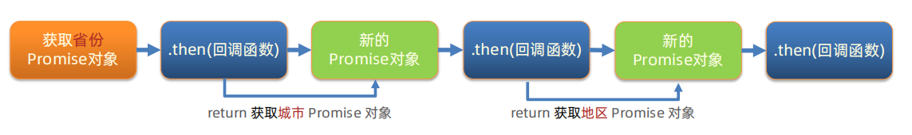

```javascript
  /**
     * 目标：把回调函数嵌套代码，改成Promise链式调用结构
     * 需求：获取默认第一个省，第一个市，第一个地区并展示在下拉菜单中
  */
  
  // axios会原地返回一个promise对象（因为实现逻辑就是这样）
  const p1 = axios({url:'http://hmajax.itheima.net/api/province'})

  let pname  = ''
  // 1 获取省份promise对象
  const p2 = p1.then(result => {
    console.log(result);
    pname = result.data.list[0]
    document.querySelector('.province').innerHTML = pname
    // return 返回一个 新的promise 对象（也就是一个axios对象）
    return axios({url:'http://hmajax.itheima.net/api/city',params:{pname}})
  })

  // 2 获取城市promise对象
  const p3 = p2.then(result => {
    console.log(result);
    const cname = result.data.list[0]
    document.querySelector('.city').innerHTML = cname
    return axios({url:'http://hmajax.itheima.net/api/area',params:{pname,cname}})
  })
  
  // 3 获取地区promise对象
  const p4 = p3.then(result => {
    console.log(result);
    const area = result.data.list[0]
    document.querySelector('.area').innerHTML = area
  })
```

**还可以不使用变量：**

```javascript
    let pname = ''
    // 1. 得到-获取省份Promise对象
    axios({url: 'http://hmajax.itheima.net/api/province'}).then(result => {
      pname = result.data.list[0]
      document.querySelector('.province').innerHTML = pname
      // 2. 得到-获取城市Promise对象
      return axios({url: 'http://hmajax.itheima.net/api/city', params: { pname }})
    }).then(result => {
      const cname = result.data.list[0]
      document.querySelector('.city').innerHTML = cname
      // 3. 得到-获取地区Promise对象
      return axios({url: 'http://hmajax.itheima.net/api/area', params: { pname, cname }})
    }).then(result => {
      console.log(result)
      const areaName = result.data.list[0]
      document.querySelector('.area').innerHTML = areaName
    })
```

## 03 async 和 await

### (1) async 和 await 使用

async 函数是使用async关键字声明的函数。async函数是AsyncFunction构造函数的实例，并且其中允许使用await关键字。**async和 await关键字让我们可以用一种更简洁的方式写出基于Promise 的异步行为，而无需刻意地链式调用promise 。**


**概念： 在 async 函数内，使用 await 关键字取代 then 函数，<font color="red">等待获取 Promise 对象成功状态的结果值</font>**

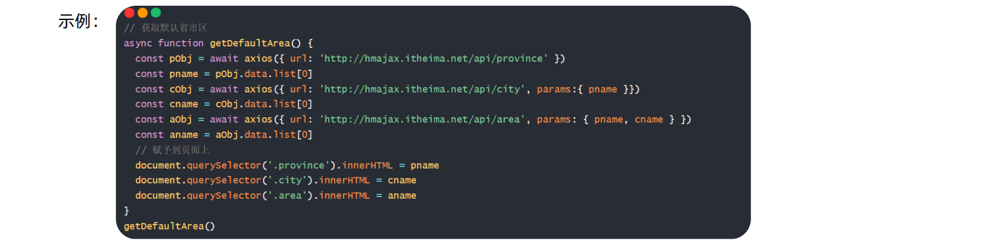

对一个函数 使用async关键字，这样这个函数就变成了异步函数。

在这个函数里面使用await关键字，await可以**原地等待**、然后返回**成功**状态结果值


<font color="blue">注意一定要调用 async 函数</font>

```javascript
  /**
   * 目标：掌握async和await语法，解决回调函数地狱
   * 概念：在async函数内，使用await关键字，获取Promise对象"成功状态"结果值
   * 注意：await必须用在async修饰的函数内（await会阻止"异步函数内"代码继续执行，原地等待结果）
  */
  async function getData() {
    const pObj = await axios({url:'http://hmajax.itheima.net/api/province'})
    const pname = pObj.data.list[0]

    const cObj = await axios({url:'http://hmajax.itheima.net/api/city', params:{pname}})
    const cname = cObj.data.list[0]

    const aObj = await axios({url:'http://hmajax.itheima.net/api/area', params:{pname,cname}})
    const area = aObj.data.list[0]
    

    document.querySelector('.province').innerHTML = pname
    document.querySelector('.city').innerHTML = cname
    document.querySelector('.area').innerHTML = area
    
  }
  getData() 
```

```
总结：
需要有一个被async修饰的函数
await【等待】PROMISE对象成功的【结果】
```

### (2) async函数和await捕获错误

因为是等待PROMISE对象成功的结果，如果错了怎么办？那就要使用到 try catch

**try . . .catch语句标记要尝试的语句块，并指定一个出现异常时抛出的响应。**

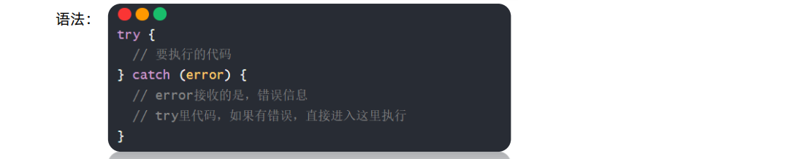

如果try里某行代码报错后，try中剩余的代码不会执行了

```javascript
  async function getData() {
    try {
      const pObj = await axios({url:'http://hmajax.itheima.net/api/province'})
      const pname = pObj.data.list[0]

      const cObj = await axios({url:'http://hmajax.itheima.net/api/city', params:{pname}})
      const cname = cObj.data.list[0]

      const aObj = await axios({url:'http://hmajax.itheima.net/api/area11', params:{pname,cname}})
      const area = aObj.data.list[0]
      

      document.querySelector('.province').innerHTML = pname
      document.querySelector('.city').innerHTML = cname
      document.querySelector('.area').innerHTML = area
    } catch(error) {
      // 接受错误信息
      console.dir(error);
      console.log(error.response.data.message);
    }
  }
  getData() 
```

## 04 事件循环-EventLoop

### (1) 事件循环

认识事件循环的好处：掌握 JavaScript 是如何安排和运行代码的

（下图打印结果都是132）

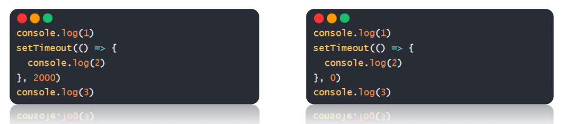


概念：JavaScript有一个基于事件循环的并发模型，事件循环负责执行代码、收集和处理事件以及执行队列中的子任务。这个模型与其它语言中的模型截然不同，比如C和Java。

原因：JavaScript 单线程（某一刻只能执行一行代码），为了让耗时代码不阻塞其他代码运行，设计了<font color="red">事件循环模型</font>


**事件循环定义**：执行代码和收集异步任务的模型，在调用栈空闲，反复调用任务队列里回调函数的执行机制，就叫事件循环

事件循环的模型分为三个部分：宿主环境（浏览器）、调用栈、任务队列

（注意浏览器是多线程但是 JS 是单线程）

耗费事件的异步代码会放在宿主环境中，在宿主环境被执行之后，他的回调函数会放到任务队列里排队，任务队列中的回调函数会在调用栈空闲的时候循环反复的执行。

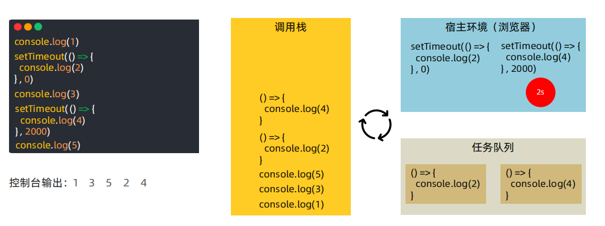

```
总结
1. 什么是事件循环？
➢ 执行代码和收集异步任务，在调用栈空闲时，反复调用任务队列里
回调函数执行机制
2. 为什么有事件循环？
➢ JavaScript 是单线程的，为了不阻塞 JS 引擎，设计执行代码的模型
3. JavaScript 内代码如何执行？
➢ 执行同步代码，遇到异步代码交给宿主浏览器环境执行
➢ 异步有了结果后，把回调函数放入任务队列排队
➢ 当调用栈空闲后，反复调用任务队列里的回调函数
```

### (2) 事件循环练习

```javascript
   /**
     * 目标：阅读并回答执行的顺序结果
    */
    console.log(1)
    setTimeout(() => {
      console.log(2)
    }, 0)
    function myFn() {
      console.log(3)
    }
    function ajaxFn() {
      const xhr = new XMLHttpRequest()
      xhr.open('GET', 'http://hmajax.itheima.net/api/province')
      xhr.addEventListener('loadend', () => {
        console.log(4)
      })
      xhr.send()
    }
    for (let i = 0; i < 1; i++) {
      console.log(5)
    }
    ajaxFn()
    document.addEventListener('click', () => {
      console.log(6)
    })
    myFn()
```

答案：1 5 3 2 4 点击一次document就会执行一次打印6


### (3) 宏任务与微任务

是对事件循环的补充。

**ES6 之后引入了 Promise 对象， 让 JS 引擎也可以发起异步任务**

异步任务分为：

✓ 宏任务：由**浏览器**环境执行的异步代码

✓ 微任务：由 **JS 引擎**环境执行的异步代码

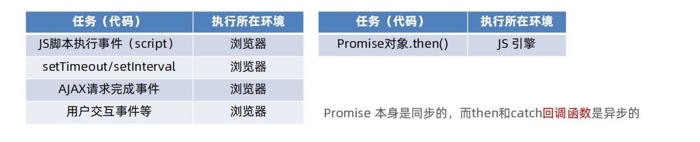

- Promise 本身是同步的，而then和catch回调函数是异步的

<font color="red">执行顺序：微任务队列清空后，才会执行下一个宏任务</font>

```
总结
1. 什么是宏任务？
➢ 浏览器执行的异步代码
➢ 例如：JS 执行脚本事件，setTimeout/setInterval，AJAX请求完成
事件，用户交互事件等
2. 什么是微任务？
➢ JS 引擎执行的异步代码
➢ 例如：Promise对象.then()的回调
3. JavaScript 内代码如何执行？
➢ 执行第一个 script 脚本事件宏任务，里面同步代码
➢ 遇到 宏任务/微任务 交给宿主环境，有结果回调函数进入对应队列
➢ 当执行栈空闲时，清空微任务队列，再执行下一个宏任务，从1再来
```


#### 事件循环 - 经典面试题

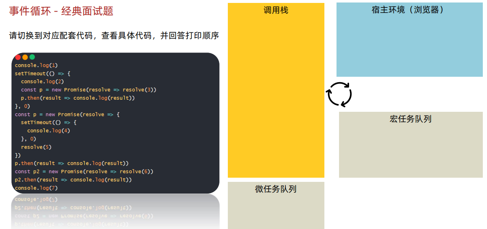

答案：1 7 5 6 2 3 4

执行顺序：

执行同步任务 1 

setTimeout放进宿主环境中 0秒之后，被推进宏任务队列中

const p = new Promise这个promise 本身是同步的，所以会执行里面的代码，setTimeout放进 浏览器环境，0秒之后，被推进宏任务队列中

p.then之中的函数是 异步调用，只有成功状态，才会被推进微任务中

## 05 Promise.all 静态方法

概念：合并多个 Promise 对象，等待所有同时成功完成（或某一个失败），做后续逻辑

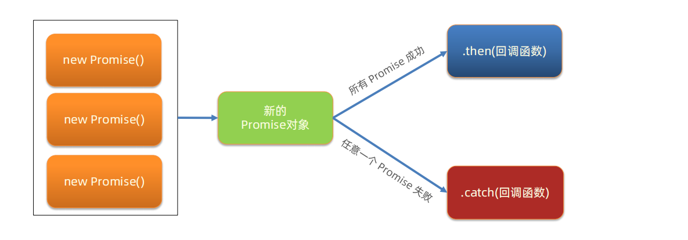

**语法：**

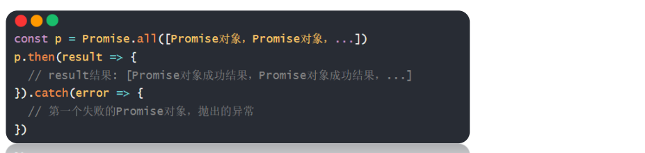


需求：同时请求“北京”，“上海”，“广州”，“深圳”的天气并在网页尽可能**同时**显示

```javascript
  // 1. 请求城市的天气 得到Promise对象
  const bjPromise = axios({url:'http://hmajax.itheima.net/api/weather',params: {city: '110100'}})
  const shPromise = axios({url:'http://hmajax.itheima.net/api/weather',params: {city: '310100'}})
  const gzPromise = axios({url:'http://hmajax.itheima.net/api/weather',params: {city: '440100'}})
  const szPromise = axios({url:'http://hmajax.itheima.net/api/weather',params: {city: '440300'}})

  // 2．使用Promise.all，合并多个Promise对象
  const p = Promise.all([bjPromise,shPromise,gzPromise,szPromise])
  p.then(result => {
    console.log(result);
    const htmlStr = result.map(item => {
      console.log(item);
      return`<li>${item.data.data.area} --- ${item.data.data.weather}</li>`
    }).join('')
    document.querySelector('.myul').innerHTML = htmlStr
  }).catch(error => {
    console.dir(error);
  })
```

```
总结
什么时候使用PROMISE.ALL：想要合并多个对象，同时等待大家的结果，在做后续处理
PROMISE.AL什么时候成功？所有小的对象都成功
```

## 06 案例 - 商品分类

需求：尽可能同时展示所有商品分类到页面上

步骤：

1. 获取所有的一级分类数据
2. 遍历id，创建获取二级分类请求
3. 合并所有二级分类Promise对象
4. 等待同时成功，开始渲染页面

> V:\Web\mycode\AJAX\4-9案例_商品分类\index.html

## 07 案例 - 学习反馈

> V:\Web\mycode\AJAX\4-10案例_学习反馈\index.html

 

**省市区切换**

1. 设置省份数据到下拉菜单
2. 切换省份，设置城市数据到下拉菜单，并清空地区下拉菜单
3. 切换城市，设置地区数据到下拉菜单

### 下拉菜单

```html
<select name="province" class="province">
            <option value="">省份</option>
          </select>
```

JS 获取下拉菜单的值，是获取不到文字的，只能获取到option的value属性，所以在渲染页面的时候就绑定value值

### 回调函数也可以用 async

```javascript
document.querySelector('.province').addEventListener('change',
async e => {

})
```

