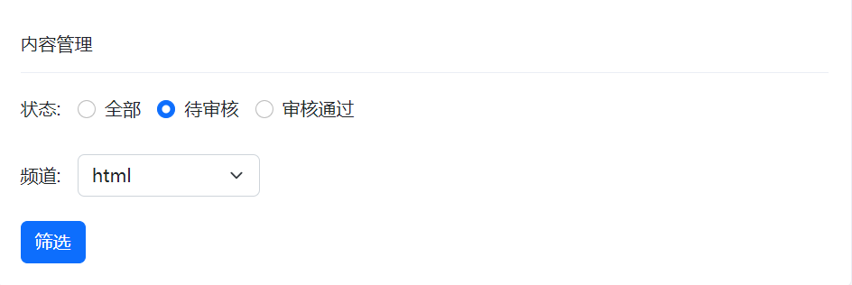

# AJAX 05 黑马头条-数据管理平台

注册登陆界面：

账号默认在登陆时就完成注册

密码默认只能是246810

> API地址：https://apifox.com/apidoc/shared-1b0dd84f-faa8-435d-b355-5a8a329e34a8/api-87683418


功能：

1. 登录和权限判断
2. 查看文章内容列表（筛选，分页）
3. 编辑文章（数据回显）
4. 删除文章
5. 发布文章（图片上传，富文本编辑器）


## 项目准备

**技术：**

• 基于 Bootstrap 搭建网站标签和样式

• 集成 wangEditor 插件实现富文本编辑器

• 使用原生 JS 完成增删改查等业务

• 基于 axios 与黑马头条线上接口交互

• 使用 axios 拦截器进行权限判断


**项目准备：**准备配套的素材代码

包含：html，css，js，静态图片，第三方插件等等

**目录管理：**建议这样管理，方便查找

• assets：资源文件夹（图片，字体等）

• lib：资料文件夹（第三方插件，例如：form-serialize）

• page：页面文件夹

• utils：实用程序文件夹（工具插件）

## 业务1：验证码登录

目标：完成验证码登录，后端设置验证码默认为 246810

原因：因为短信接口不是免费的，防止攻击者恶意盗刷

步骤：

1. 在 utils/request.js 配置 axios 请求**基地址**

作用：提取公共前缀地址，配置后 axios 请求时都会 baseURL + url

2. 收集手机号和验证码数据
3. 基于 axios 调用验证码登录接口
4. 使用 Bootstrap 的 Alert 警告框反馈结果给用户

### bootstrap提示框

已经写好了一个


默认是不显示的，加上show类才会显示。加上alert-danger 或者alert-success才会有样式。

在JS中我们有封装一个函数 

> V:\Web\mycode\AJAX\5-黑马头条-数据管理平台\page\login\index.js

### 实际业务中的验证码登录


在这一部分，前端调用了两个接口

### token

概念：访问权限的令牌，本质上是一串字符串

创建：正确登录后，由后端签发并返回


作用：判断**是否有登录状态**等，控制访问权限

注意：前端只能判断 token 有无，而后端才能判断 token 的有效性


目标：只有登录状态，才可以访问内容页面

步骤：

1. 在 utils/auth.js 中判断无 token 令牌字符串，则强制跳转到登录页（手动修改地址栏测试）
2. 在登录成功后，保存 token 令牌字符串到本地，再跳转到首页（手动修改地址栏测试）


```
总结
1. token 的作用？
✓ 判断用户是否有登录状态等
2. token 的注意：
✓ 前端只能判断 token 的有无
✓ 后端通过解密可以提取 token 字符串的原始信息，判断有效性
```


## 【注】HTML遗落的知识

1、form表单一定需要name属性才能提交

2、input 默认的值 可以在 value中设置


3、下拉框 HTML获取不到 文字，只能获取 value属性

4、JS 的引入要有顺序，比如在登陆页面index.js中 我的弹框 是调用alert.js里的函数得到的，那么在主页面引入的时候，上下顺序不可以反


5、label可以关联form表单元素 ：【做法】把label中的for属性 和 表单中的id设置为一样，就能关联


这里的意思是，不管是 点击了“封面”这个label元素，还是点击了 “+”加号这个 label元素，都会触发input 这个元素选择，（而且这个元素选择是被隐藏的）

6、清空表单

```javascript
const form = document.querySelector('form')
form.reset()
只能清空表单元素
```


## 【注】JS遗漏的知识

1、classList进行add和remove 的时候不可以加点

```javascript
document.querySelector('.place').classList.add('hide')
```

比如上文，hide是类名，前面不能加点

2、当点击 一个元素的时候，想要触发另一个元素的事件怎么办

——直接调用 该元素的事件函数

```javascript
document.querySelector('.rounded').addEventListener('click', () =>{
  document.querySelector('.img-file').click()
})
```

3、删除对象data中的id属性

```javascript
delete data.id
```


## 业务2：个人信息设置 & axios拦截器

需求：设置用户昵称

语法：axios 可以在 headers 选项传递请求头参数


**总结：**

1. 什么是 axios 请求拦截器？

✓ 发起请求之前，调用的一个<font color="red">函数</font>，对<font color="red">请求参数</font>进行<font color="red">额外的设置</font>

2. axios 请求拦截器，什么时候使用？

✓ 有<font color="red">公共配置</font>和设置时，统一设置在请求拦截器中

### axios请求拦截器

尚硅谷

> https://www.bilibili.com/video/BV1wr4y1K7tq?p=10&vd_source=ceab44fb5c1365a19cb488ab650bab03

因为在功能模块 个人信息渲染页面/所有频道渲染页面/文章列表，都需要用户资料。所以设置一个请求拦截器，每次都在请求头header处携带上token

这是一个请求拦截器，config是本次请求的配置参数

```javascript
// 这个JS文件 每个页面都引入了
axios.interceptors.request.use(function (config) {
  // 在发送请求之前做些什么
  console.log('===请求拦截器===');
  console.log(config);
  // 统一携带token令牌字符串在请求头上
  const token = localStorage.getItem('token')
  token && (config.headers.Authorization = `Bearer ${token}`)
  console.log(config);
  console.log('===请求拦截器===');
  return config
}, function (error) {
  // 对请求错误做些什么
  return Promise.reject(error)
})
```

### axios响应拦截器

axios 响应拦截器：响应回到 then/catch 之前，触发的拦截函数，对响应结果统一处理

例如：身份验证失败，统一判断并做处理


```javascript

axios.interceptors.response.use(function (response) {
  // 2xx 范围内的状态码都会触发该函数。
  return response;
}, function (error) {
  // 超出 2xx 范围的状态码都会触发该函数。
  // 对响应错误做点什么，例如：判断响应状态为 401 代表身份验证失败
  console.dir(error);
  if (error?.response?.status === 401) {
    alert('登录状态过期，请重新登录')
    localStorage.clear()//清空本地缓存
    window.location.href = '../login/index.html'// 回到登陆页面
  }
  return Promise.reject(error);
});
```


```
总结
1. 什么是 axios 响应拦截器？
✓ 响应回到 then/catch 之前，触发的拦截函数，对响应结果统一处理
2. axios 响应拦截器，什么时候触发成功/失败的回调函数？
✓ 状态为 2xx 触发成功回调，其他则触发失败的回调函数
```

**通过响应拦截器优化服务器相应效果**


```javascript
axios.interceptors.response.use(function (response) {
  // 2xx 范围内的状态码都会触发该函数。
  const result = response.data
  return result;
}, function (error) {
  // 略
});
```

## 业务3：发布文章

### 1. 富文本（wangEditor 插件）

富文本：带样式，多格式的文本，在前端一般使用标签配合内联样式实现

富文本编辑器：用于编写富文本内容的容器


目标：发布文章页，富文本编辑器的集成

**使用：wangEditor 插件**

步骤：参考文档

> https://www.wangeditor.com/v5/getting-started.html

1. 引入 CSS 定义样式
2. 定义 HTML 结构
3. 引入 JS 创建编辑器
4. 监听内容改变，保存在隐藏文本域（便于后期收集）

```html
  <link rel="stylesheet" href="https://cdn.bootcdn.net/ajax/libs/wangeditor5/5.1.23/css/style.min.css">
  <script src="https://cdn.bootcdn.net/ajax/libs/wangeditor5/5.1.23/index.min.js"></script>

```

### 2. 频道列表


### 3. 封面设置


**label可以关联form表单元素 ：【做法】把label中的for属性 和 表单中的id设置为一样，就能关联**


这里的意思是，不管是 点击了“封面”这个label元素，还是点击了 “+”加号这个 label元素，都会触发input 这个元素选择，（而且这个元素选择是被隐藏的）

刚开始 ``````这个标签是被隐藏的，因为没有选择图片。它和```<label for="img" class="place">+</label>```的关系是，当有图片之后，让label隐藏，让img显示


通过我们的定义的 show hide类 就可以实现``````

和 ```<label for="img" class="place">+</label>```的切换


<font color="red">**代码实战：**</font>


```javascript
// 文件选择对象； <input type="file" name="" id="">

document.querySelector('.img-file').addEventListener('change',
async e => {
  // 选择文件并保存在 FormData
  const file = e.target.files[0] // 文件对象
  const fd = new FormData()
  fd.append('image', file)

  // 单独上传图片并得到图片 URL 网址
  const res = await axios({
    url: '/v1_0/upload',
    method: 'POST',
    data: fd
  })

  const imgUrl = res.data.url
  document.querySelector('.rounded').src = imgUrl
  // 隐藏加号
  document.querySelector('.place').classList.add('hide')
  // 显示图片
  document.querySelector('.rounded').classList.add('show')
  
})
```

但是此时有一个问题，当 ``````显示之后，我想切换图片，但是无法触发了，因为```<label for="img" class="place">+</label>```被隐藏了。

所以<font color="blue">当点击img时，用 JS 的方式触发文件选择元素 的click 事件</font>

```javascript
document.querySelector('.rounded').addEventListener('click', () =>{
  document.querySelector('.img-file').click()
})
```

### 4. 收集并保存（form-serialize插件）


### 5、文章列表展示

目标1：获取文章列表并展示

1.1 准备查询参数对象

1.2 获取文章列表数据

1.3 展示到指定的标签结构中


### 6、筛选功能



注意这里 的实现是 先绑定，而不是等到点击按钮之后再绑定

```javascript
document.querySelectorAll('.form-check-input').forEach(item => {
  item.addEventListener('change',e => {
    aObj.staus = e.target.value
  })
})

document.querySelector('.form-select').addEventListener('change',
e => {
  console.log(e.target.value);
})

document.querySelector('.sel-btn').addEventListener('click',
e => {
  getAllArticle()
})
```

### 7、分页


```javascript
/**
 * 目标3：分页功能
 *  3.1 保存并设置文章总条数
 *  3.2 点击下一页，做临界值判断，并切换页码参数并请求最新数据
 *  3.3 点击上一页，做临界值判断，并切换页码参数并请求最新数据
 */

// 文章总条数
let totalCount = 0

// 点击下一页，做临界值判断
document.querySelector('.next').addEventListener('click',e => {
  if(aObj.page < Math.ceil(totalCount / aObj.per_page)) {
    aObj.page++
    getAllArticle()
    document.querySelector('.page-now').innerHTML = `第${aObj.page}页`
  }
})
// 点击下一页
document.querySelector('.last').addEventListener('click',e => {
  if(aObj.page > 1) {
    aObj.page--
    getAllArticle()
    document.querySelector('.page-now').innerHTML = `第${aObj.page}页`
  }
})
```

### 8、删除文章


点击删除图标，删除该篇文章

要使用事件委托，文章是使用模板字符串动态添加的，所以将文章ID 绑定在父元素TD上。一个编辑一个删除都需要文章ID 


#### 删除最后一条时的问题


### 9、编辑文章(页面跳转传参)


```javascript

// 点击编辑 获取文章ID 跳转到发布文章页面传递ID
document.querySelector('.art-list').addEventListener('click', async e => {
  if(e.target.classList.contains('edit')) {
    const aID = e.target.parentNode.dataset.id
    // ..回到父级的父级
    location.href = `../publish/index.html?id=${aID}`
  }
})
```


跨页面传参

async 和 awiat就近原则

### 10、退出登录


```javascript
// 3.1 绑定点击事件
document.querySelector('.quit').addEventListener('click', e => {
  // 3.2 清空本地缓存，跳转到登录页面
  localStorage.clear()
  location.href = '../login/index.html'
})

```

