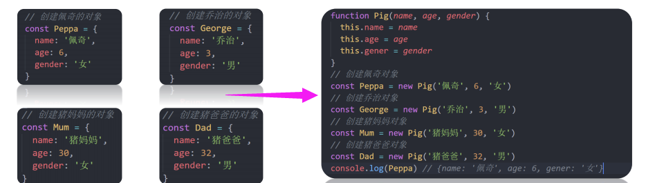
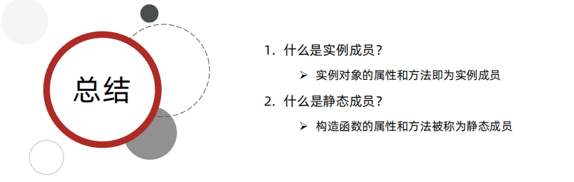
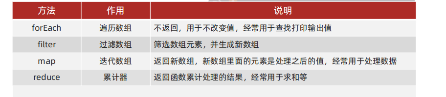
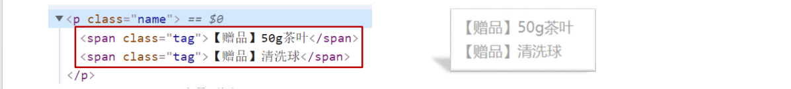

# 一、深入对象

## 1、创建对象三种方式

**1. 利用对象字面量创建对象**

```javascript
const obj = {
	name: 'pink',
	age: 18
}
```

**2.利用 new Object 创建对象**

```javascript
  const obj = new Object()
  obj.name = 'pink'
  console.log(obj)

  // 或者
  const obj = new Object({uname: 'pink'})
```

**3.利用构造函数创建对象**

## 2、构造函数

**构造函数 ：**是一种特殊的函数，主要用来**初始化对象**

**使用场景：**常规的 {...} 语法允许创建一个对象。比如我们创建了佩奇的对象，继续创建乔治的对象还需要重新写一遍，此时可以通过构造函数来快速创建多个类似的对象。




构造函数在技术上是常规函数，但为了跟别的函数有所区分，有两个约定：

1. 它们的命名以大写字母开头。
2. 它们只能由 "new" 操作符来执行。

```javascript
  function Pig(uname, age) {
    this.uname = uname
    this.age = age
  }
  const a = new Pig('佩奇', 6)
  const b = new Pig('佩奇', 6)
```

说明：

1. 使用 new 关键字调用函数的行为被称为**实例化**
2. 实例化构造函数时没有参数时可以省略 ()
3. 构造函数内部无需写return，返回值即为新创建的对象
4. 构造函数内部的 return 返回的值无效，所以不要写return
5. new Object（） new Date（） 也是实例化构造函数

### 实例化执行过程

说明：

1. 创建新对象
2. 构造函数this指向新对象
3. 执行构造函数代码，修改this，添加新的属性
4. 返回新对象

## 3、实例成员&静态成员

### 实例成员

通过构造函数创建的对象称为实例对象，实例对象中的<font color="red">属性和方法</font>称为实例成员。

**说明：**

1. 实例对象的属性和方法即为实例成员
2. 为构造函数传入参数，动态创建结构相同但值不同的对象
3. 构造函数创建的实例对象彼此独立互不影响

说明2：

```javascript
  // a b 是 通过同一个构造函数构造的，但是他俩是不同的对象
  function Pig(uname, age) {
    this.uname = uname
    this.age = age
  }
  const a = new Pig('佩奇', 6)
  const b = new Pig('佩奇', 6)
  console.log(a === b) // false 
```

### 静态成员

**静态成员：**

构造函数的属性和方法被称为静态成员

```javascript
// 构造函数
function Person(name, age) {

}
// 静态属性
Person.eyes = 2
Person.arms = 2

// 静态方法
Person.walk = () => {
	console.log('人走路中')
	console.log(this.eyes)
}
```

说明：

1. 构造函数的属性和方法被称为静态成员
2. 一般公共特征的属性或方法静态成员设置为静态成员
3. 静态成员方法中的 this 指向构造函数本身



# 二、内置构造函数

在 JavaScript 中最主要的数据类型有 6 种：

**基本数据类型：**字符串、数值、布尔、undefined、null

**引用类型:** 对象


但是，我们会发现有些特殊情况：

```javascript
const str = 'andy'
console.log(str.length) 
// 字符串str有属性方法，按照道理来说字符串属于简单数据类型
// 不是复杂数据类型（对象），它本应该是没有属性方法的

//JS底层完成：
const str = new String('pink')
```

<font color="red">其实字符串、数值、布尔、等基本类型也都有专门的构造函数，这些我们称为包装类型。</font>

包装：把基本数据类型包装成复杂数据类型

JS中几乎所有的数据都可以基于构造函数创建。


<font color="red">**JS 提供的内置构造函数: **</font>

**引用类型**

Object，Array，RegExp，Date 等

**包装类型**

String，Number，Boolean 等

注意所有的内置构造函数都是大写。

## 1、Object

Object 是内置的构造函数，用于创建普通对象。

```javascript
// 通过构造函数创建普通对象
const obj = new Object({name:'小明', age:15})
```

推荐使用字面量方式声明对象，而不是 Object 构造函数


**学习三个常用静态方法（静态方法就是只有构造函数Object可以调用的）**

- <font color="red">**方法一、二**</font>

以前想获得对象里面的属性和值怎么做的?

```javascript
const o = {name: '佩奇', age:6}

// 或者
for(let k in o) {
  console.log(k) // 属性 name age
  console.log(o[k]) // 值 佩奇 6
}
```

现在：

**作用：** **Object.keys**  静态方法获取对象中所有属性（键） ,返回的是数组。**Object.values**获得所有的属性值。

**语法：**

```javascript
const o = {name: '佩奇', age:6}
const arr = Object.keys(o)
console.log(arr) // ['name', 'age']
```

<font color="red">**方法三**</font>

**作用：**Object. assign 静态方法常用于对象拷贝

**语法：**

```javascript
  const old = {name: '佩奇', age:6}
  const newOne = {}
  Object.assign(newOne, old)
  console.log(newOne)
```

**使用场景：**经常使用的场景给对象添加属性

```javascript
  const o = {name: '佩奇', age:6}
  Object.assign(o, {gender:'女'})
  console.log(o) //  \{name: '佩奇', age: 6, gender: '女'}
```


## 2、Array

Array 是内置的构造函数，用于创建数组

```javascript
const arr = new Array(3, 5)
console.log(arr) // [3, 5]
```

创建数组建议使用字面量 ```const arr = [3,5]``` 创建，不用 Array构造函数创建

### ① 数组常见实例方法-核心方法

注意 实例方法 是实例对象中的方法。



<font color="red">**【reduce】**</font>

**作用：**reduce 返回函数累计处理的结果，经常用于求和等

**基本语法：**

```arr.reduce(function(){}, 起始值)```

```arr.reduce(function(上一次值，当前值){}, 起始值)```

**参数：**起始值可以省略，如果写就作为第一次累计的起始值

```javascript
 const arr = [1, 5, 8]
  
  // 1、没有初始值
  const total = arr.reduce(function(prev, current) {
    return prev + current // 14
  })
  
  // 2、有初始值
  const total2 = arr.reduce(function(prev, current) {
    return prev + current // 24
  },10)

//箭头函数写法
  const total3 = arr.reduce((prev,current) => prev+current, 10)
```


**执行流程：**

1. 如果没有起始值，则上一次值以数组的第一个数组元素的值
2. 每一次循环，把返回值给做为下一次循环的上一次值
3. 如果有起始值，则起始值做为上一次值


#### 练习：计算薪资

需求：

①：给员工每人涨薪 30%

②：然后计算需要支出的费用

数据：

```javascript
const arr = [
  {
    name: '张三',
    salary: 10000
  }, 
  {
    name: '李四',
    salary: 10000
  }, 
  {
    name: '王五',
    salary: 10000
  }
]

  // 求和
  const total = arr.reduce((prev, current) => {
    // return prev.salary + current.salary 这样是错的
    return prev + current.salary
  },0)
  //必须有初始值

  // 上一次值          当前值             返回值
  //  0(初始值)    10000(数组第1个)      10000
  // 10000         10000(数组第2个)      20000
  // 20000         10000(数组第3个)      30000
  
  // 涨薪 
  const totalNew = arr.reduce((prev, current) => prev + current.salary*1.3, 0)
```

### ② 数组其他方法

数组赋值后，无论修改哪个变量另一个对象的数据值也会相当发生改变。

总结：

1. 推荐使用字面量方式声明数组，而不是 `Array` 构造函数

2. 实例方法 `forEach` 用于遍历数组，替代 `for` 循环 (重点)

3. 实例方法 `filter` 过滤数组单元值，生成新数组(重点)

4. 实例方法 `map` 迭代原数组，生成新数组(重点)

5. 实例方法 `join` 数组元素拼接为字符串，返回字符串(重点)

6. 实例方法  `find`  查找元素， 返回符合测试条件的第一个数组元素值，如果没有符合条件的则返回 undefined(重点) <font color="red">在MDN中看</font>

7. 实例方法`every` 检测数组所有元素是否都符合指定条件，如果**所有元素**都通过检测返回 true，否则返回 false(重点)

8. 实例方法`some` 检测数组中的元素是否满足指定条件   **如果数组中有**元素满足条件返回 true，否则返回 false

9. 实例方法 `concat`  合并两个数组，返回生成新数组

10. 实例方法 `sort` 对原数组单元值排序

11. 实例方法 `splice` 删除或替换原数组单元

12. 实例方法 `reverse` 反转数组

13. 实例方法 `findIndex`  查找元素的索引值


- find

```javascript
  /*
  参数
  find(callbackFn)
  find(callbackFn, thisArg)

  返回值
  数组中第一个满足所提供测试函数的[元素]的值，否则返回 undefined。
  */
  const arr = ['red', 'blue', 'green']
  const re = arr.find(function(item) {
    return item === 'blue'
  })
  console.log(re); //blue

  // 实际场景
  // 需求：只取小米 不取华为。分析：要找小米这个【对象】，并且返回
  const arr2 = [
    {
      name: '小米',
      price: 1999
    },
    {
      name: '华为',
      price: 3999
    }
  ]

  const re2 = arr2.find(function(item) {
    // item是数组中的每一个元素  也就是对象
    // 返回的是数组元素 也就是对象
    return item.name === '小米'
  })
  console.log(re2); // {name: '小米', price: 1999}
```

- every

> arr.every(callback (element[, index [, array]]))  [, thisArg]  中括号表示可选

```javascript
  // every 
  const arr4 = [10, 20, 30]
  const flag = arr4.every(item => item >= 10)
  console.log(flag);
```

##### 练习

const spec = { size: '40cm*40cm' , color: '黑色'}

请将里面的值写到div标签里面，展示内容为：40cm*40cm/黑色

思路： 获得所有的属性值，然后拼接字符串就可以了

①： 获得所有属性值是： Object.values() 返回的是数组

②： 拼接数组是 join(‘’) 这样就可以转换为字符串了

```
const spec = { size: '40cm*40cm' , color: '黑色'}
document.querySelector('div'.innerHTML) = Object.value(spec).join('/')
```

### ③ 伪数组转换为真数组

静态方法 Array.from()

```javascript
// 伪数组没有pop方法
const lis = document.querySelectorAll('ul li')
const lis2 = Array.from(lis)
lis2.pop()
```


## 3、String

**回顾包装类型：**

在 JavaScript 中的字符串、数值、布尔具有对象的使用特征，如具有属性和方法。之所以具有对象特征的原因是字符串、数值、布尔类型数据是 JavaScript 底层使用 Object 构造函数“包装”来的，被称为**包装类型**。

### ① 常见实例方法

总结：

1. 实例属性 `length` 用来获取字符串的度长(重点)
2. 实例方法 `split('分隔符')` 用来将字符串拆分成数组(重点)
3. 实例方法 `substring（需要截取的第一个字符的索引[,结束的索引号]）` 用于字符串截取(重点)
4. 实例方法 `startsWith(检测字符串[, 检测位置索引号])` 检测是否以某字符开头(重点)
5. 实例方法 `includes(搜索的字符串[, 检测位置索引号])` 判断一个字符串是否包含在另一个字符串中，根据情况返回 true 或 false(重点)
6. 实例方法 `toUpperCase` 用于将字母转换成大写
7. 实例方法 `toLowerCase` 用于将就转换成小写
8. 实例方法 `indexOf`  检测是否包含某字符
9. 实例方法 `endsWith` 检测是否以某字符结尾
10. 实例方法 `replace` 用于替换字符串，支持正则匹配
11. 实例方法 `match` 用于查找字符串，支持正则匹配

注：String 也可以当做普通函数使用，这时它的作用是强制转换成字符串数据类型。


- split

```javascript
  const str = 'pink,red'
  const arr = str.split(',')
  console.log(arr); //  ['pink', 'red']

  const str2 = '2022-4-8'
  const arr2 = str2.split('-')
  console.log(arr2); // ['2022', '4', '8']
  // 这里是字符型数组 因为切割的是字符串4
```

- substring

> str.substring(indexStart[, indexEnd]) 中括号表示可以省略
>
> 字串的范围 是 [ indexStart ，indexEnd ) 左闭右开区间

```javascript
const str = 'Mozilla';

console.log(str.substring(1, 3));
// Expected output: "oz"

console.log(str.substring(2));
// Expected output: "zilla"
```

- startsWith

> str.startsWith( searchString [, position] ) 
>
> position默认从0开始 ，返回值是布尔值

```javascript
const str = "To be, or not to be, that is the question.";

console.log(str.startsWith("To be")); // true
console.log(str.startsWith("not to be")); // false
console.log(str.startsWith("not to be", 10)); // true
```

- includes

```javascript
const str = "To be, or not to be, that is the question.";

console.log(str.includes("To be")); // true
console.log(str.includes("question")); // true
console.log(str.includes("nonexistent")); // false
console.log(str.includes("To be", 1)); // false
console.log(str.includes("TO BE")); // false
console.log(str.includes("")); // true
```

#### 练习：显示赠品

请将下面字符串渲染到准备好的 p标签内部，结构必须如左下图所示，展示效果如右下图所示：
```const gift = '50g茶叶,清洗球'```




```html
/*思路：
①：把字符串拆分为数组，这样两个赠品就拆分开了 用那个方法？
②：利用map遍历数组，同时把数组元素生成到span里面，并且返回
③：因为返回的是数组，所以需要 转换为字符串, 用那个方法？
④：p的innerHTML 存放刚才的返回值*/

<body>
  <p></p>
</body>
<script>
  const gift = '50g茶叶,清洗球'
  const arr = gift.split(',')
  // const str =''
  // for(let i = 0; i < arr.length; i++) {

  // }

  const str = arr.map(function(item) {
    return `<span>【赠品】${item}<span> <br>`
  }).join('')

  const p = document.querySelector('p')
  p.innerHTML = str
</script>
```

- 转换为字符串，两种方法

```
const num = 10
console.log(String(num))
console.log(num.toString())
```


## 4、Number

Number 是内置的构造函数，用于创建数值

常用方法：toFixed() 设置保留小数位的长度 **四舍五入**

```javascript
const price = 12.345
console.log(price.toFixed(2)) // 12.35

const price2 = 10
console.log(price.toFixed(2)) // 10.00
```


# 综合案例

> V:\Web\mycode\JS2-8综合案例素材.html

