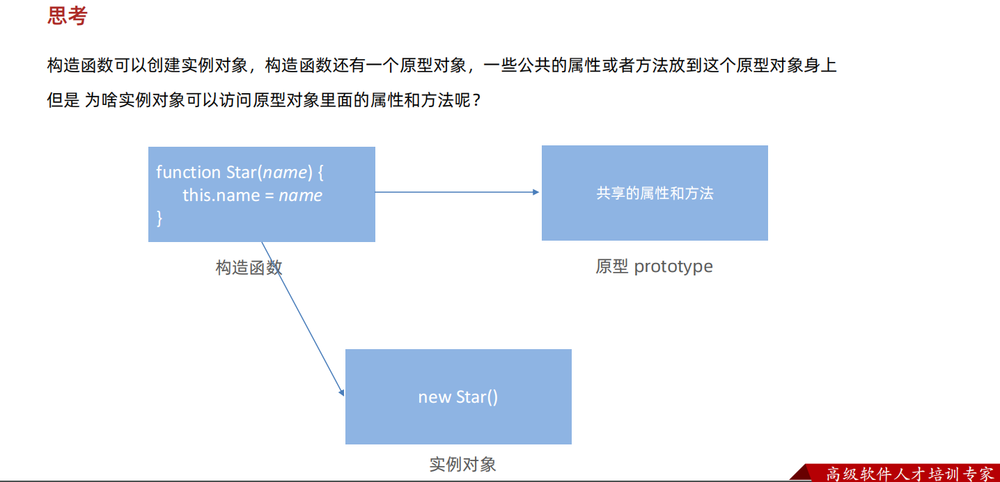
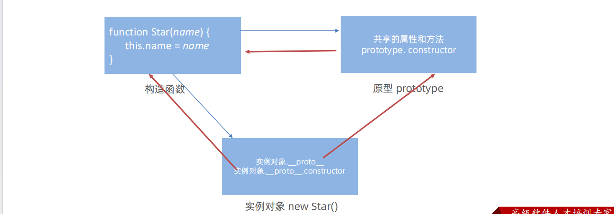
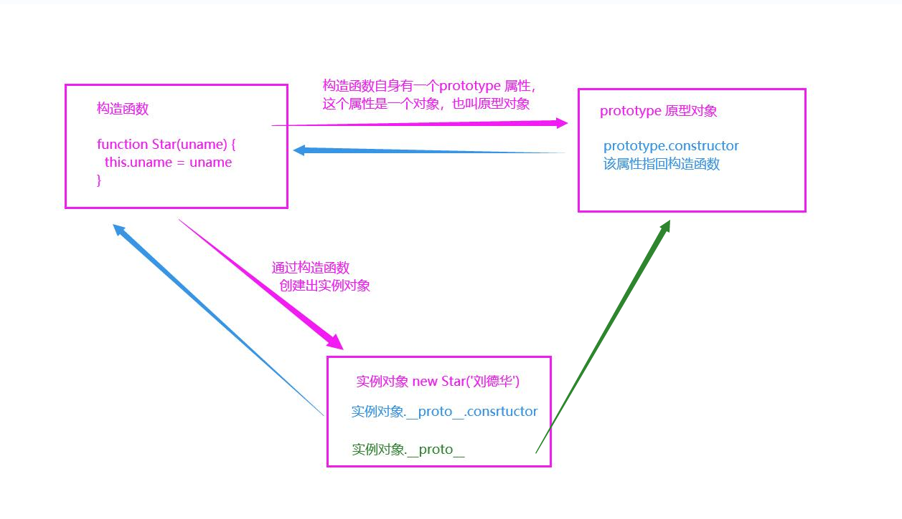
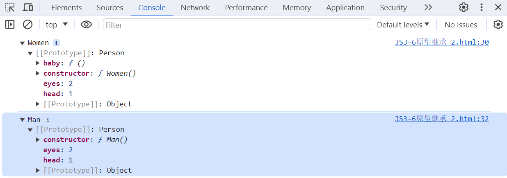
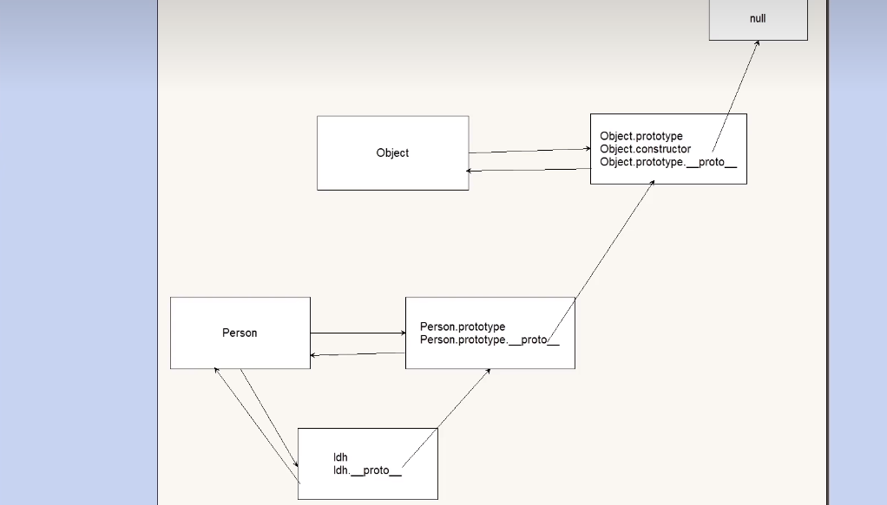

# 编程思想

## 面向过程介绍

**面向过程**就是分析出解决问题所需要的步骤，然后用函数把这些步骤一步一步实现，使用的时候再一个一个的依次调用就可以了。

面向过程，就是按照我们分析好了的步骤，按照步骤解决问题。

## 面向对象介绍

**面向对象**是把事务分解成为一个个对象，然后由对象之间分工与合作。

面向对象是以对象功能来划分问题，而不是步骤。

- 在面向对象程序开发思想中，每一个对象都是功能中心，具有明确分工。

- 面向对象编程具有灵活、代码可复用、容易维护和开发的优点，更适合多人合作的大型软件项目。

- 面向对象的特性：封装性、继承性、多态性


# 构造函数

封装是面向对象思想中比较重要的一部分，js 面向对象可以通过构造函数实现的封装。

- 同样的将变量和函数组合到了一起并能通过 this 实现数据的共享，所不同的是 JS **借助构造函数**创建出来的实例对象之间是彼此不影响的


- 前面我们学过的构造函数方法很好用，但是 存在浪费内存的问题


我们希望所有的对象使用同一个函数，这样就比较节省内存，那么我们要怎样做呢?


# 原型

## 1、介绍

目标：能够利用原型对象实现方法共享

- 构造函数通过原型分配的函数是所有对象所 **共享的**。

- JavaScript 规定，**每一个构造函数都有一个 prototype 属性**，指向另一个对象，所以我们也称为原型对象

- 这个对象可以挂载**函数**，对象实例化不会多次创建原型上函数，节约内存

- 我们可以把那些不变的方法，直接定义在 prototype 对象上，这样所有对象的实例就可以共享这些方法。

- 构造函数和原型对象中的this 都指向 实例化的对象

- <font color="red">注意：这里不可以使用箭头函数，因为箭头函数的this指向上一层 </font>


```javascript
  // 我们可以把那些不变的方法，直接定义在 prototype 对象上
  function Star(uname, age) {
    this.uname = uname
    this.age = age
  }
  Star.prototype.sing = function() {
    console.log(唱歌)
  }

  const ldh = new Star('刘德华',55)
  const zxy = new Star('张学友',58)
  console.log(ldh.sing === zxy.sing); //true
```

```javascript
  // 构造函数和原型对象中的this 都指向 实例化的对象
  let that
  function Star(uname) {
    that = this
    this.uname = uname
  }
  let that2
  Star.prototype.sing = function() {
    that2 = this
    console.log('唱歌');
  }
  // 构造函数中的this指向实例化对象
  const ldh = new Star('刘德华')
  console.log(that === ldh) // true
  
  // 原型对象中的this指向实例化对象
  ldh.sing()
  console.log(that2 === ldh) // true
```

### 练习：给数组扩展方法

需求：

①：给数组扩展求最大值方法和求和方法

比如： 以前学过 const arr = [1,2,3]。arr.reverse() 结果是 [3,2,1]

扩展完毕之后：arr.sum() 返回的结果是 6

```javascript
  // 求最大值
  Array.prototype.max = function() {
    return Math.max(...this) // 展开运算符
  }
  Array.prototype.min = function() {
    return Math.min(...this) // 展开运算符
  }
  Array.prototype.sum = function() {
    return this.reduce( (prev,item)=> prev + item,0)
  }

  const arr = new Array(1,2,3) // 数组实例化
  console.log(arr);

  console.log(arr.max());
  console.log(arr.min());
  console.log(arr.sum());
```


## 2、constructor 属性

每个原型对象 prototype 里面都有个constructor 属性（constructor 构造函数）

**作用：** **该属性指向该原型对象的构造函数**， 简单理解，就是指向我的爸爸，我是有爸爸的孩子


```javascript
  function Star() {
  }
  const ldh = new Star()
  console.log(Star.prototype.constructor === Star); // true
```

<font color="red">**constructor 的具体作用讲解：**</font>

```javascript
  // 背景需求：我们在原型中添加函数的时候，有可能需要一次性加很多个。
  function Star2() {
  }

  // Star2.prototype.sing = function() {
  //   console.log('唱歌');
  // }
  // Star2.prototype.dance = function() {
  //   console.log('跳舞');
  // }
  console.log(Star2.prototype); // {constructor: ƒ}
  console.log(Star2.prototype.constructor); //ƒ Star2() {}

  // 我们想到或许可以用这种方法添加函数：
  Star2.prototype = {
    sing: function() {
      console.log('唱歌');
    },
    dance: function() {
      console.log('跳舞');
    }
  }
  console.log(Star2.prototype); //{sing: ƒ, dance: ƒ}
  console.log(Star2.prototype.constructor); // ƒ Object() { [native code] }

  // 但是这种方式出现了问题，这样子的prototype是赋值，不是追加。
  // 原型失去了原本的constructor
```


```javascript
// 解决方法是 加一条constructor: Star 重新指回去。这就是加一条constructor的用处
  Star2.prototype = {
    constructor: Star,
    sing: function() {
      console.log('唱歌');
    },
    dance: function() {
      console.log('跳舞');
    }
  }
  console.log(Star2.prototype); // {sing: ƒ, dance: ƒ}
  console.log(Star2.prototype.constructor); // ƒ Star2() {}
```


## 3、对象原型

思考：



<font color="red">对象都会有一个属性 ```__proto__```  </font>指向构造函数的 prototype 原型对象，之所以我们对象可以使用构造函数 prototype 原型对象的属性和方法，就是因为对象有  ```__proto__ ```原型的存在。


```javascript
  function Star() {}
  const ldh = new Star()
  console.log(ldh);
```


注意：

- ```__proto__``` 是 JS 非标准属性

- [[prototype]]（谷歌浏览器）和```__proto__```意义相同

  意思就是如果想在谷歌浏览器控制台查看，就要用 ```【实例对象.__proto__】```

- 用来表明当前实例对象指向哪个原型对象prototype

- ```__proto__```对象原型里面也有一个 constructor属性，指向创建该实例对象的构造函数

```javascript
  function Star() {}
  const ldh = new Star()
  console.log(ldh);
  // 当前实例对象指向哪个原型对象prototype
  console.log(ldh.__proto__ === Star.prototype); //true
  
  // __proto__对象原型里面也有一个 constructor属性，指向创建该实例对象的构造函数
  console.log(ldh.__proto__.constructor === Star); //true
```

### 构造函数、实例对象、原型的关系

先有构造函数 function Star。用户通过 new Star，创建实例对象。构造函数 Star中 有属性：prototype原型（因为原型是一个对象，所以也叫作原型对象）。

实例对象 new Star()中：

实例对象有一个属性```__proto__```（对象原型）指向构造函数的 prototype属性（原型对象）。

实例对象的```__proto__.constructor``` 指回构造函数 Star。

原型对象prototype中：

constructor指回构造函数 Star。




### 练习

1. prototype是什么？哪里来的？

原型（原型对象）

构造函数都自动有原型

2. constructor属性在哪里？作用干啥的？

 prototype原型和对象原型__proto__里面都有

 都指向创建实例对象/原型的构造函数

3. `__proto__`属性在哪里？指向谁？

 在实例对象里面

 指向原型 prototype



## 4、原型继承

继承是面向对象编程的另一个特征，通过继承进一步提升代码封装的程度，JavaScript 中大多是借助原型对象实现继承的特性。

**说明：**

有女人构造函数Women、男人构造函数Men。

```javascript

  function Women() {
    this.eyes = 2
    this.head = 1
  }
  const red = new Women()
  console.log(red);


  function Men() {
    this.eyes = 2
    this.head = 1
  }
  const black = new Men()
  console.log(black);
```

因为构造函数中的属性都是一样，所以可以提取一个Person

```javascript
  const Person = {
    eyes = 2
    head = 1
  }
  function Women() {}
  function Man() {}

  Women.prototype = Person // 通过原型继承
  Women.prototype.constructor = Women //  补充一个指回

  Man.prototype = Person
  Man.prototype.constructor = Man


  const red = new Women()
  console.log(red);
  const black = new Man()
  console.log(black);
```

**通过原型继承**

现在想要给女人增加一个生孩子函数 baby

```javascript
Women.prototype.baby = function { console.log('生孩子')}

console.log(red);
console.log(black);
```

结果发现男人也能生孩子。这是因为两者都继承了同一个对象Person

所以通过 Women.prototype = Person 和 Man.prototype = Person 这种继承是不合理的 


**所以可以通过构造函数 new对象，而不是const 生成对象**

```javascript
function Person() {
    this.eyes = 2
    this.head = 1
}
function Women() {}
function Man() {}

Women.prototype = new Person() // 通过原型继承
Women.prototype.constructor = Women //  补充一个指回

Man.prototype = new Person()
Man.prototype.constructor = Man

//实例验证
Women.prototype.baby = function() {
  console.log('baby')
}
const red = new Women()
console.log(red);
const black = new Man()
console.log(black);
```




## 5、原型链

```__proto__属性的链状结构```

基于原型对象的继承使得不同构造函数的原型对象关联在一起，并且这种关联的关系是一种链状的结构，我们将原型对象的链状结构关系称为原型链


- 举例说明

```javascript
  // function Object() {

  // }

  function Person() {

  }
  const ldh = new Person()

  // 构造函数Person 有prototype(原型)
  console.log(Person.prototype); 
  console.log(Person.prototype.__proto__ === Object.prototype);  // true

  //【前提】：每一个构造函数都有原型，每一个对象都有__proto_属性

  // Person是我们定义的构造函数，构造函数Person 有prototype(原型)
  // 【Person.prototype】是一个对象，每个对象里面都有一个__PROTO__，
  // Person.prototype.__PROTO__指向 "构造出【Person.prototype】这个对象的构造函数 的prototype "  
  // 有一个最大构造函数 Objct，这个构造函数构造出 Person.prototype 
  // 因此，Person.prototype.__PROTO__指向Object 的prototype

原型对象(也就是一个对象实例)，指向 构造出这个对象的构造函数(function) 的prototype
原型对象
```



### 查找规则

__proto__对象原型的意义就在于为对象成员查找机制提供一个方向，或者说一条路线

**查找规则如下：**

① 当访问一个对象的属性（包括方法）时，首先查找这个对象自身有没有该属性。

② 如果没有就查找它的原型（也就是 __proto__指向的 prototype 原型对象）

③ 如果还没有就查找原型对象的原型（Object的原型对象）

④ 依此类推一直找到 Object 为止（null）


⑤ __proto__对象原型的意义就在于为对象成员查找机制提供一个方向，或者说一条路线

⑥ 可以使用 instanceof 运算符用于检测构造函数的 prototype 属性是否出现在某个实例对象的原型链上


```javascript
const arr = [1,2,3] // arr是对象 相当于 const arr = new Array(1,2,3)
arr.map(function() {
  // 略
})

1、当访问 arr 的方法 map 时，首先查找这个对象自身有没有该属性。
发现没有
2、查找 arr 的原型（也就是 arr.__proto__指向的 prototype 原型对象）
该prototype 原型对象 属于 构造函数 Array的原型，找到了
```

- instance of

```javascript
  const zxy = new Person()
  console.log(zxy instanceof Person); // zxy 属于 Person 吗 : true
  console.log(zxy instanceof Object); // zxy 属于 Object 吗 : true
  console.log(zxy instanceof Array);  // zxy 属于 Array 吗 :  false
  console.log(Array instanceof Object); // true
```


# 综合案例

练习面向对象写插件（模态框）

> V:\Web\mycode\JS3-8综合案例.html


语：

数：必修一二

英：阅读+语法+单词

物

化 ： 必修一 必修二 

政


