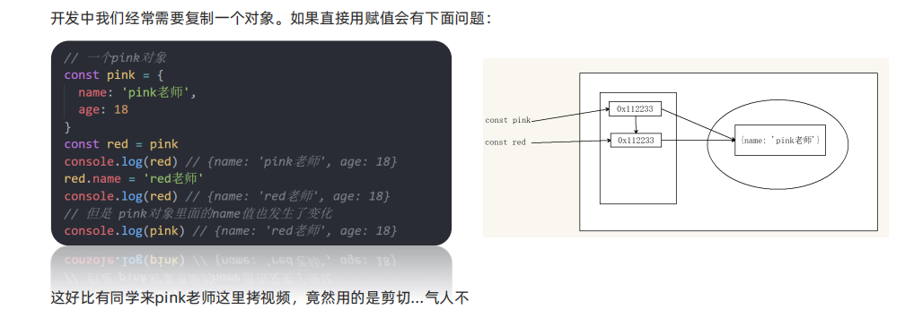
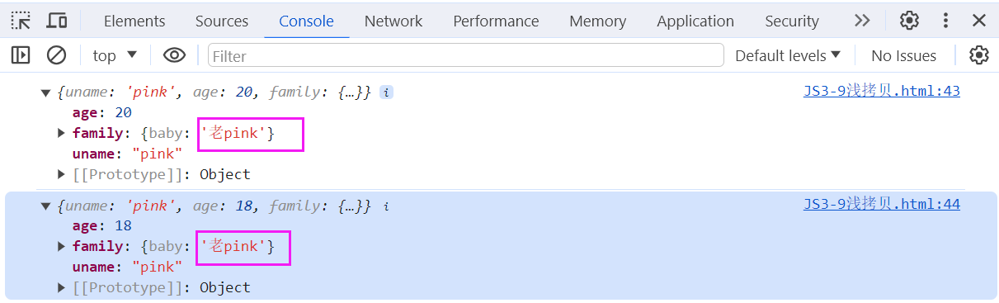
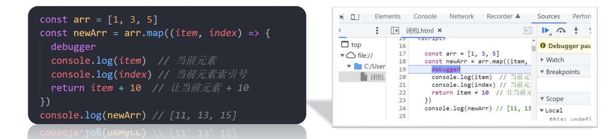
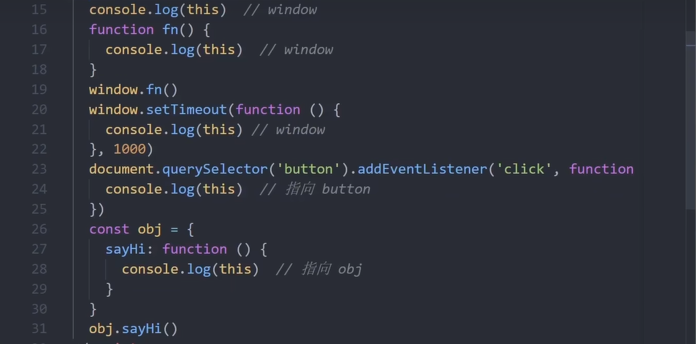
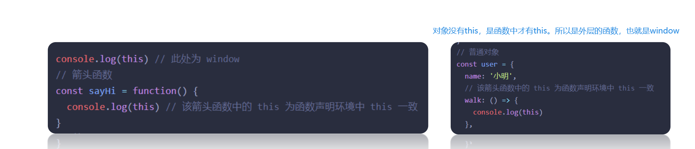
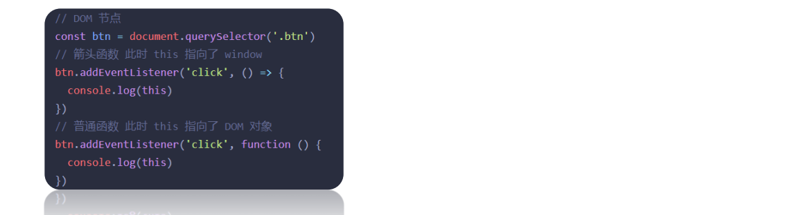
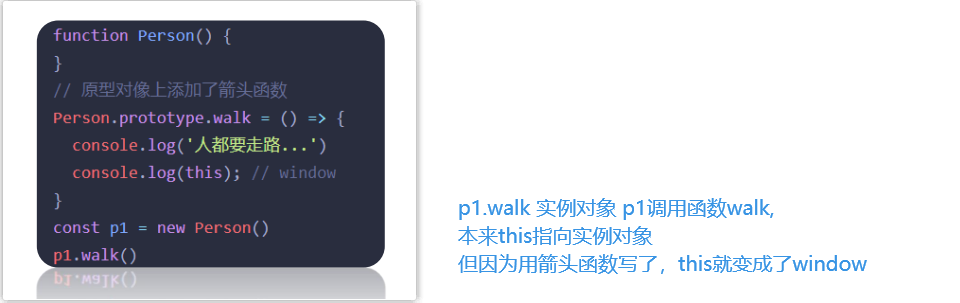
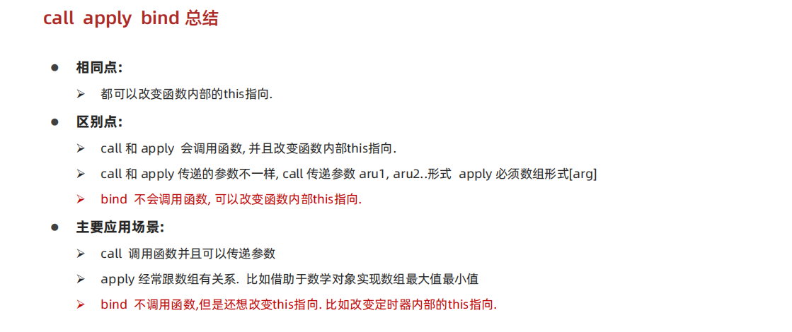
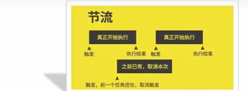
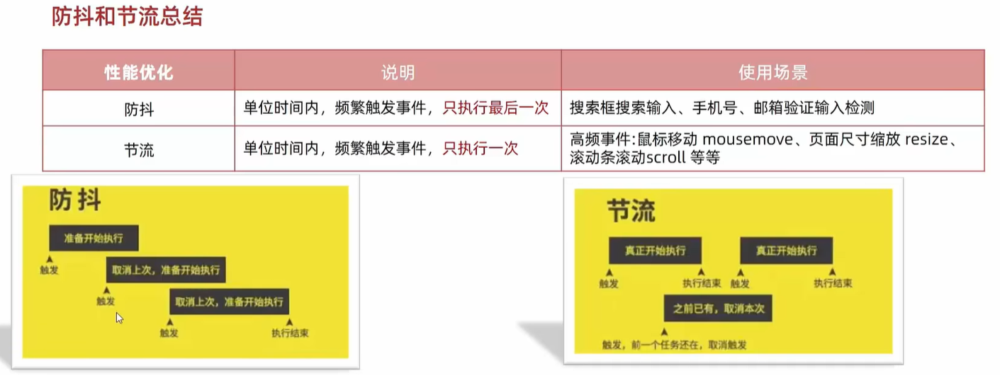

# 深浅拷贝



## 1、浅拷贝

<font color="red">首先浅拷贝和深拷贝只针对**引用类型**</font>

浅拷贝：拷贝的是地址


**常见方法：**

1. 拷贝对象：Object.assgin() / 展开运算符 {...obj} 拷贝对象
2. 拷贝数组：Array.prototype.concat() 或者 [...arr]

 

如果是简单数据类型，拷贝值

如果是引用数据类型，拷贝的是地址 (简单理解： 如果是单层对象，没问题，如果有多层就有问题)


- 举例

只有简单数据类型时：

```javascript
  const obj = {
    uname: 'pink',
    age: 18
  }
  
  // 展开运算符
  const o = {...obj}
  o.age = 20
  console.log(o); // {uname: 'pink', age: 20}
  console.log(obj); // {uname: 'pink', age: 18}

  // assign方法
  const o2 = {}
  Object.assign(o2, obj)
  o2.age = 22

  console.log(o2); // {uname: 'pink', age: 22}
  console.log(obj); // {uname: 'pink', age: 18}

```

问题出现了 ：

```javascript
  const obj = {
    uname: 'pink',
    age: 18,
    family : {
      baby: '小pink'
    }
  }

  const o = {}
  Object.assign(o, obj)
  o.age = 20
  o.family.baby = '老pink'
  console.log(o)
  console.log(obj);
```



简单数据类型，如字符串、数字，会直接拷贝值；但如果是复杂数据类型，还是复制的地址。

## 2、深拷贝

<font color="red">首先浅拷贝和深拷贝只针对**引用类型**</font>

深拷贝：拷贝的是对象，不是地址

**常见方法：**

1. 通过递归实现深拷贝
2. lodash/cloneDeep
3. 通过JSON.stringify()实现

### ① 通过递归实现

**函数递归：**如果一个函数在内部可以调用其本身，那么这个函数就是递归函数

- 简单理解：函数内部自己调用自己, 这个函数就是递归函数

- 递归函数的作用和循环效果类似

- 由于递归很容易发生“栈溢出”错误（stack overflow），所以必须要加退出条件 return

#### 练习

利用递归函数实现 setTimeout 模拟 setInterval效果

```javascript
  function getTime() {
    document.querySelector('div').innerHTML = new Date().toLocaleDateString
    setTimeout(getTime, 1000)
  }
  getTime() 
```

<font color="red">**通过递归函数实现深拷贝（简版）:**</font>

```javascript
  const obj = {
    uname: 'pink',
    age: 18,
    hobby: ['乒乓球','足球']
  }
  const newO = {}
  // 拷贝函数
  function deepCopy(newObj, oldObj) {
    for(let k in oldObj) {
      console.log(k);
      console.log(oldObj[k]);
      // 处理数组的问题
      if(oldObj[k] instanceof Array) {
        newObj[k] = [] // 空数组接收
        deepCopy(newObj[k],oldObj[k])
      } else if (oldObj[k] instanceof Object){
        newObj[k] = {} // 空数组接收
        deepCopy(newObj[k],oldObj[k])
      } else {
        // K是属性名， 值是oldObj[K]
        newObj[k] = oldObj[k]
      }
      // 这里一定先写 Array，后写Object 
      // console.log(Array instanceOf Object) // true
    }
  }
  deepCopy(newO,obj)
  //console.log(newO);
  newO.age = 33
  newO.hobby[0] = '篮球'
  //console.log(obj);
```

### ②  js库lodash里面cloneDeep

```html
<script src="./lodash.min.js"></script>
<script>
  const obj = {
    uname: 'pink',
    age: 18,
    hobby: ['乒乓球','足球'],
    family: {
      baby: '小pink'
    }
  }

  const o = _.cloneDeep(obj)
</script>
```

### ③ 通过JSON.stringify()实现

```javascript
  const obj = {
    uname: 'pink',
    age: 18,
    hobby: ['乒乓球','足球'],
    family: {
      baby: '小pink'
    }
  }
  /*把对象转换为JSON字符串
  JSON.stringify()
  把JSON字符串转换为对象
  JSON.parse()*/
  const newO = JSON.parse(JSON.stringify(obj))
```


# 异常处理

## 1、throw 抛异常

总结：

1. throw 抛出异常信息，程序也会终止执行
2. throw 后面跟的是错误提示信息
3. Error 对象配合 throw 使用，能够设置更详细的错误信息

```javascript
 function fn(x,y) {
    if(!x || !y) {
      // throw '没有参数传递进来'
      throw new Error('没有参数传递进来')
    }
    return x + y
  }
  console.log(fn());
```


## 2、try /catch 捕获异常

我们可以通过try / catch 捕获错误信息（浏览器提供的错误信息） try 试试， catch 拦住 ，finally 最后

总结：

1. try...catch 用于捕获错误信息

2. 将预估可能发生错误的代码写在 try 代码段中

3. 如果 try 代码段中出现错误后，**会执行 catch 代码段，并截获到错误信息**

   利用catch的参数调用错误信息

4. finally 不管是否有错误，都会执行

```javascript
  function fn() {
    try {
      // 可能发送的代码 要写到try
      const p = document.querySelector('.p')
      p.style.color = 'red'
    } catch(err) {
      // 拦截错误，提示浏览器提供的错误信息，但是不中断
      console.log(err.message);
      
      // 如果想中断，就可以添加 return 中断程序
      // return

      //throw new Error('错了')
      //抛出错误会中断，导致下面的代码 console.log('会正常执行');不输出
    } finally {
      // 不管程序对不对，一定会执行
      alert('弹出对话框')
    }

    console.log('会正常执行');
  }

  fn()
```


## 3、debugger

在运行后直接跳转位置，很方便



# 处理this

## this的指向

this 是 JavaScript 最具“魅惑”的知识点，不同的应用场合 this 的取值可能会有意想不到的结果，在此我们对以往学习过的关于【 this 默认的取值】情况进行归纳和总结。

学习路径：

1. 普通函数this指向
2. 箭头函数this指向

### ① 普通函数

- 普通函数的调用方式决定了 this 的值，即【谁调用 this 的值指向谁】

- 普通函数没有明确调用者时 this 值为 window，**严格模式 'use strict' 下** 没有调用者时 this 的值为 undefined 



### ② 箭头函数

箭头函数中的 this 与普通函数完全不同，也不受调用方式的影响，<font color="red">事实上箭头函数中并不存在 this ！</font>

1. 箭头函数会默认帮我们绑定外层 this 的值，所以在箭头函数中 this 的值和外层的 this 是一样的
2. 箭头函数中的this引用的就是最近作用域中的this
3. 向外层作用域中，一层一层查找this，直到有this的定义




**注意情况1：**

在开发中【使用箭头函数前需要考虑函数中 this 的值】，事件回调函数使用箭头函数时，this 为全局的 window。因此DOM事件回调函数如果里面需要DOM对象的this，则不推荐使用箭头函数



**注意情况2：**

同样由于箭头函数 this 的原因，基于原型的面向对象也不推荐采用箭头函数




总结：

1. 函数内不存在this，沿用上一级的
2. 不适用：构造函数，原型函数，dom事件函数等等
3. 适用：需要使用上层this的地方

4. 使用正确的话，它会在很多地方带来方便，后面会大量使用慢慢体会

## 改变this

JavaScript 中还允许指定函数中 this 的指向，有 3 个方法可以动态指定普通函数中 this 的指向

- call()

- apply()

- bind()

### ① call()

使用 call 方法**调用函数**，**同时**指定被调用函数中 this 的值

**语法：**fun.call(thisArg, arg1, arg2, ...) 

- thisArg：在 fun 函数运行时指定的 this 值

- arg1，arg2：传递的其他参数

- 返回值就是函数的返回值，因为它就是调用函数

```javascript
  function fn() {
    console.log(this);
  }
  fn() // output：window

  const obj = {
    uname: 'pink'
  }
  fn.call(obj) // output：obj
```

### ② apply()

 使用 apply 方法调用函数，同时指定被调用函数中 this 的值

**语法：**fun.apply(thisArg, [argsArray])

- thisArg：在fun函数运行时指定的 this 值

- argsArray：传递的值，<font color="red">必须包含在数组里面(与call的区别)</font>

- 返回值就是函数的返回值，因为它就是调用函数

- 因此 apply 主要跟数组有关系，比如使用 Math.max() 求数组的最大值

```javascript
  function fn() {
    console.log(this);
  }
  const obj = {
    uname: 'pink'
  }
  fn() // window
  fn.apply() // window
  fn.apply(obj) // obj

  // ============讲解参数===============
  function fn2(x,y){
    console.log(this);
    console.log(x+y);
  }
  fn.apply(obj, [1,2])
  // 返回值 ：apply本身就是在调用函数，所以返回值就是函数的返回值
```

**使用场景：**求数组最大值(对比展开运算符,他是求数字们的最大值)

```javascript
  // ====使用场景:求数组最大值(对比展开运算符,他是求数字们的最大值)===
  // Math.max()是在调用函数
  const max = Math.max(1,2,3)
  // 所以可以通过apply调用 Math.max函数
  const max2 = Math.max.apply(null, [1,2,3]) // 不想改变指向，写一个空就可以了
  console.log(max2); // 3

  const arr = [100, 44, 77]
  const max3 = Math.max.apply(null, arr)
  console.log(max3); // 100
```


### ③ bind()

bind() 方法<font color="red">**不会**</font>调用函数。但是能改变函数内部 this 指向。

**语法：**fun.bind(thisArg, arg1, arg2, ...)

- thisArg：在 fun 函数运行时指定的 this 值

- arg1，arg2：传递的其他参数

- 返回由指定的 this 值和初始化参数改造的 原函数拷贝 （新函数）

- 因此当我们只是想改变 this 指向，并且不想调用这个函数的时候，可以使用 bind，比如改变定时器内部的this指向

```javascript
  const obj = {
    age: 18
  }
  
  function fn() {
    console.log(this);
  }
  fn.bind() // 没有输出,不会调用函数,但能改变this指向
  fn.bind(obj) //  因为无法打印,我们来研究一下bind函数的返回值
  // call apply 的返回值,就是函数fn的 返回值
  // bind返回值:(改过的)返回由指定的 this 值和初始化参数改造的 原函数拷贝 （新函数）

  const fun = fn.bind(obj) // bind返回值是函数
  console.log(fun); // 控制台输出:fn() { console.log(this);}
  fun() // {age: 18}
```

**练习：**有一个按钮，点击就禁用，两秒钟之后开启

```html
<body>
  <button>点击</button>
</body>
<script>
  const btn = document.querySelector('button')
  btn.addEventListener('click', function(){
    // 禁用按钮
    this.disabled = true 

    // 这段代码无效,因为普通函数this指向调用它的, this就是window
    // setTimeout(function(){
    //   this.disabled = false 
    // }, 2000)
    
    // 方法一:修改如下
    // setTimeout(function(){
    //   btn.disabled = false 
    // }, 2000)

    // 方法二:也可以在这个普通函数里面,修改this的指向
    // 要把this的指向从window改为btn
    window.setTimeout(function(){
      this.disabled = false 
    }.bind(btn), 2000) 
      
    /*这里的 btn 能改成this,最后一行改成  }.bind(this), 2000) 
      为什么呢，因为此时外部的this就表示btn
    */
  })
</script>
```



# 性能优化

## 1、防抖

防抖：单位时间内，频繁触发事件，只执行最后一次


**使用场景：**

搜索框搜索输入。只需要用户最后一次输入完，再发送请求

手机号、邮箱验证输入检测

### 案例

利用防抖来处理-鼠标划过盒子显示文字

要求：鼠标在盒子上移动，鼠标停止500ms之后，里面的数字才会变化+1

**实现方式：**

1. lodash 提供的防抖来处理   _.debounce(func, [wait=0], [options=])
2. 手写一个防抖函数处理

```javascript
  const box = document.querySelector('.box')
  let i = 1
  function mouseMove() {
    box.innerHTML = i++
    // 如果这里存在大量消耗性能的代码,比如dom操作,比如数据处理
    // 可能造成卡顿
  }
  //box.addEventListener('mousemove',mouseMove)
  // 但是因为mousemove这个事件是移动了1px就会改变
  // 如果飞快地移动鼠标,数字更改的就会很快

  box.addEventListener('mousemove',_.debounce(mouseMove,500))
```

**手写核心思路：**

防抖的核心就是利用定时器(setTimeout)来实现

①:声明一个定时器变量

②:当鼠标每次滑动都先判断是否有定时器了，如果有定时器先清除以前的定时器

③:如果没有定时器则开启定时器，记得存到变量里面

④:在定时器里面调用要执行的函数。

```javascript
 // 手写防抖函数
  function mydebounce(fn, t){
    let timer
    return function() {
      if(timer) clearInterval(timer)
      timer = setTimeout(function(){
        fn()
      }, t)
    }
  }
  box.addEventListener('mousemove', mydebounce(mouseMove,500))
  // 分析我们自己的mydebounce为什么要返回函数
  // mydebounce(mouseMove,500)是在调用函数,
  // 函数返回值是 一个函数
  // mydebounce(mouseMove,500) = function() { }
  // 所以就相当于,鼠标一滑动就要执行这个匿名函数
```

<font color="red">不是很懂</font>

## 2、节流

所谓节流，就是指连续触发事件但是在 n 秒中只执行一次函数

例子：游戏的技能冷却

简单区分：防抖是执行最后一个，节流是执行第一个



开发使用场景 – 小米**轮播图点击效果 、 鼠标移动、页面尺寸缩放resize、滚动条滚动 就可以加节流**

高频事件：鼠标移动mousemove、页面尺寸缩放resize、滚动条滚动scroll

### 案例

利用节流来处理-鼠标滑过盒子显示文字

要求： 鼠标在盒子上移动，不管移动多少次，每隔500ms，里面的数字才会变化+1

**实现方式：**

1. lodash 提供的节流函数来处理   _.throttle(func, [wait=0], [options=]) 

   在wait秒内最多执行func一次的函数

2. 手写一个节流函数处理

```javascript
 const box = document.querySelector('.box')
  let i = 1
  function mouseMove() {
    box.innerHTML = i++
    // 如果这里存在大量消耗性能的代码,比如dom操作,比如数据处理
    // 可能造成卡顿
  }

  box.addEventListener('mouseover', _.throttle(mouseMove, 3000))
```

核心思路:
节流的核心就是利用定时器(setTimeout)来实现

①:声明一个定时器变量

②:当鼠标每次滑动都先判断是否有定时器了，如果有定时器则不开启新定时器

③:如果没有定时器则开启定时器，记得存到变量里面

​	定时器里面调用执行的函数

​	定时器里面要把定时器清空


## 防抖节流总结



# 综合案例

> V:\Web\mycode\JS4-14节流综合案例素材.html

节流综合案例