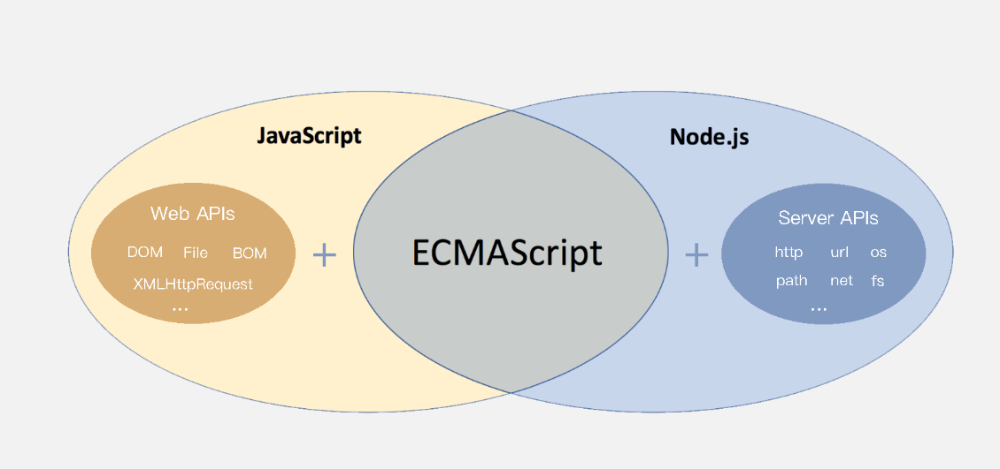
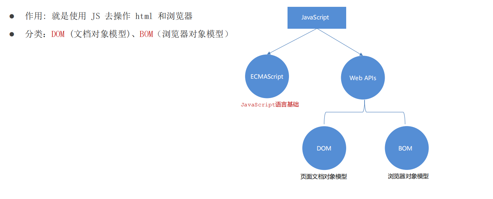

# 引入：const优先

<font color="red">**const 优先**</font>
- const 语义化更好
- 很多变量我们声明的时候就知道他不会被更改了，那为什么不用 const呢？
- 实际开发中也是，比如react框架，基本const 
- 也可以有了变量先给const，如果发现它后面是要被修改的，再改为let

**请判断下面的变量是否能从let改成const**


```javascript
//不不不不不可以把let 改为 const
//因为变量进行了重新赋值
let num = 1
num = num + 1
console.log(num)
```
```javascript
//可以把let 改为 const
let arr = ['red', 'green']
arr.push('pink')
console.log(arr)
```

```javascript
//可以把let 改为 const
let person = {
	uname: 'pink'
	age: 18
	gender: '女'
}
person.address = '武汉黑马'
console.log(person)
```

```javascript
// 这是错的
const arr = ['red', 'blue']
arr = [1, 2]
```


<font color = "red">数组和对象是引用类型，里面存储的是地址，只要地址不变，就不会报错</font>

<font color = "red">建议数组和对象使用const来声明</font>

# Web API 基本认知

ECMAScript 简称 ES 它提供了一套语言标准规范，如变量、数据类型、表达式、语句、函数等语法规则都是由 ECMAScript 规定的。浏览器将 ECMAScript 大部分的规范加以实现，并且在此基础上又扩展一些实用的功能，这些被扩展出来的内容我们称为 Web APIs。



ECMAScript 运行在浏览器中然后再结合 Web APIs 才是真正的 JavaScript，Web APIs 的核心是 DOM 和 BOM。

**DOM（Document Object Model）是将整个 HTML 文档的每一个标签元素视为一个对象，这个对象下包含了许多的属性和方法**，通过操作这些属性或者调用这些方法实现对 HTML 的**动态更新**，为实现网页特效以及用户交互提供技术支撑。

### 01 作用和分类

作用：就是使用 JS 去操作 html 和浏览器

分类：DOM (文档对象模型)、BOM（浏览器对象模型）



### 02 什么是DOM

DOM（Document Object Model——文档对象模型）是用来呈现以及与任意 HTML 或 XML文档交互的API

白话文：DOM是浏览器提供的一套专门用来 **操作网页内容** 的功能

**DOM作用：**开发网页内容特效和实现用户交互


### 03 DOM树

将 HTML 文档以树状结构直观的表现出来，我们称之为文档树或 DOM 树

描述网页内容关系的名词

作用：文档树直观的体现了标签与标签之间的关系


最大的document节点，整个页面是一个文件。

#### DOM 节点

节点是文档树的组成部分，**每一个节点都是一个 DOM 对象**，主要分为元素节点、属性节点、文本节点等。

1. 【元素节点】其实就是 HTML 标签，如上图中 `head`、`div`、`body` 等都属于元素节点。
2. 【属性节点】是指 HTML 标签中的属性，如上图中 `a` 标签的 `href` 属性、`div` 标签的 `class` 属性。
3. 【文本节点】是指 HTML 标签的文字内容，如 `title` 标签中的文字。
4. 【根节点】特指 `html` 标签。
5. 其它...

#### document

`document` 是 JavaScript 内置的专门用于 DOM 的对象，该对象包含了若干的属性和方法，`document` 是学习 DOM 的核心。

```html
<script>
  // document 是内置的对象
  // console.log(typeof document); object

  // 1. 通过 document 获取根节点
  console.log(document.documentElement); // 对应 html 标签

  // 2. 通过 document 节取 body 节点
  console.log(document.body); // 对应 body 标签

  // 3. 通过 document.write 方法向网页输出内容
  document.write('Hello World!');
</script>
```

上述列举了 `document` 对象的部分属性和方法，我们先对 `document` 有一个整体的认识。

### 04 DOM对象

- DOM对象：浏览器根据html标签生成的 **JS对象**（只要是对象就会有属性和方法）

​	所有的标签属性都可以在这个对象上面找到

​	修改这个对象的属性会自动映射到标签身上

- DOM的核心思想

​	把网页内容当做对象来处理

```javascript
//在HTML里面叫标签
<div></div>

//在JS里叫DOM对象
const div = document.querySelector('div')
console.dir(div)
```

- document 对象

  DOM里面最大的对象是document对象 

​	是 DOM 里提供的一个**对象**

​	所以它提供的属性和方法都是**用来访问和操作网页内容的**

​		例：document.write()

​	网页所有内容都在document里面


# 获取DOM对象

### 01 根据CSS选择器获取

<font color="red">**1、选择匹配的第一个元素**</font>

**语法：**

```javascript
document.querySelector('css选择器')
```

页面所有的内容都在document对象中存放，可以通过document

**参数:**

包含一个或多个有效的CSS选择器 **字符串**

**返回值：**

CSS选择器匹配的第一个元素,一个 HTMLElement**对象**。

如果没有匹配到，则返回null


- 示例

```html
<body>
  <div class="box">111</div>
  <div class="box">222</div>
  <script>
    const box = document.querySelector('div');
	const box2 = document.querySelector('.box');
    console.log('==');
    console.log(box);
	console.log(box2);
  </script>
</body>
```


注意只能获取第一个div

```html
<body>
  <p id="nav"></p>
  <script>
    const nav = document.querySelector('#nav')
    const nav2 = document.querySelector('p')
    console.log(nav);
    console.log(nav2);
  </script>
</body>
```

<font color="red">注意 这里 id和class 是不一样的</font>

```html
<body>
  <ul>
    <li>测试</li>
    <li>测试</li>
    <li>测试</li>
  </ul>

  <script>
    const li = document.querySelector('ul li')
  </script>
```


<font color="red">**2、选择匹配的多个元素**</font>

**语法：**

```javascript
document.querySelectorAll('css选择器')
```

**参数:**

包含一个或多个有效的CSS选择器 **字符串**

**返回值：**

CSS选择器匹配的**NodeList 对象集合**

得到的是一个**伪数组**：有长度有索引号的数组，但是没有 pop() push() 等数组方法。想要得到里面的每一个对象，则需要遍历（for）的方式获得。


注意：哪怕只有一个元素，通过querySelectAll() 获取过来的也是一个**伪数组**，里面只有一个元素而已


- 案例

```javascript
document.querySelectorAll('ul li')
```

```html
<body>
  <ul class="nav">
    <li>我的首页</li>
    <li>产品介绍</li>
    <li>联系方式</li>
  </ul>

  <script>
    const nav = document.querySelector('.nav')
    const lis = document.querySelectorAll('ul li')
    
    for(let i=0; i<lis.length; i++) {
      console.log(lis[i]); // 每一个小li对象
    }
  </script>
</body>

```

### 02 其他获取DOM元素方法

```javascript
  <div id="nav"></div>
  <div class="w"></div>

document.getElementById('nav')
document.getElementsByClassName('w')
document.getElementsByTagName('div')
```


# 操作元素内容

在获取了DOM对象之后，希望能修改元素的文本更换内容

- DOM对象都是根据标签生成的，所以操作标签，本质上就是操作DOM对象。

- 就是操作对象使用的点语法。 

- 如果想要修改标签元素的里面的**内容**，则可以使用如下几种方式

1. 对象.innerText 属性
2. 对象.innerHTML 属性

### 01 innerText 属性

将文本内容添加/更新到任意标签位置

显示纯文本，不解析标签

```html
<body>
  <div class="box">我是文字内容</div>
  <script>
    // 1、获取元素
    const box = document. querySelector('.box')
    // 2、修改文字内容
    console.log(box.innerText) //获取文字内容
    box.innerText = '我是一个盒子'
  </script>
</body>
```

### 02 innerHTML 属性

将文本内容添加/更新到任意标签位置

**会解析标签，多标签建议使用模板字符**

```html
<body>
  <div class="box">我是文字内容</div>
  <script>
    // 1、获取元素
    const box = document. querySelector('.box')
    // 2、修改文字内容
    // INNERHTML
    console.log(box.innerHTML);
    box.innerHTML = '<strong>我是一个盒子</strong>'
  </script>
</body>
```


- 案例 年会抽奖案例

需求：从数组随机抽取一等奖、二等奖和三等奖，显示到对应的标签里面。

思路分析：

① 声明数组

② 实现随机抽取人

③ innerHTML修改

```html

<body>
  <div class="wrapper">
    <strong>传智教育年会抽奖</strong>
    <h1>一等奖：<span id="one">???</span></h1>
    <h3>二等奖：<span id="two">???</span></h3>
    <h5>三等奖：<span id="three">???</span></h5>
  </div>
  <script>
    let names = ['周杰伦', '刘德华', '周星驰', 'Pink老师', '张学友']
    const random = Math.floor(Math.random()*names.length)
    // console.log(names[random]);
    const one = document.querySelector('#one')
    one.innerHTML = names[random]
    names.splice(random, 1)
  </script>
</body>
```


# 操作元素属性

### 操作元素的常用属性

常用的属性比如：href, title, src

比如在HTML中 img是图片标签，JS中是图像对象，其中有src属性

> 语法 ：对象.属性 = 值
>
>  注：如果原本有这个属性，就修改；如果无，就新增。

- 案例

  需求：刷新页面，页面随机显示不同的图片

  分析：

  ①：随机显示，则需要用到随机函数

  ②：更换图片需要用到图片的 src 属性，进行修改

  ③：核心思路：

  1. 获取图片元素
  2. 随机得到图片序号
  3. 图片.src = 图片随机路径

```html
<body>
  
  <script>
    // 取到 N ~ M 的随机整数
    function getRandom(N, M) {
      return Math.floor(Math.random() * (M - N + 1)) + N
    }
    // 1. 获取图片对象
    const img = document.querySelector('img')
    // 2. 随机得到序号
    const random = getRandom(1, 6)
    // 3. 更换路径
    img.src = `./images/${random}.webp`
  </script>
</body>
```


### 操作元素的样式属性

学习路径：

1. 通过 style 属性操作CSS（适用于样式比较少的情况）
2. 操作类名(className) 操作CSS（多个类名操作麻烦）
3. ⭐通过 classList 操作类控制CSS，三个方法 add remove toggle


<font color = "red">**1 通过 style 属性操作CSS**</font>

> 语法：对象.style.样式属性 = 值
>
> 这里修改之后变成**行内样式**，优先级高

**注意事项：**

​        ① 修改样式通过style属性引出

​	② 如果属性有-连接符，需要转换为小驼峰命名法。比如background-color 写成backgroundColor

​	③ 赋值的时候，需要的时候不要忘记加css单位

```html
<body>
  <div class="box"></div>
  <script>
    // 获取对象
    const box = document.querySelector('.box')

    // 修改样式
    box.style.height = '900px' //注意这里不能漏掉单位
    // box.style.background-color = 'red';  这里是错的
    box.style.backgroundColor = 'red'
    // 解决方式是小驼峰命名法
  </script>
</body>
<style>
  .box {
    width: 200px;
    height: 200px;
    background-color: pink;
  }
</style>
```


- 案例：页面刷新，页面随机更换背景图片

需求：当我们刷新页面，页面中的背景图片随机显示不同的图片

分析：

①： 随机函数

②： css页面背景图片 background-image

③： 标签选择body， 因为body是唯一的标签，可以直接写 **document.body.style**


<font color = "red">**2 操作类名(className) 操作CSS**</font>

如果修改的样式比较多，直接通过style属性修改比较繁琐，我们可以通过借助于css类名的形式。

> 语法：元素.className = 'active'
>
> // active是一个css类名

**注意：**

1. 由于class是关键字, 所以使用className去代替
2. className是使用<font color = "red">新值换旧值</font>, 如果需要添加一个类,需要保留之前的类名
3. 直接使用 className 赋值会覆盖以前的类名

```html
<body>
  <div class="mybox"></div>
</body>

<style>
  .mystyle {
    width: 300px;
    height: 300px;
    margin: 100px auto;
    border: 1px solid black;
  }
    
  .color {
     background-color: red;
  }
</style>

  <script>
    const mybox = document.querySelector('.mybox');
    mybox.className = 'mystyle'
  </script>
```

如果相同添加 mystyle color,只需要 ```mybox.className = 'mystyle color'```即可


<font color = "red">**3 通过 classList 操作类控制CSS**</font>

为了解决className 容易覆盖以前的类名，我们可以通过classList方式**追加和删除**类名

> **语法：**
>
> // 追加一个类
>
> 元素.classList.add('类名')
>
> 
>
> // 删除一个类
>
> 元素.classList.remove('类名')
>
> 
>
> // 切换一个类：有就删掉，没有就加上
>
> 元素.classList.toggle('类名')  


- 案例：轮播图简易版

  ①：页面一刷新，图片会随机变换

  ②：底部盒子背景颜色和文字内容会变换

  ③：小圆点随机一个高亮显示


分析：

①： 准备一个数组对象，里面包含详细信息（素材包含）

②： 随机选择一个数字，选出数组对应的对象，更换图片，底部盒子背景颜色，以及文字内容

③： 利用这个随机数字，让小圆点添加高亮的类（addClass） **利用css 结构伪类选择器**

```html
<body>
  <div class="slider">
    <div class="slider-wrapper">
      
    </div>
    <div class="slider-footer">
      <p>对人类来说会不会太超前了？</p>
      <ul class="slider-indicator">
        <li></li>
        <li></li>
        <li></li>
        <li></li>
        <li></li>
        <li></li>
        <li></li>
        <li></li>
      </ul>
      <div class="toggle">
        <button class="prev">&lt;</button>
        <button class="next">&gt;</button>
      </div>
    </div>
  </div>
  <script>
    // 1. 初始数据
    const sliderData = [
      { url: './images/slider01.jpg', title: '对人类来说会不会太超前了？', color: 'rgb(100, 67, 68)' },
      { url: './images/slider02.jpg', title: '开启剑与雪的黑暗传说！', color: 'rgb(43, 35, 26)' },
      { url: './images/slider03.jpg', title: '真正的jo厨出现了！', color: 'rgb(36, 31, 33)' },
      { url: './images/slider04.jpg', title: '李玉刚：让世界通过B站看到东方大国文化', color: 'rgb(139, 98, 66)' },
      { url: './images/slider05.jpg', title: '快来分享你的寒假日常吧~', color: 'rgb(67, 90, 92)' },
      { url: './images/slider06.jpg', title: '哔哩哔哩小年YEAH', color: 'rgb(166, 131, 143)' },
      { url: './images/slider07.jpg', title: '一站式解决你的电脑配置问题！！！', color: 'rgb(53, 29, 25)' },
      { url: './images/slider08.jpg', title: '谁不想和小猫咪贴贴呢！', color: 'rgb(99, 72, 114)' },
    ]

    // 图片、文字、背景颜色、li都要修改

    //随机选中哪一个数据
    function getRandom(N, M) {
      return Math.floor(Math.random() * (M - N + 1)) + N
    }
    const random = getRandom(1,8)

    // 修改图片
    const img = document.querySelector('.slider-wrapper img')
    img.src = sliderData[random].url

    // 修改文字
    const p = document.querySelector('.slider-footer p')
    p.innerHTML = sliderData[random].title 

    //修改背景颜色
    const footer = document.querySelector('.slider-footer')
    footer.style.backgroundColor = sliderData[random].color

    //修改li
    const lis = document.querySelectorAll('.slider-indicator li')
    lis[random-1].classList.add('active') 
    
    //这里也可以用 li:ntd-child
    // const li = document.querySelector(`.slider-indicator li:nth-child(${random})`)
    // li.classList.add('active') 
  </script>
</body>
```


### 操作表单元素的属性

操作 **表单元素** 的属性

- 表单很多情况，也需要修改属性，比如点击眼睛，可以看到密码，本质是把表单类型转换为文本框

- 正常的有属性有取值的 跟其他的标签属性没有任何区别

> <font color = "red">操作方法</font>
>
> 获取: DOM对象.属性名
>
> 设置: DOM对象.属性名 = 新值

<font color = "red">表单的重要属性：**value  和 type**</font>

value是表单的值，单标签的值；如果是双标签的内容就是innerHTML，button是双标签，所以不是value，而是innerHTML

```html
<body>
  <input type="text" value="电脑">
</body>

<script>
  // step 1 获取元素
  const uname = document.querySelector('input')

  // step 2 获取值：获取表单里面的值 用的是表单.value
  console.log(uname.value);
  console.log(uname.innerHTML); //innerHTML得不到表单的内容

  // step 3 修改值
  uname.type = 'password'
</script>
```


表单属性中添加就有效果,移除就没有效果,一律使用**布尔值**表示 如果为true 代表添加了该属性 如果是false 代表移除了该属性

<font color = "red">例如表单的 **disabled、checked、selected**</font>


```html
<body>
  <input type="checkbox">
</body>

<script>
  const ipt = document.querySelector('input')
  console.log(ipt.checked) // checked默认false
  ipt.checked = true
</script>
```

注意这里 ipt.checked = ’true‘ 还是会有效果，但是不提倡。因为字符串里面只有空字符串着一种情况才为 false，其余的全部为 true


```html
<body>
  <button>点击</button>
</body>

<script>
  const button = document.querySelector('button')
  button.disabled = true
</script>
```


### 自定义属性

**标准属性:** 

标签天生自带的属性 比如class id title等, 可以直接使用点语法操作比如： disabled、checked、selected

**自定义属性：**

在html5中推出来了专门的data-自定义属性

在标签上一律以 <font color = "red">**data-** </font> 开头

在DOM对象上一律以<font color = "red">**dataset** </font>对象方式获取


- 示例

```html
<body>
  <div data-id="1" data-spm="haha" data-haha="aa">1</div>
  <div data-id="2">2</div>
  <div data-id="3">3</div>
  <div data-id="4">4</div>
  <div data-id="5">5</div>
</body>
<script>
  const one = document.querySelector('div') // 获取第一个div
  console.log(one.dataset)
  console.log(one.dataset.id)
  console.log(one.dataset.spm)
  console.log(one.dataset.haha)
</script>
```


# 定时器-间歇函数

**引入：**

网页中经常会需要一种功能：每隔一段时间需要自动执行一段代码，不需要我们手动去触发。例如：网页中的倒计时

要实现这种需求，需要定时器函数

**定时器函数有两种**，今天先讲间歇函数


<font color = "red">**定时器函数可以开启和关闭定时器**</font>

**1. 开启定时器**

```
setInterval(函数，间隔时间)
间隔时间单位是毫秒
```

**作用：每隔一段时间调用这个函数**

**注意：**


- 举例

```html
// 方法1 匿名函数
<script>
  //setInterval()
  setInterval(function(){
    //匿名函数
    console.log("一秒执行一次");
  },1000)
</script>

// 方法2 函数
<script>
  function fn() {
    console.log("一秒执行一次");
  }

  setInterval(fn, 1000)
    //请注意代码执行到这里的时候，会隔一秒之后再第一次打印
</script>
```


**2. 关闭定时器**

场景：轮播图一般一直在播放，但是用户鼠标放上去之后就应该停止

```
let 变量名 = setInterval(函数，间歇时间) //这里不可以用const
clearInterval(变量名)
```

```JS
let timer = setInterval(function() {
    console.log('hihihi')
}, 1000)

clearInterval(timer)
```

每一个定时器都有对应的一个号，相互独立


一般不会刚创建就停止，而是满足一定条件再停止

### 案例：阅读注册协议

需求：按钮60秒之后才可以使用

分析：

​	①：开始先把按钮禁用（disabled 属性）

​	②：一定要获取元素

​	③：函数内处理逻辑

​		秒数开始减减

​		按钮里面的文字跟着一起变化

​		如果秒数等于0 停止定时器 里面文字变为 同意 最后 按钮可以点击

```html
<body>
    <textarea name="" id="" cols="30" rows="10">
        用户注册协议
        欢迎注册成为京东用户！在您注册过程中，您需要完成我们的注册流程并通过点击同意的形式在线签署以下协议
      </textarea>
    <br>
    <button class="btn" disabled>我已经阅读用户协议(5)</button>

</body>
<script>
  const btn = document.querySelector('.btn')

  let i = 5
  let cl = setInterval(function(){
    i--
    btn.innerHTML = `我已经阅读用户协议(${i})`

    if(i === 0) {
      clearInterval(cl) //关闭定时器
      btn.disabled = false
      btn.innerHTML = '同意'
    }
  },1000)
</script>
```

### 案例：轮播图定时器版

需求：每隔一秒钟切换一个图片

```html
<body>
  <div class="slider">
    <div class="slider-wrapper">
      
    </div>
    <div class="slider-footer">
      <p>对人类来说会不会太超前了？</p>
      <ul class="slider-indicator">
        <li class = "active"></li>
        <li></li>
        <li></li>
        <li></li>
        <li></li>
        <li></li>
        <li></li>
        <li></li>
      </ul>
      <div class="toggle">
        <button class="prev">&lt;</button>
        <button class="next">&gt;</button>
      </div>
    </div>
  </div>
  <script>
    // 1. 初始数据
    const sliderData = [
      { url: './images/slider01.jpg', title: '对人类来说会不会太超前了？', color: 'rgb(100, 67, 68)' },
      { url: './images/slider02.jpg', title: '开启剑与雪的黑暗传说！', color: 'rgb(43, 35, 26)' },
      { url: './images/slider03.jpg', title: '真正的jo厨出现了！', color: 'rgb(36, 31, 33)' },
      { url: './images/slider04.jpg', title: '李玉刚：让世界通过B站看到东方大国文化', color: 'rgb(139, 98, 66)' },
      { url: './images/slider05.jpg', title: '快来分享你的寒假日常吧~', color: 'rgb(67, 90, 92)' },
      { url: './images/slider06.jpg', title: '哔哩哔哩小年YEAH', color: 'rgb(166, 131, 143)' },
      { url: './images/slider07.jpg', title: '一站式解决你的电脑配置问题！！！', color: 'rgb(53, 29, 25)' },
      { url: './images/slider08.jpg', title: '谁不想和小猫咪贴贴呢！', color: 'rgb(99, 72, 114)' },
    ]

    // 获取元素
    const img = document.querySelector('.slider-wrapper img')
    const p = document.querySelector('.slider-footer p')
    const footer = document.querySelector('.slider-footer')
    
    //开启定时器
    let i = 0
    setInterval(function() {
      //刚打开网页的时候默认了第一张图片，所以定时器应该从第二张开始
      i++
      i = i % 8
      // console.log(sliderData[i]);
      img.src = sliderData[i].url
      p.innerHTML = sliderData[i].title
      footer.style.backgroundColor = sliderData[i].color

      //先删除以前的active 
      document.querySelector(`.slider-indicator .active`).classList.remove('active')
      //找出当前的 .active然后删掉，
      //注意在HTML中一定！！！一定在最开始需要加上 一个 active

      //只让当前li添加 active
      document.querySelector(`.slider-indicator li:nth-child(${i+1})`).classList.add('active')
      // 数组从0开始，小li从1开始

    }, 1000)
  </script>
```

本篇小结：
DOM就是把HTML标签视为一个对象，这个对象下包含了许多的属性和方法。通过操作这些属性或者调用这些方法实现对 HTML 的动态更新。
学习了DOM的操作：①获取DOM对象 ②操作元素内容（文本内容）：innerText、innerHTML ③操作元素属性。
还学习了定时器