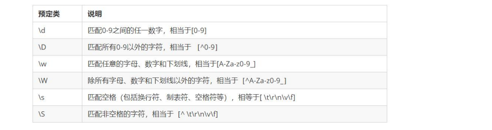

# 正则表达式

## 1、介绍

正则表达式（Regular Expression）是用于匹配字符串中字符组合的**模式**。

在 JavaScript中，正则表达式也是对象。

通常用来查找、替换那些符合正则表达式的文本，许多语法都支持正则表达式。


**使用场景：**

- 例如验证表单：用户名表单只能输入英文字母、数字或者下划线， 昵称输入框中可以输入中文<font color="red">(匹配)</font>

​	 比如用户名: /^[a-z0-9_-]{3,16}$/

- 过滤掉页面内容中的一些敏感词<font color="red">(替换)</font>，或从字符串中获取我们想要的特定部分<font color="red">(提取)</font>等 。


## 2、语法

我们想要查找是否有戴眼镜的人, 怎么做呢？

1. 定义规则： 戴眼镜的
2. 根据规则去查找：找到则返回

正则表达式，同样道理，我们分为两步：

1. 定义规则
2. 查找

### 方法一

<font color="red">**1. 定义正则表达式语法：**</font>

```javascript
const 变量名 = /表达式/
```

其中 / / 是正则表达式字面量

<font color="red">**2.判断是否有符合规则的字符串**</font>

test() 方法 用来查看正则表达式与指定的字符串是否匹配

```javascript
regObj.test(被检测的字符串)
```

如果正则表达式与指定的字符串匹配 ，返回true，否则false


- 举例

```javascript
//要检测的字符串
const str = 'IT培训,前端开发培训,IT培训课程, web前端培训, Java培训,人工智能培训'
// 1、定义正则表达式，检测规则
const reg = /前端/ 
// 2、检测方法
console.log(reg.test(str)); 
// 如果正则表达式与指定的字符串匹配 ，返回true，否则false
```

### 方法二

**检索（查找）符合规则的字符串：**

**exec()** 方法 在一个指定字符串中执行一个搜索匹配

**语法：**

```javascript
regObj.exec(被检测的字符串)
如果匹配成功，exec() 方法返回一个数组，否则返回null
```


- 举例

```javascript
//要检测的字符串
const str = 'IT培训,前端开发培训,IT培训课程, web前端培训, Java培训,人工智能培训'
// 1、定义正则表达式，检测规则
const reg = /前端/ 
// 2、检测方法


 console.log(reg.exec(str)); 
```


## 3、元字符

- **普通字符:**

大多数的字符仅能够描述它们本身，这些字符称作普通字符，例如所有的字母和数字。

也就是说普通字符只能够匹配字符串中与它们相同的字符。

- **元字符(特殊字符）**

**是一些具有特殊含义的字符，可以极大提高灵活性和强大的匹配功能。**

比如，规定用户只能输入英文26个英文字母，普通字符的话 abcdefghijklm….. 

但是换成元字符写法： [a-z]

- **参考文档：**

MDN：https://developer.mozilla.org/zh-CN/docs/Web/JavaScript/Guide/Regular_Expressions

正则测试工具: http://tool.oschina.net/regex


### 分类

为了方便记忆和学习，我们对众多的元字符进行了分类：

① 边界符（表示位置，开头和结尾，必须用什么开头，用什么结尾）

② 量词 （表示重复次数）

③ 字符类 （比如 \d 表示 0~9）


#### ① 边界符

正则表达式中的边界符（位置符）用来提示字符所处的位置，主要有两个字符


```javascript
console.log(/哈/.test('哈')); // true
console.log(/哈/.test('哈哈')); // true
console.log(/哈/.test('二哈')); // true

// 1 边界符
// /^哈/必须以哈开头
console.log(/^哈/.test('哈哈')); // true
console.log(/^哈/.test('二哈')); // false 

//  /^哈$/
console.log(/^哈$/.test('哈')); // true
console.log(/^哈$/.test('哈哈')); // false 
// 这是精准匹配，要求里面只有一个字符，以哈开头以哈结尾
// 只有一种情况为true ：/^哈$/.test('哈')
```


#### ② 量词 

量词用来 <font color="red">设定某个模式出现的**次数**</font>


```javascript
console.log(/哈/.test('哈')); // true
console.log(/哈/.test('哈哈')); // true
console.log(/哈/.test('二哈')); // true

// 1 边界符
// /^哈/必须以哈开头
console.log(/^哈/.test('哈哈')); // true
console.log(/^哈/.test('二哈')); // false 

//  /^哈$/
console.log(/^哈$/.test('哈')); // true
console.log(/^哈$/.test('哈哈')); // false 
// 这是精准匹配，要求里面只有一个字符，以哈开头以哈结尾
// 只有一种情况为true ：/^哈$/.test('哈')

// 2 量词
// * + ?
console.log('-------------------------');
console.log(/^哈$/.test('哈')); // true
// * 大于等于零次
console.log(/^哈*$/.test('')); // true
console.log(/^哈*$/.test('哈')); // true
console.log(/^哈*$/.test('哈哈')); // true
console.log(/^哈*$/.test('哈666')); // false 要求以哈结尾
console.log(/^哈*$/.test('666哈')); // false 要求以哈开头
console.log(/^哈*$/.test('哈666哈')); // false 要求只能有哈

// + 大于等于零次
console.log(/^哈*$/.test('')); // false [只有这个和 * 不一样]
console.log(/^哈*$/.test('哈')); // true
console.log(/^哈*$/.test('哈哈')); // true
console.log(/^哈*$/.test('哈666')); // false 要求以哈结尾
console.log(/^哈*$/.test('666哈')); // false 要求以哈开头
console.log(/^哈*$/.test('哈666哈')); // false 要求只能有哈

// ？ 0次或者1
console.log(/^哈*$/.test('')); // true 
console.log(/^哈*$/.test('哈')); // true
console.log(/^哈*$/.test('哈哈')); // false
console.log(/^哈*$/.test('哈666')); // false 
console.log(/^哈*$/.test('666哈')); // false 
console.log(/^哈*$/.test('哈666哈')); // false 

//量词{n} 写几次 就必须出现几次
console.log('{n}{n}{n}{n}{n}{n}{n}{n}{n}');
console.log(/^哈{4}$/.test('哈')); 
console.log(/^哈{4}$/.test('哈哈')); 
console.log(/^哈{4}$/.test('哈哈哈')); 
console.log(/^哈{4}$/.test('哈哈哈哈')); // true 其余全为 false
console.log(/^哈{4}$/.test('哈哈哈哈哈')); 

//{n,m}  >=n, <=m 逗号左右两侧千万不可以有空格
console.log(/^哈{4,6}$/.test('哈哈哈哈')); // t
console.log(/^哈{4,6}$/.test('哈哈哈哈哈')); // t
console.log(/^哈{4,6}$/.test('哈哈哈哈哈哈')); // t
console.log(/^哈{4,6}$/.test('哈哈哈哈哈哈哈')); // false

```


#### ③ 字符类 

**(1)  [ ]匹配字符集合**

- [abc]待检测字符串只要包含 abc 中**任意一个,只选一个**字符，都返回 true

```javascript
console.log(/[abc]/.test('andy')) // T
console.log(/[abc]/.test('baby')) // T
console.log(/[abc]/.test('cry')) // T
console.log(/[abc]/.test('die')) // F

console.log(/[abc]/.test('ab')) // 错了 因为只选一个字符
console.log(/[abc]{2}/.test('ab')) // true
// 用量词 设定了[abc]这个模式可以出现2次，所以可以选2次
```


**(1) [ ] 里面加上 - 连字符 :  使用连字符 - 表示一个范围**

[a-z] 表示 a 到 z ， 26个英文字母都可以，**但也是只能选一个！**

[a-zA-Z] 表示大小写都可以

[0-9] 表示 0~9 的数字都可以

```
腾讯QQ号：^[1-9][0-9]{4,}$  （腾讯QQ号从10000开始)
```


**(1) [ ] 里面加上 ^ 取反符号**

``` [^a-z]``` 匹配除了小写字母以外的字符

注意要写到中括号里面


**(1) . (点) 匹配除换行符之外的任何单个字符**


**字符类的 预定义**

预定义：指的是 某些常见模式的简写方式。



日期格式：^\d{4}-\d{1,2}-\d{1,2}

### 案例：用户名验证

需求：用户名要求用户英文字母,数字,下划线或者短横线组成，并且用户名长度为 6~16位

分析：

①：首先准备好这种正则表达式模式 /^[a-zA-Z0-9-_]{6,16}$/

②：当表单失去焦点就开始验证

③：如果符合正则规范, 则让后面的span标签添加 right 类

④：如果不符合正则规范, 则让后面的span标签添加 wrong 类


## 4、修饰符

修饰符约束正则执行的某些细节行为，如是否区分大小写、是否支持多行匹配等

**语法：/表达式/修饰符**

- i 是单词 ignore 的缩写，正则匹配时字母不区分大小写

- g 是单词 global 的缩写，匹配所有满足正则表达式的结果

```javascript
console.log(/^java$/.test('JAVA')); // f
console.log(/^java$/i.test('JAVA')); // t
```

- 替换 ：replace 替换

**语法：字符串.replace(/正则表达式/, ‘替换的文本’)**

**注意替换后的字符串是以返回值的形式获取，原先的字符串不会变化。**

```javascript
const str = 'java是一门编程语言，学完java之后工资很高'
const newStr = str.replace(/java/ig,'C++')
///java/i只会替换 第一个，g是全局替换
// 还有一种方法是 /java|JAVA/g  一个竖杠表示“或”
console.log(newStr);
```

### 案例：过滤敏感字

需求：要求用户不能输入敏感字

比如，pink老师上课很有**

分析：

①：用户输入内容

②：内容进行正则替换查找，找到敏感词，进行**

③：要全局替换使用修饰符 g


```html
<body>
  <textarea name="" id="" cols="30" rows="10"></textarea>
  <button>发布</button>
  <div>123</div>
</body>
<script>
  const textarea = document.querySelector('textarea')
  const button = document.querySelector('button')
  const div = document.querySelector('div')

  button.addEventListener('click', function() {
    console.log(textarea.value);
    
    console.log();
    div.innerHTML = textarea.value.replace(/激情|基情/g,'**')
  })
</script>
```


## 案例：小兔鲜注册

> V:\Web\mycode\6-6综合案例素材\register.html
>
> BV1Y84y1L7Nn ，P143

### 注册模块


注意：做业务的时候，因为变量名很多了，所以直接用网页检查element叫什么

**业务一：验证码** 

点击《发送验证码》 ，显示 “05”秒后重新获取“，5秒时间到了之后，显示《重新获取》

优化：利用 变量 flag，防止倒计时过程中重复点击


**业务二：用户名验证**

- 用户名验证（注意封装函数 verifyxxx） , 失去焦点触发这个函数

正则 /^[a-zA-Z0-9-_]{6,10}$/

- 如果不符合要求，则出现提示信息 并 return false 中断程序。否则 则return true

- 之所以返回 布尔值，是为了 最后的提交按钮做准备

- 侦听使用 input 的 change事件，当鼠标离开了表单，并且表单值发生了变化时触发（类似京东效

果）


这里的提示信息一定不能用 querySelector('msg')  因为其他input 也是msg。直接用 兄弟节点

输入框input 使用属性[name=username]定位的，对于form表单来说一定有name这个属性，且唯一，否则不知道用户输入了什么


做好需求二之后：

**需求三： 手机号验证**

正则: /^1(3\d|4[5-9]|5[0-35-9]|6[567]|7[0-8]|8\d|9[0-35-9])\d{8}$/

其余同上

**需求四： 验证码验证**

正则 /^\d{6}$/

其余同上

**需求五： 密码验证**

正则 

/^[a-zA-Z0-9-_]{6,20}$/

其余同上


**需求六： 再次密码验证**

如果本次密码不等于上面输入的密码则返回错误信息

其余同上


**需求七： 我同意模块**

添加类 .icon-queren2 则是默认选中样式 可以使用 toggle切换类


**需求八：提交模块**

使用 submit 提交事件

如果没有勾选同意协议，则提示 需要勾选

classList.contains() 看看有没有包含某个类，如果有则返回true，么有则返回false

如果上面input表单 只要有模块，返回的是 false 则 阻止提交

### 登录模块

> V:\Web\mycode\6-6综合案例素材\login.html

业务一：tab栏切换

排他思想

注意：什么情况不适合事件委托，嵌套元素太多就不适合。但如果一个盒子里的元素只有相同的（比如 子元素全是 li 或者 a），就很合适用事件委托。


业务二：登录模块

要在 localStorage 中存储好 用户名，因为进到主页需要

### 首页页面

1. 从登录页面跳转过来之后，自动显示用户名
2. 如果点击退出，则不显示用户名


