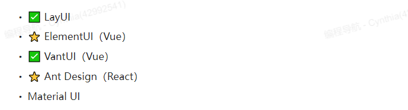
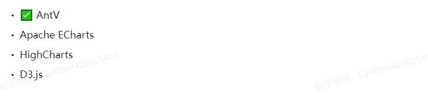
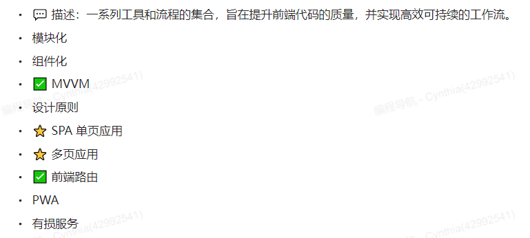

# 基础

## HTML

MDN https://developer.mozilla.org/zh-CN/docs/Learn/HTML

## CSS

MDN https://developer.mozilla.org/zh-CN/docs/Learn/CSS

W3Cschool编程入门实战:https://www.w3cschool.cn/codecamp/

阿里云前端实战学习https://developer.aliyun.com/learning/roadmap/frontend

## CSS框架

- BootStrap

- Tailwind CSS

## JS

MDN https://developer.mozilla.org/zh-CN/docs/Web/JavaScript

### Ajax

### ES6+

阮一峰 https://es6.ruanyifeng.com/

### Promise

# 前端网络基础

# 计算机基础

## 计算机网络

HTTP协议

网络模型

UDP/TCP协议

## 操作系统

## 算法和数据结构

# 软件开发基础

## 设计模式

## Git

## Linux服务器

常用命令

## 正则表达式

# 前端工程化

## 研发流程

 

## 代码托管

GitHub 

## 😃Node.js

一个开源与跨平台的JavaScript运行时环境。它是一个可用于几乎任何项目的流行工具

官方教程https://nodejs.cn/learn

入门 https://cnodejs.org/getstart

### 包管理

用于安装Node.js的扩展、工具等。

npm

### node开发框架(Express)

Express

Express 是一个保持最小规模的灵活的 Node.js Web 应用程序开发框架,

## 开发框架

### CSS框架

BootStrap

Tailwind CSS

### JS框架

#### Vue

#### React

 

## 封装库

### 组件库

 

### 数据可视化

 

### 组件（插件）

 

### 工具库

 

### 动效库

 

### 字体图标库

 

## 脚手架

. Vue CLl
. create-react-app

## 前端架构设计

 

### 服务端渲染

### 微前端

## CSS in JS

用JS写CSS

### CSS模块化

## 开发调试

